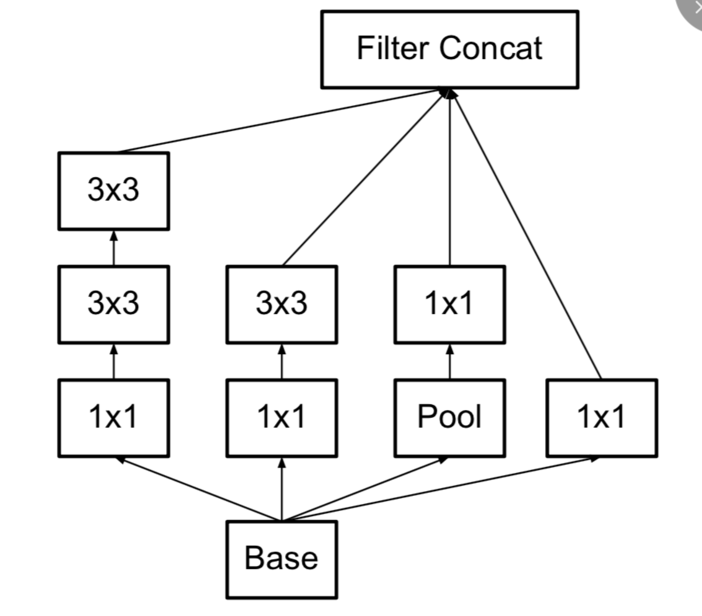
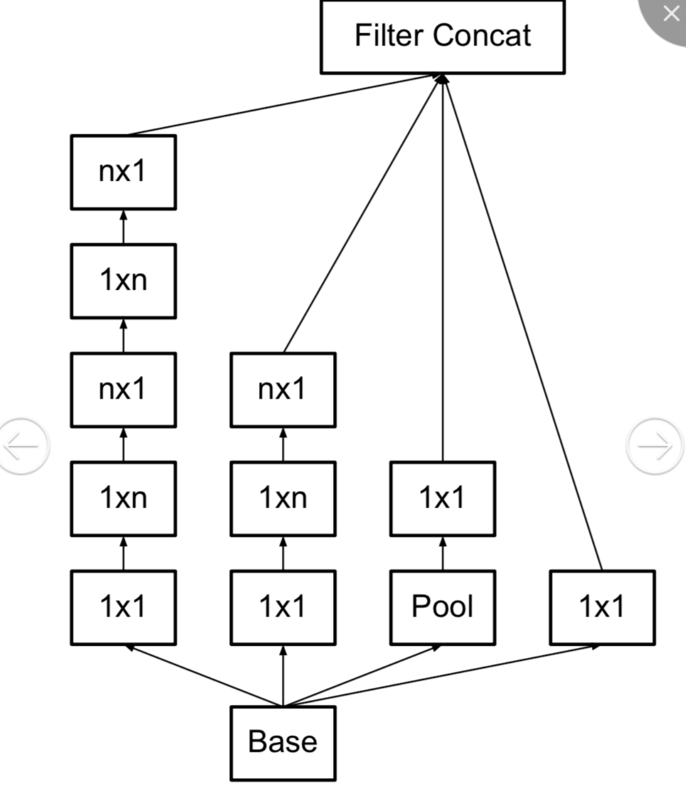
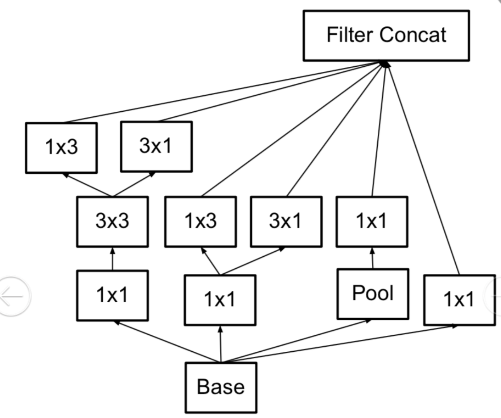
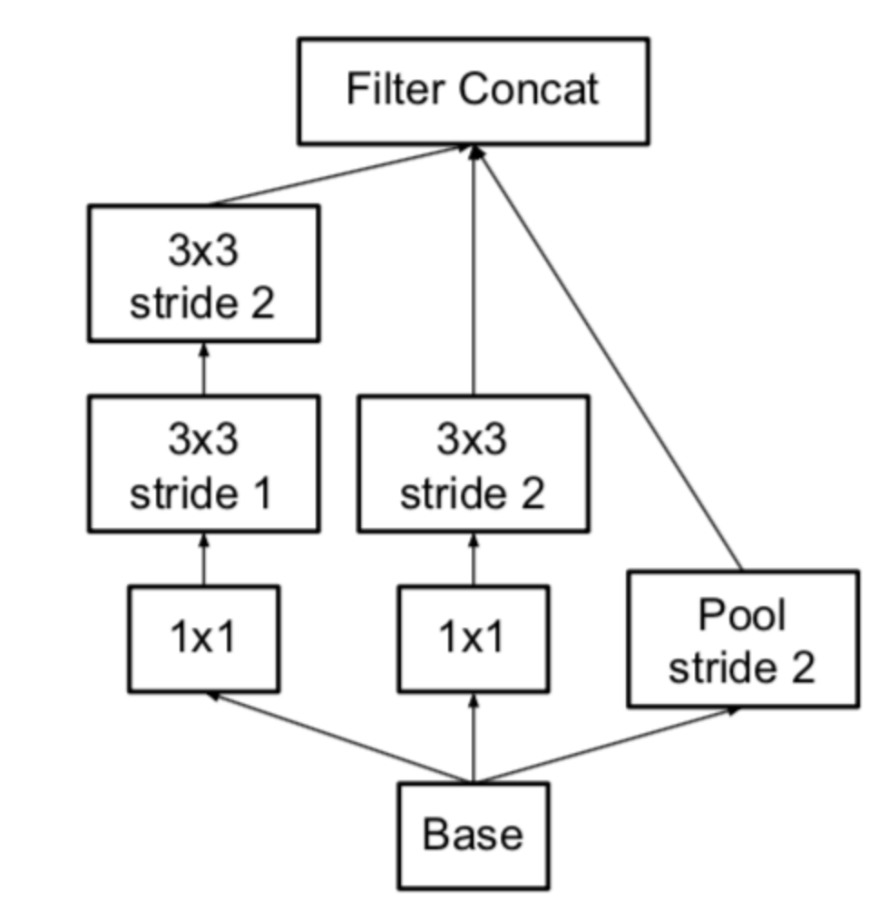
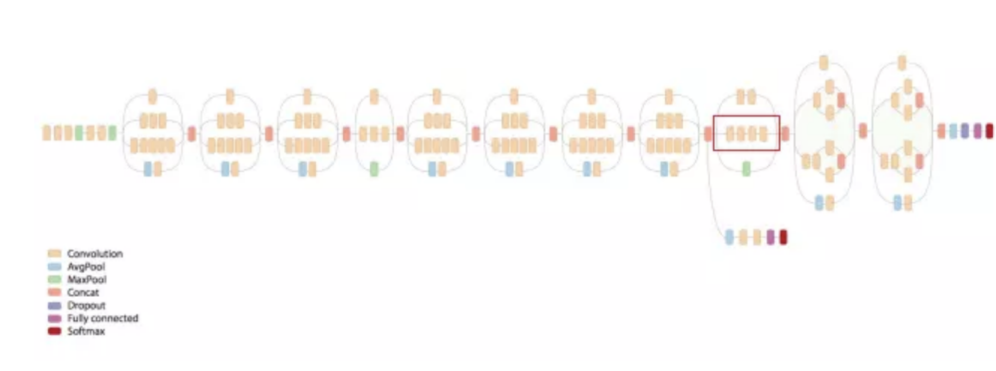

 在**inceptionv2**提出**Batch-Normalization**之后很大程度上加速了网络收敛，在**inceptionv3**中大量采用了卷积分解的方法来进一步减少计算量，并且提出了一些LSR方法来平滑标签来用预测概率来拟合真实概率。论文首先根据大量的实验提出了设计卷积神经网络的四个一般性原则：
 1.避免在较浅的层使用bottleneck结构，因为在较早的使用会造成信息压缩进而丢失有效信息。
 2.更高维度的表示在网络中更容易局部处理。因为经过更多的非线性激活提炼到的特征更加抽象也更加稀疏。
 3.空间聚合可以在较低维度嵌入上完成，而不会在表示能力上造成许多或任何损失。即使用1x1来先进行减少channel数量，再进行卷积不会造成不利影响，甚至会促进更快的学习。
 4.平衡网络的宽度和深度，通过平衡每个阶段的滤波器数量和网络的深度可以达到网络的最佳性能。
 论文中共提出了3中卷积分解的方式，每一种分解方式都作用在不同的阶段，即对应不同的特征图大小，三种不同的分解方式如下所示：
 1.将5x5分解为两个3x3
 

 2.将nxn分解为1xn和nx1的不对称卷积，采用这种分解在前面的层次上不能很好地工作，但是对于中等网格尺寸（在m×m特征图上，其中m范围在12到20之间），其给出了非常好的结果。在这个水平上，通过使用1×7卷积，然后是7×1卷积可以获得非常好的结果。
 

 3.具有扩展的滤波器组输出的**Inception**模块。这种架构被用于最粗糙的（8×8）网格，以提升高维表示，仅在最粗的网格上使用了此解决方案，因为这是产生高维度的地方，稀疏表示是最重要的，因为与空间聚合相比，局部处理（1×1 卷积）的比率增加。
 

&ensp;&ensp;&ensp;&ensp;接着论文提出了新的变换降维方式，将先卷积再通过池化的卷积方式变为卷积和池化同时进行最后进行concat的并行方式，这种方式可以在不损失信息的前提下减少计算资源。这种结构用在每一个inception组的第一个块来进行降维。
 

&ensp;&ensp;&ensp;&ensp;论文中提出了LSR（label smooth regulization），更改了一般交叉熵真实标签one-hot编码的方式，引入了平滑参数对one-hot编码进行调整，将其加上一个真实标签的先验分布。

`!$$ P(k|x) = \frac{exp(Z_k)}{\sum_i^{i=k}exp(Z_i)} $$`

`!$$ loss = -\sum_{k=1}^{k}q(k|x)log(p(k|x)) $$`

`!$$ q'(k|x) = (1-\epsilon)\delta_{k,y}+\epsilon u(k)  $$`
&ensp;&ensp;&ensp;&ensp;提出的LSR方法主要是针对对于损失函数需要用预测概率去拟合真实概率，而拟合one-hot的真实概率函数会带来两个问题：1)无法保证模型的泛化能力，容易造成过拟合；2) 全概率和0概率鼓励所属类别和其他类别之间的差距尽可能加大，而由梯度有界可知，这种情况很难adapt。会造成模型过于相信预测的类别。
&ensp;&ensp;&ensp;&ensp;inceptionv3中只使用了一个辅助分类器，因为原来设想的辅助分类器能够在浅层加快梯度回传来加速收敛的想法有误，作者发现发现辅助分类器在训练早期并没有导致改善收敛：在两个模型达到高精度之前，有无侧边网络的训练进度看起来几乎相同。接近训练结束，辅助分支网络开始超越没有任何分支的网络的准确性，达到了更高的稳定水平，所以去掉了浅层的分类器。作者认为辅助分类器起着正则化项的作用，由于如果侧分支是批标准化的或具有丢弃层，则网络的主分类器性能更好，这也为推测批标准化作为正则化项给出了一个弱支持证据。
&ensp;&ensp;&ensp;&ensp;最后提出的分类网络结构如下图：
 

 &ensp;&ensp;&ensp;&ensp;

 `!$$ 5+3(block1module1)+3(block1module2)+3(block1module3)+3(block2module1)+5(block2module2)+5(block2module3)+5(block2module4)+5(block2module5)+4(block3module1)+3(block3module2)+3(block3module3)= 47 $$`

共47层，此处需要注意的是inception组的降维是在每一个inception组的第一个inception块进行的。
 参考：
  &ensp;https://arxiv.org/abs/1512.00567
  &ensp;https://www.jianshu.com/p/3bbf0675cfce
 **注**：此博客内容为原创，转载请说明出处