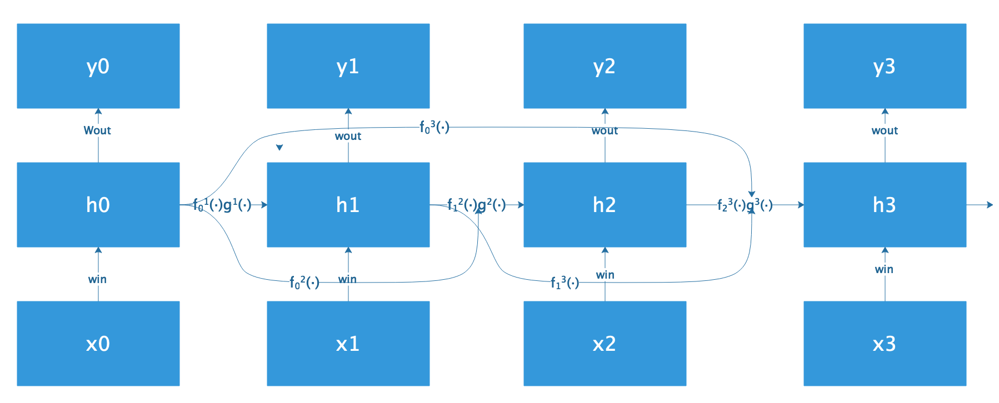
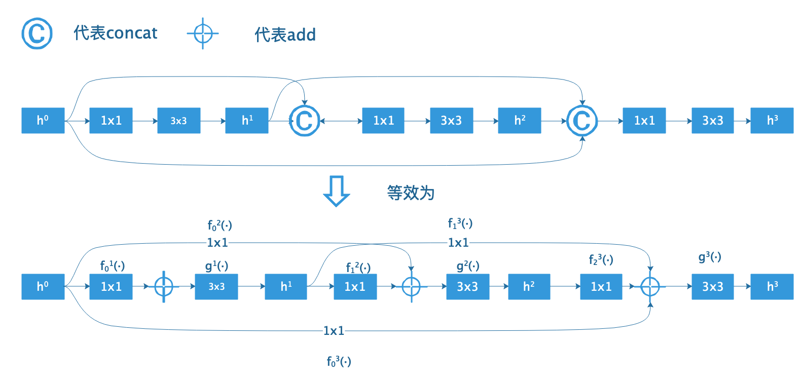
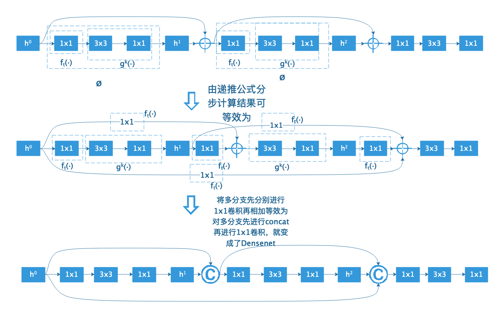
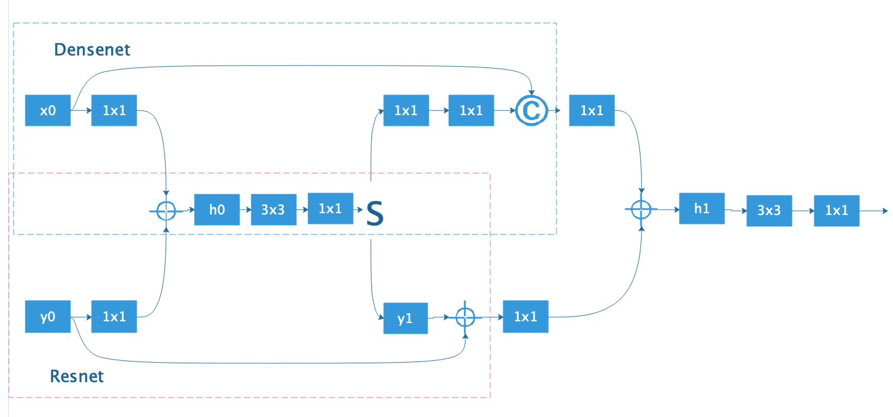

&ensp;&ensp;&ensp;&ensp;**DPN**从**HORNN**的角度来分析了**Resnet**和**Densenet**,分析结果得出**Resnet**是权重共享的特殊情况下的**Densenet**,并且**Resnet**能够进行特征复用，而**Densenet**能够产生新的特征，最后结合这两个网络的特点提出了能够利用这两种特点的**DPN**双通道网络。
&ensp;&ensp;&ensp;&ensp;首先来看一下什么是**HORNN**(Higher order recurrent neural networks),论文给出了**HORNN**的一般形式：
`!$$ h^k = g^k[\sum_{t=0}^{k-1}f_t^k(h^t)] $$`
将上式分步计算：
`!$$ h^1 = g^1[f_0^1(h^0)] $$`
`!$$ h^2 = g^2[f_0^2(h^0)+f_1^2(h^1)] $$`
`!$$ h^3 = g^3[f_0^3(h^0)+f_1^3(h^1)+f_2^3(h^2)] $$`

**注**:在**HORNN**中，ftk(·)代表权重Whk,gk(·)代表非线性变化，如**Rule**或**Sigmoid**，在此处假设ftk(·)恒等于ft(·)，gk(·)相同，但在**HORNN**原文中只有：

`!$$ f_0^1(·) = f_1^2(·) = f_2^3(·) $$`
`!$$ f_0^2(·) = f_1^3(·) $$`
`!$$ f_0^3(·) $$`
**Densenet**的一般形式：

`!$$ h^k = g^k[\sum_{t=0}^{k-1}f_t^k(h^t)] $$`
将上式分步计算：

`!$$ h^1 = g^1[f_0^1(h^0)] $$`
`!$$ h^2 = g^2[f_0^2(h^0)+f_1^2(h^1)] $$`
`!$$ h^3 = g^3[f_0^3(h^0)+f_1^3(h^1)+f_2^3(h^2)] $$`

**注**：在**Densenet**中ftk(·)表示连接的1x1的卷积核，且各不相同，gk(·)代表3x3的卷积核且各不相同。这里的等效与**Resnext**中的第一个等效一样，**将多分支先分别进行1x1卷积再相加等效为对多分支先进行concat再进行1x1卷积**。
**Resnet**的一般形式：

`!$$ r^k = \sum_{t=1}^{k-1}f_t(h^t) = r^(k-1) + f_{k-1}(h^{k-1}) $$`
`!$$ h^k = g^k(r^k) $$`
`!$$ r^0 = 0 $$`
`!$$ r^k = r^(k-1) + f_{k-1}(h^{k-1}) = r^{k-1}+f_{k-1}(g^{k-1}r^{k-1}) = r^{k-1} + /phi^{k-1}(r^{k-1}) $$`
&ensp;&ensp;&ensp;&ensp;其中前面三个式子构成了递推公式，且前提条件式tk(·)恒等于ft(·)，最后一个式子将**Densenet**的一般表达式化为了**Resnet**的一般形式。下面将前三个递推公式分步计算：

`!$$ h^1 = g^1(r^1) $$`
`!$$ r^1 = r^0 + f_0(h^0) $$`
`!$$ h^1 = g^1(r^0 + f_0(h^0)) = g^1(f_0(h^0)) $$`
`!$$ h^2 = g^2(r^2) $$`
`!$$ r^2 = r^1 + f_1(h^1) = f_0(h^0) + f_1(h^1) $$`
`!$$ h^2 = g^2(f_0(h^0)+f_1(h^1)) $$`
`!$$ h^3 = g^3(r^3) $$`
`!$$ r^3 = r^2 + f_2(h^2) = f_0(h^0) + f_1(h^1) + f_2(h^2) $$`
`!$$ h^3 = g^3(f_0(h^0) + f_1(h^1) + f_2(h^2)) $$`

最后提出的**DPN**形式为：

`!$$ x^k = \sum{t=1}{k-1}f_t^k(h^t) $$`
`!$$ y^k = \sum{t=1}{k-1}V_t(h^t) = y^{k-1} + /phi^{k-1}(y^{k-1}) $$`
`!$$ r^k = x^k + y^k $$`
`!$$ h^k = g^k(r^k) $$`

最后论文以**Resnext**为主干网络，将输入通过1x1,3x3,1x1的瓶颈结构，并将最后的输出分为两部分，一部分add，一部分concat。
参考：
  &ensp;https://arxiv.org/abs/1707.01629
 **注**：此博客内容为原创，转载请说明出处

