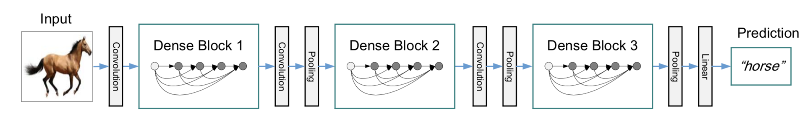
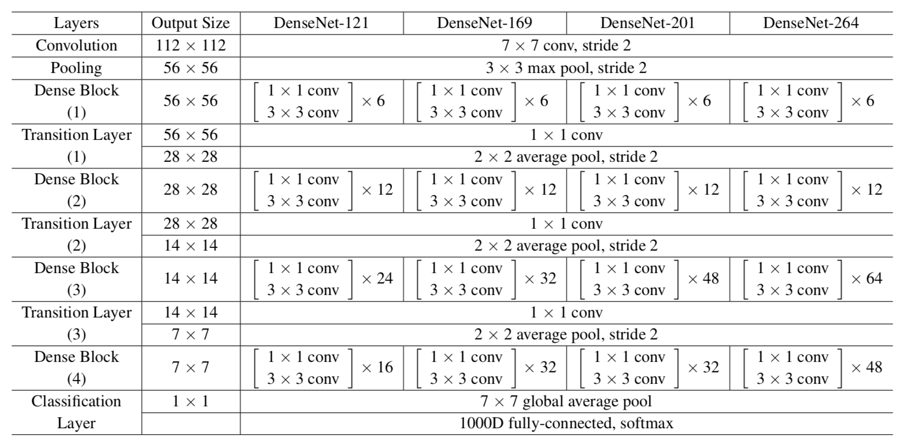
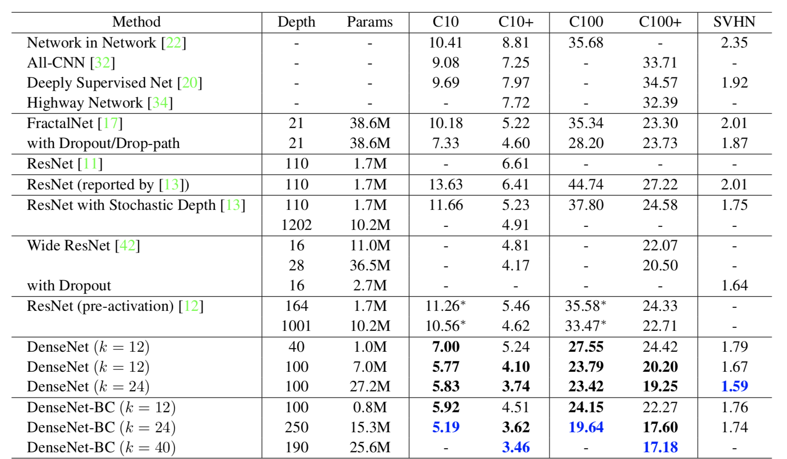

&ensp;&ensp;&ensp;&ensp;**Densenet**和**Resnet**类似都使用了断路连接的方式，但是**Densenet**做的更加“粗暴”，它将第L层前的每一层的输出都连接到第L层上，这样做可以进行特征复用和使用更少的通道数来减少参数量，第l层的输入为k0+k(l-1),输出channel为k，并且称k为增长率。当然这是在**Dense block**中进行的，不然随着网络层数的增加每一层的输入将不断增长。

&ensp;&ensp;&ensp;&ensp;同时作者还探索到这种稠密连接结构还具有正则化的效果，可以减少过拟合。其中每个Dense Block包含若干个瓶颈结构，每个瓶颈结构由BN-ReLU-Conv（1x1）和BN-ReLU-Conv（3x3）组成，其中1x1的channel数为4k，3x3的channel数为k，论文中的所有3X3的卷积核都通过padding使其特征图大小不变。在每个Block之间由Transition层连接来进行降维，每个Transition层由一个1x1卷积层，2x2的步长为2的平均池化层组成，其中1x1的卷积层的channel数由一个变量&theta;决定，一般设置为0.5，只对Transition层的1X1输出进行压缩(&theta;<1)称为**Densenet-C**,如果对所有的1x1包括瓶颈层的进行压缩称为**Densenet-BC**。

&ensp;&ensp;&ensp;&ensp;第一层7x7的卷积的输出为2k，在imagenet数据集上作者利用了四个**Dense block**，而在其它数据集作者使用了三个**Dense block**。
&ensp;&ensp;&ensp;&ensp;其不同结构的对比如下：

参考：
  &ensp;https://arxiv.org/abs/1608.06993
 **注**：此博客内容为原创，转载请说明出处
