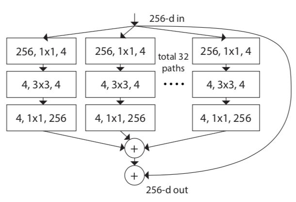
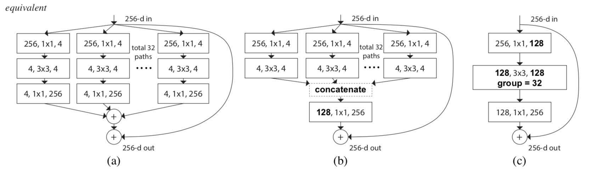
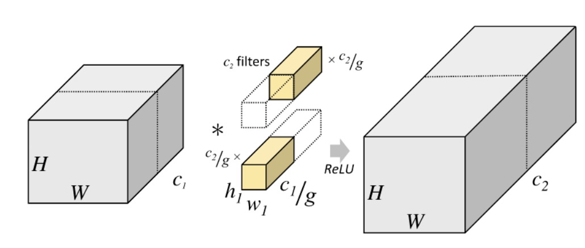

&ensp;&ensp;&ensp;&ensp;作者结合**VGG**堆叠和**Resnet**短路连接的思想提出了更加简单的瓶颈同质多分支结构(即每个分支采用相同的瓶颈结构)和残差连接结构，并将这种分支的个数定义为一个新的维度**cardinality(基)**,记做**C**，这也是**Resnext**名称的由来，**next dimension**。

随后作者分别采用将多分支先分别进行1x1卷积再相加等效为对多分支先进行concat再进行1x1卷积，和将低维度的多分支利用**group**卷积来等效来简化网络结构，这时**group**的组数就代表**C**，最终的网络结构与**Resnet**非常像，只是瓶颈结构的3x3卷积使用了组卷积。

这两种等效方式如下：
1.第一种等效
&ensp;&ensp;&ensp;&ensp;假设有四个矩阵：A1=[1 2],A2=[3 4],B1=[1 2]T,B2=[3 4]T,则:
`!$$ A_1*B_1+A_2*B_2 = 5+25 = 30 $$`
等效为：
[A1,A2] = [1 2 3 4],[B1,B2] = [1 2 3 4]T,
`!$$ [A_1,A_2]*[B_1,B_2] =[1,2,3,4] *[1,2,3,4]^T = 30 $$`
2.分组卷积

假设输入为DF x DF x M,输出为DF x DF x N,卷积核的大小为DK x DK,则组卷积可将计算量压缩为：

`!$$ \frac{D_K*D_K*M*D_F*D_F*N}{(D_K*_D_K*(M\g)*D_F*D_F*(N\g))*g} = \frac{1}{g} $$`
  &ensp;https://arxiv.org/abs/1611.05431
 **注**：此博客内容为原创，转载请说明出处

