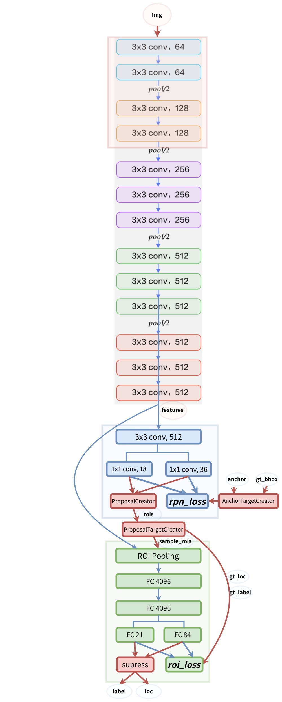
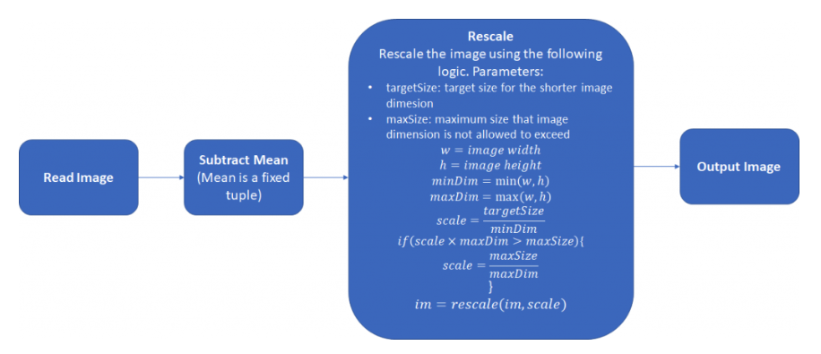
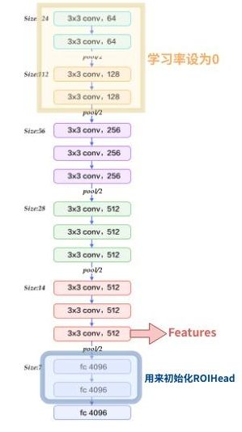
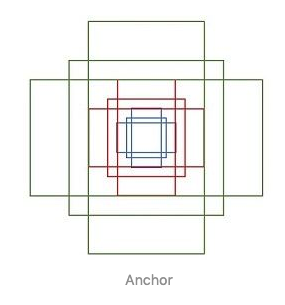
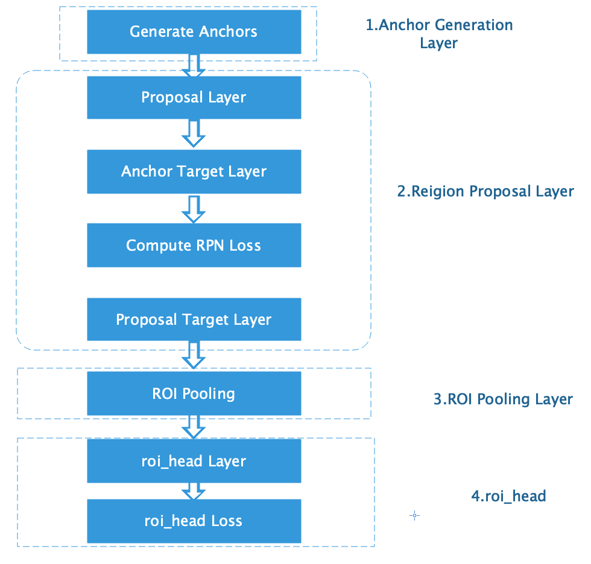
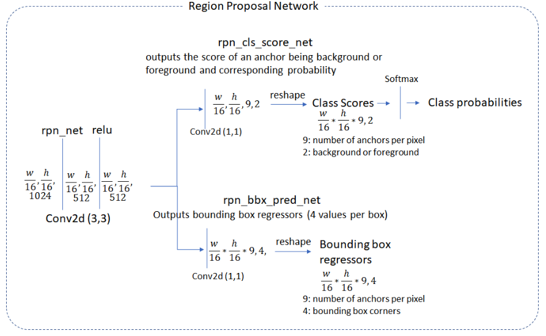
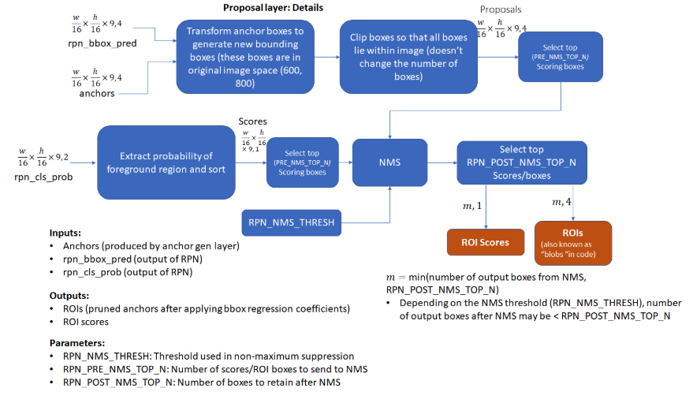
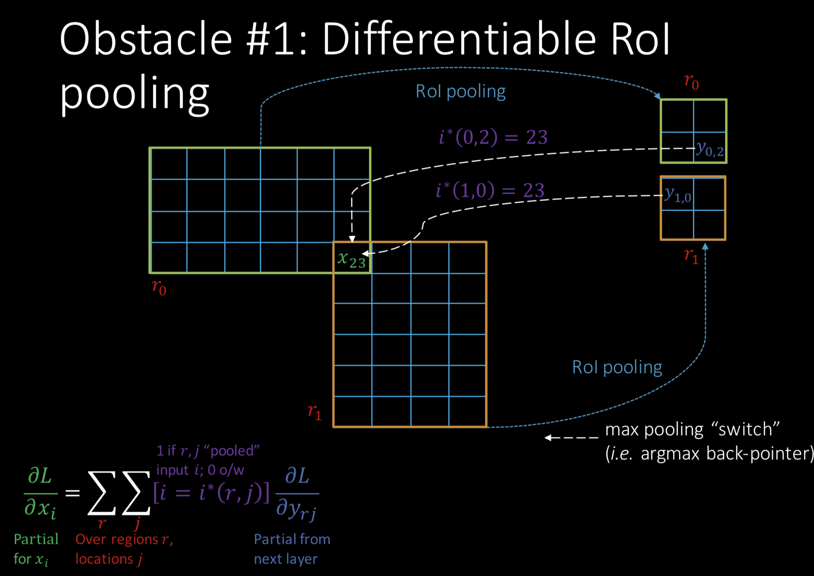

&ensp;&ensp;&ensp;&ensp;在**Fast RCNN**中，rgb大神已经将**RCNN**中提取特征、训练分类器和训练位置回归合并为一个网络，极大的节省了时间和空间开销，现在**Fast RCNN**中面临的另一个瓶颈就是建议框的生成，在**Fast RCNN**中依然使用的是**selective search**的方法，这种方法耗费大量的时间，所以在**Faster RCNN**中，作者继续发力提出了**RPN**来代替**selective search**方法，几乎将这一部分花费的时间降为了0秒（2s -> 0.01s）。
<!--more-->
在网上已经有很多大神对不同版本实现的**Faster RCNN**进行了解读，但是有些细节还是百思不得其解，本想从源码角度来捋一捋，奈何水平有限，caffe版本的源码都不知从何看起。原作者的caffe版本源码见[**py-faster-rcnn**](https://github.com/rbgirshick/py-faster-rcnn)，对于该版本较好的讲解见[一文读懂Faster RCNN](https://zhuanlan.zhihu.com/p/31426458)。Tensorflow版本的源码见[**tf-faster-rcnn**](https://github.com/endernewton/tf-faster-rcnn)。pytorch版本的源码见[**ruotianluo/pytorch-faster-rcnn**](https://github.com/ruotianluo/pytorch-faster-rcnn)，对于该版本的讲解见[Object Detection and Classification using R-CNNs](http://www.telesens.co/2018/03/11/object-detection-and-classification-using-r-cnns/)。对于此博客参考的是陈云实现的简易版的pytorch实现[**simple-faster-rcnn-pytorch**](https://github.com/chenyuntc/simple-faster-rcnn-pytorch)，陈云自己的讲解见[从编程实现角度学习Faster R-CNN（附极简实现）](https://zhuanlan.zhihu.com/p/32404424)。这篇博客大部分内容也是参考的前面几个讲解，在此对这几位的工作表示膜拜。虽然是简易版但其效果也不错，而且更适合来理解网络的脉络。从编程角度来说， Faster R-CNN主要分为四部分：
&ensp;&ensp;&ensp;&ensp;1）Dataset：数据，提供符合要求的数据格式（目前常用数据集是VOC和COCO）。
&ensp;&ensp;&ensp;&ensp;2）Extractor： 利用CNN提取图片特征features（原始论文用的是ZF和VGG16，后来人们又用ResNet101）。
&ensp;&ensp;&ensp;&ensp;3）RPN(Region Proposal Network): 负责提供候选区域rois（每张图给出大概2000个候选框）。
&ensp;&ensp;&ensp;&ensp;4）RoIHead： 负责对rois分类和微调。对RPN找出的rois，判断它是否包含目标，并修正框的位置和座标。
Faster R-CNN整体的流程可以分为三步：
&ensp;&ensp;&ensp;&ensp;1）提特征： 图片（img）经过预训练的网络（Extractor），提取到了图片的特征（feature）。
&ensp;&ensp;&ensp;&ensp;2）Region Proposal： 利用提取的特征（feature），经过RPN网络，找出一定数量的rois（region of interests）。
&ensp;&ensp;&ensp;&ensp;3）分类与回归：将rois和图像特征features，输入到RoIHead，对这些rois进行分类，判断都属于什么类别，同时对这些rois的位置进行微调。
在论文中作者给出了**Faster RCNN**三种训练方式：
&ensp;&ensp;&ensp;&ensp;1）交替训练。首先训练RPN，使用proposals训练Fast R-CNN。网络使用Fast R-CNN微调，然后用来初始化RPN,迭代这个过程。
&ensp;&ensp;&ensp;&ensp;2）近似联合训练。在每次SGD迭代时，前馈计算生成区域推荐，看作训练Fast R-CNN检测器的预计算推荐。反馈传播中共享层传播RPN和Fast R-CNN结合的损失。这种方式忽略了关于推荐框坐标的导数。
&ensp;&ensp;&ensp;&ensp;3）非近似联合训练。Fast R-CNN中的 RoI pooling层接收卷积特征和预测的bounding boxes作为输入，这时反向传播会涉及到box corrdinates.这时需要RoI poling层关于box coordinates是可微的。
作者的论文中实现的是4步交替训练，第一步，训练RPN，用预训练的ImageNet模型初始化，端到端微调区域推荐任务。第二步，通过Fast R-CNN训练一个单独的检测网络，从第一步的模型中产生推荐框。这个网络也用ImageNet模型初始化。这时候两个网络不共享卷积层。第三步，使用检测网络初始化RPN训练，固定了共享卷积层，只微调独属于RPN的层。现在两个网络共享卷积层。第四步，使卷积层固定，微调独属于Fast R-CNN的层。这样，两个网络共享了卷基层，形成了一个统一网络。陈云的pytorch实现是采用的近似联合训练，其网络模型如下：

<div align=center></div>

需要注意的是： 蓝色箭头的线代表着计算图，梯度反向传播会经过。而红色部分的线不需要进行反向传播（论文了中提到了ProposalCreator生成RoIs的过程也能进行反向传播，但需要专门的算法）

##### 详细实现
&ensp;&ensp;&ensp;&ensp;接下来从大佬的代码一步一步来捋一遍**Faster RCNN**的**详细实现**。
###### 数据部分
<div align=center></div>
对与每张图片，需要进行如下数据处理：
&ensp;&ensp;&ensp;&ensp;1）图片进行缩放，使得长边小于等于1000，短边小于等于600（至少有一个等于）。
&ensp;&ensp;&ensp;&ensp;2）对相应的bounding boxes 也也进行同等尺度的缩放。
&ensp;&ensp;&ensp;&ensp;3）对于Caffe 的VGG16 预训练模型，需要图片位于0-255，BGR格式，并减去一个均值，使得图片像素的均值为0。

最后返回四个值供模型训练：
&ensp;&ensp;&ensp;&ensp;1）images ： 3×H×W ，BGR三通道，宽W，高H
&ensp;&ensp;&ensp;&ensp;2）bboxes： 4×K , K个bounding boxes，每个bounding box的左上角和右下角的座标，形如（Y_min,X_min, Y_max,X_max）,第Y行，第X列。（**注意bboxes的坐标形式**）
&ensp;&ensp;&ensp;&ensp;3）labels：K， 对应K个bounding boxes的label（对于VOC取值范围为[0-19]）
&ensp;&ensp;&ensp;&ensp;4）scale: 缩放的倍数, 原图H' ×W'被resize到了HxW（scale=H/H' ）
从作者github的readme里给出的**begin training**中可以看出其入口程序为train.py，并且需要传入三个参数
```javascript
python train.py train --env='fasterrcnn-caffe' --plot-every=100 --caffe-pretrain
```
&ensp;&ensp;&ensp;&ensp;在train.py文件中的载入数据主要代码为：
```javascript
    #解析输入参数，为config类的对象，config类位于config.py中，其定义了网络的配置参数，env代表可视化环境，plot-every代表每多少次迭代可视化一次，caffe-pretrain代表迁移学习的模型
    opt._parse(kwargs)
	#解析voc数据，并对其做预处理
    dataset = Dataset(opt)
    print('load data')
    dataloader = data_.DataLoader(dataset, \
                                  batch_size=1, \
                                  shuffle=True, \
                                  # pin_memory=True,
                                  num_workers=opt.num_workers)
    testset = TestDataset(opt)
    test_dataloader = data_.DataLoader(testset,
                                       batch_size=1,
                                       num_workers=opt.test_num_workers,
                                       shuffle=False, \
                                       pin_memory=True
                                       )
```
&ensp;&ensp;&ensp;&ensp;对数据的处理首先通过\data\voc_dataset.py中的get_example函数将voc的每一个xml文件解析为(img, bbox, label, difficult)类型的输出，但是difficult数据并没有使用，随后将这样的每一个数据对进行预处理，其预处理函数为\data\dataset.py中的Transfrom类：
```javascript
class Transform(object):
    def __init__(self, min_size=600, max_size=1000):
        self.min_size = min_size
        self.max_size = max_size

    def __call__(self, in_data):
        img, bbox, label = in_data
        _, H, W = img.shape#获取图片的长和宽
        img = preprocess(img, self.min_size, self.max_size)#对图片进行缩放
        _, o_H, o_W = img.shape
        scale = o_H / H
        bbox = util.resize_bbox(bbox, (H, W), (o_H, o_W))#对ground_truth进行缩放
        # horizontally flip进行数据增广
        img, params = util.random_flip(
            img, x_random=True, return_param=True)
        bbox = util.flip_bbox(
            bbox, (o_H, o_W), x_flip=params['x_flip'])
        return img, bbox, label, scale
```
其中对图片预处理的preprocess的主要代码为：
```javascript
       def preprocess(img, min_size=600, max_size=1000):
            C, H, W = img.shape
            scale1 = min_size / min(H, W)
			scale2 = max_size / max(H, W)
			scale = min(scale1, scale2)#获取需要缩放的比例
			img = img / 255.#因为在pytorch_normalze中的使用的是归一化的数据
			img = sktsf.resize(img, (C, H * scale, W * scale), mode='reflect',anti_aliasing=False)#使用skimage包对图片进行resize
			# both the longer and shorter should be less than
			# max_size and min_size
			if opt.caffe_pretrain:
				normalize = caffe_normalize#对数据进行通道转换，减均值，这一步是不是应该放在resize之前？
			else:
				normalize = pytorch_normalze
			return normalize(img)
```
其caffe_normalize的代码如下：
```javascript
		def caffe_normalize(img):
			"""
			return appr -125-125 BGR
			"""
			img = img[[2, 1, 0], :, :]  # RGB-BGR
			img = img * 255
			mean = np.array([122.7717, 115.9465, 102.9801]).reshape(3, 1, 1)
			img = (img - mean).astype(np.float32, copy=True)
			return img
```
&ensp;&ensp;&ensp;&ensp;以上就是对数据的处理过程,在得到数据之后便可以进行到训练阶段了。
###### Extractor
&ensp;&ensp;&ensp;&ensp;Extractor使用的是预训练好的模型提取图片的特征。论文中主要使用的是Caffe的预训练模型VGG16。修改如下图所示：为了节省显存，前四层卷积层的学习率设为0。Conv5_3的输出作为图片特征（feature）。conv5_3相比于输入，下采样了16倍，也就是说输入的图片尺寸为3×H×W，那么feature的尺寸就是C×(H/16)×(W/16)。VGG最后的三层全连接层的前两层，一般用来初始化RoIHead的部分参数，这个稍后再讲。总之，一张图片，经过extractor之后，会得到一个C×(H/16)×(W/16)的feature map。
<div align=center></div>
&ensp;&ensp;&ensp;&ensp;对于网络结构的划分在\model\faster_rcnn_vgg16.py中的FasterRCNNVGG16类中，其定义为：
```javascript
class FasterRCNNVGG16(FasterRCNN):

    feat_stride = 16  # downsample 16x for output of conv5 in vgg16

    def __init__(self,
                 n_fg_class=20,
                 ratios=[0.5, 1, 2],
                 anchor_scales=[8, 16, 32]
                 ):
                 
        extractor, classifier = decom_vgg16()#将vgg16模型分为特征提取器和分类器两部分

        rpn = RegionProposalNetwork(
            512, 512,
            ratios=ratios,
            anchor_scales=anchor_scales,
            feat_stride=self.feat_stride,
        )#定义RPN

        head = VGG16RoIHead(
            n_class=n_fg_class + 1,
            roi_size=7,
            spatial_scale=(1. / self.feat_stride),
            classifier=classifier
        )#用vgg_16的分类部分作为最后的经过RPN之后的网络的头部

        super(FasterRCNNVGG16, self).__init__(
            extractor,
            rpn,
            head,
        )
```
&ensp;&ensp;&ensp;&ensp;从上述代码可以看出将vgg16模型通过decom_vgg16分为特征提取器和分类器两部分,decom_vgg16函数同样位于faster_rcnn_vgg16.py,其代码如下：

```javascript
	def decom_vgg16():
		# the 30th layer of features is relu of conv5_3
		if opt.caffe_pretrain:
			model = vgg16(pretrained=False)#载入vgg16模型
			if not opt.load_path:
				model.load_state_dict(t.load(opt.caffe_pretrain_path))#利用caffe版训练的参数进行迁移
		else:
			model = vgg16(not opt.load_path)

		features = list(model.features)[:30]#取前30层作为特征提取器
		classifier = model.classifier#取最后的三个全连接层作为分类器

		classifier = list(classifier)
		del classifier[6]#去掉最后一个全连接层，只需要前两个全连接层
		if not opt.use_drop:
			del classifier[5]#去掉drop_out层
			del classifier[2]#去掉drop_out层
		classifier = nn.Sequential(*classifier)

		# freeze top4 conv
		for layer in features[:10]:
			for p in layer.parameters():
				p.requires_grad = False#设置梯度不更新
				
		return nn.Sequential(*features), classifier
```
&ensp;&ensp;&ensp;&ensp;上述代码中其中VGG的classifier定义如下：
```javascript
	self.classifier = nn.Sequential(
				nn.Linear(512 * 7 * 7, 4096),
				nn.ReLU(True),
				nn.Dropout(),#对应classifier[2]
				nn.Linear(4096, 4096),
				nn.ReLU(True),
				nn.Dropout(),#对应classifier[5]
				nn.Linear(4096, num_classes),#对应classifier[6]
			)
```
&ensp;&ensp;&ensp;&ensp;将网络整体分为上述的 extractor，RPN，classifier，VGG16RoIHead后首先将数据部分得到的**scale**之后的image送入extrator进行特征提取得到vgg_16的conv_5之后的特征图，这个过程中对图片进行了下采样，使得图片的大小变为了预处理**scale**之后的1/16倍。提取完特征图之后便进入到了最重要的第三个部分**RPN**层。
###### RPN
&ensp;&ensp;&ensp;&ensp;在**RPN**中，作者提出了**anchor**。**Anchor**是大小和尺寸固定的候选框。论文中用到的**anchor**有三种尺寸和三种比例，如下图所示，三种尺寸分别是小（蓝128）中（红256）大（绿512），三个比例分别是1:1，1:2，2:1。3×3的组合总共有9种**anchor**。

<div align=center></div>
&ensp;&ensp;&ensp;&ensp;然后用这9种**anchor**在特征图（feature）左右上下移动，每一个特征图上的点都有9个anchor，最终生成了 (H/16)× (W/16)×9个**anchor**. 对于一个512×62×37的**feature map**，有 62×37×9~ 20000个anchor。 也就是对一张图片，有20000个左右的anchor。这种做法很像是暴力穷举，20000多个anchor，哪怕是蒙也能够把绝大多数的ground truth bounding boxes蒙中。
&ensp;&ensp;&ensp;&ensp;在此我想先把所有生成的anchor的总体处理流程做一个介绍，如下图：
<div align=center></div>
**Anchor Generation Layer**：负责在训练RPN的时候，从上万个anchor中选择一些(比如256)进行训练，以使得正负样本比例大概是1:1. 同时给出训练的位置参数目标。 即返回gt_rpn_loc和gt_rpn_label。
**Proposal Layer**：在RPN中，从上万个anchor中，选择一定数目（2000或者300），调整大小和位置，生成RoIs，用以Fast R-CNN训练或者测试。首先根据RPN得到的anchor的偏移和放缩值$(t_y,t_x,t_h,t_w)$对anchor进行调整得到($\hat{G_x}$,$\hat{G_y}$,$\hat{G_w}$,$\hat{G_h}$)，然后根据anchor的前景概率排序应用nms来筛选出2000个anchor。
**Anchor Target Layer**：Anchor Target Layer的目标是产生一组“好”anchor和相应的前景/背景标签和目标回归系数以训练RPN。 该层的输出仅用于训练RPN网络，并且不被分类层使用。 给定一组anchor（由Anchor Generation Layer生成，Anchor Target Layer标记那些与某些ground truth重叠高于阈值的那些anchor为前景。标记与任何重叠的ground truth低于阈值为背景。Anchor Target Layer还输出一组边界框回归量，这些回归量只对前景框有意义。 没有背景框的“最近的边界框”的概念。
**RPN Loss**:RPN的loss包含两部分，一部分是边界框的回归loss，使用smoolth_l1,另一部分是分类loss，使用交叉熵。**注意**参与RPN loss计算的为**Anchor Target Layer**的输出。
**Proposal Target Layer**：负责在训练RoIHead/Fast R-CNN的时候，从RoIs选择一部分(比如128个)用以训练。同时给定训练目标, 返回（sample_RoI, gt_RoI_loc, gt_RoI_label）。
**注意**：其中AnchorTargetCreator和ProposalTargetCreator是为了生成训练的目标，只在训练阶段用到，ProposalCreator是RPN为Fast R-CNN生成RoIs，在训练和测试阶段都会用到。三个共同点在于他们都不需要考虑反向传播（因此不同框架间可以共享numpy实现）。
**ROI Pooling Layer**：实现空间变换网络，该网络在给定由提议目标层产生的区域提议的边界框坐标的情况下对输入要素图进行采样。 这些坐标通常不在整数边界上，因此需要基于插值的采样。
**roi_head**：分类层采用ROI池层生成的输出特征图，并将它们传递给roi_head，最后输出两个全连接层。 第一层为每个区域提议生成类概率分布，第二层生成一组特定于类的边界框回归量。**注意**这部分的输入是**Proposal Target Layer**的输出。
**roi_head Loss**: 与RPN loss类似，分类丢失是在优化期间最小化以训练分类网络的度量。 在反向传播期间，误差梯度也流向RPN网络，因此训练分类层也会修改RPN网络的权重。 
###### Reigon Proposal Network
<div align=center></div>
&ensp;&ensp;&ensp;&ensp;**anchor**的数量和**feature map**相关，不同的**feature map**对应的**anchor**数量也不一样。接下来**RPN**在**Extractor**输出的**feature maps**的基础之上，先增加了一个卷积（用来语义空间转换？），然后利用两个1x1的卷积分别进行二分类（是否为正样本）和位置回归。进行分类的卷积核通道数为9×2（9个anchor，每个anchor二分类，使用交叉熵损失），进行回归的卷积核通道数为9×4（9个anchor，每个anchor有4个位置参数）。RPN是一个全卷积网络（fully convolutional network），这样对输入图片的尺寸就没有要求了。
RPN在自身训练的同时，还会提供RoIs（region of interests）给Fast RCNN（RoIHead）作为训练样本。RPN生成RoIs的过程(ProposalCreator)如下：

&ensp;&ensp;&ensp;&ensp;1）对于每张图片，利用它的feature map， 计算 (H/16)× (W/16)×9（大概20000）个anchor属于前景的概率，以及对应的位置参数。
&ensp;&ensp;&ensp;&ensp;2）选取概率较大的12000个anchor。
&ensp;&ensp;&ensp;&ensp;3）利用回归的位置参数，修正这12000个anchor的位置，得到RoIs。
&ensp;&ensp;&ensp;&ensp;4）利用非极大值（(Non-maximum suppression, NMS）抑制，选出概率最大的2000个RoIs。


**注意**在inference的时候，为了提高处理速度，12000和2000分别变为6000和300。
**注意**这部分的操作不需要进行反向传播，因此可以利用numpy/tensor实现。RPN的输出：RoIs（形如2000×4或者300×4的tensor）
&ensp;&ensp;&ensp;&ensp;**RPN**定义在\model\region_proposal_network.py中，其代码如下：
```javascript
class RegionProposalNetwork(nn.Module):
    """Region Proposal Network introduced in Faster R-CNN.

    This is Region Proposal Network introduced in Faster R-CNN [#]_.
    This takes features extracted from images and propose
    class agnostic bounding boxes around "objects".

    .. [#] Shaoqing Ren, Kaiming He, Ross Girshick, Jian Sun. \
    Faster R-CNN: Towards Real-Time Object Detection with \
    Region Proposal Networks. NIPS 2015.

    Args:
        in_channels (int): The channel size of input.
        mid_channels (int): The channel size of the intermediate tensor.
        ratios (list of floats): This is ratios of width to height of
            the anchors.
        anchor_scales (list of numbers): This is areas of anchors.
            Those areas will be the product of the square of an element in
            :obj:`anchor_scales` and the original area of the reference
            window.
        feat_stride (int): Stride size after extracting features from an
            image.
        initialW (callable): Initial weight value. If :obj:`None` then this
            function uses Gaussian distribution scaled by 0.1 to
            initialize weight.
            May also be a callable that takes an array and edits its values.
        proposal_creator_params (dict): Key valued paramters for
            :class:`model.utils.creator_tools.ProposalCreator`.

    .. seealso::
        :class:`~model.utils.creator_tools.ProposalCreator`

    """

    def __init__(
            self, in_channels=512, mid_channels=512, ratios=[0.5, 1, 2],
            anchor_scales=[8, 16, 32], feat_stride=16,
            proposal_creator_params=dict(),
    ):
        super(RegionProposalNetwork, self).__init__()
        self.anchor_base = generate_anchor_base(
            anchor_scales=anchor_scales, ratios=ratios)#得到基础的9个anchor
        self.feat_stride = feat_stride
        self.proposal_layer = ProposalCreator(self, **proposal_creator_params)
        n_anchor = self.anchor_base.shape[0]
        self.conv1 = nn.Conv2d(in_channels, mid_channels, 3, 1, 1)#参数分为为in_channels,out_channels,kenel_size,stride,padding
        self.score = nn.Conv2d(mid_channels, n_anchor * 2, 1, 1, 0)
        self.loc = nn.Conv2d(mid_channels, n_anchor * 4, 1, 1, 0)
        normal_init(self.conv1, 0, 0.01)
        normal_init(self.score, 0, 0.01)
        normal_init(self.loc, 0, 0.01)

    def forward(self, x, img_size, scale=1.):
        """Forward Region Proposal Network.

        Here are notations.

        * :math:`N` is batch size.
        * :math:`C` channel size of the input.
        * :math:`H` and :math:`W` are height and witdh of the input feature.
        * :math:`A` is number of anchors assigned to each pixel.

        Args:
            x (~torch.autograd.Variable): The Features extracted from images.
                Its shape is :math:`(N, C, H, W)`.
            img_size (tuple of ints): A tuple :obj:`height, width`,
                which contains image size after scaling.
            scale (float): The amount of scaling done to the input images after
                reading them from files.

        Returns:
            (~torch.autograd.Variable, ~torch.autograd.Variable, array, array, array):

            This is a tuple of five following values.

            * **rpn_locs**: Predicted bounding box offsets and scales for \
                anchors. Its shape is :math:`(N, H W A, 4)`.
            * **rpn_scores**:  Predicted foreground scores for \
                anchors. Its shape is :math:`(N, H W A, 2)`.
            * **rois**: A bounding box array containing coordinates of \
                proposal boxes.  This is a concatenation of bounding box \
                arrays from multiple images in the batch. \
                Its shape is :math:`(R', 4)`. Given :math:`R_i` predicted \
                bounding boxes from the :math:`i` th image, \
                :math:`R' = \\sum _{i=1} ^ N R_i`.
            * **roi_indices**: An array containing indices of images to \
                which RoIs correspond to. Its shape is :math:`(R',)`.
            * **anchor**: Coordinates of enumerated shifted anchors. \
                Its shape is :math:`(H W A, 4)`.

        """
        n, _, hh, ww = x.shape
        anchor = _enumerate_shifted_anchor(
            np.array(self.anchor_base),
            self.feat_stride, hh, ww)#通过偏移得到所有的anchor，偏移之后得到的anchor是相对于原图大小的

        n_anchor = anchor.shape[0] // (hh * ww) #得到每张图片上生成的anchor数量
        h = F.relu(self.conv1(x))#经过3x3的卷积

        rpn_locs = self.loc(h)#经过1x1的卷积，输出为(N, n_anchor * 4, H, w)
        # UNNOTE: check whether need contiguous
        # A: Yes
        rpn_locs = rpn_locs.permute(0, 2, 3, 1).contiguous().view(n, -1, 4)#转换维度为(N, H W A, 4)
        rpn_scores = self.score(h)#经过1x1的卷积，输出为(N, n_anchor * 2, H, w)
        rpn_scores = rpn_scores.permute(0, 2, 3, 1).contiguous()#转换维度为(N,H,W,n_anchor * 2)
        rpn_softmax_scores = F.softmax(rpn_scores.view(n, hh, ww, n_anchor, 2), dim=4)#对最后一个维度进行softmax
        rpn_fg_scores = rpn_softmax_scores[:, :, :, :, 1].contiguous()
        rpn_fg_scores = rpn_fg_scores.view(n, -1)
        rpn_scores = rpn_scores.view(n, -1, 2)#转换维度为(N, H W A, 2)

        rois = list()
        roi_indices = list()
        for i in range(n):#n代表batch_size,此处n=1
            roi = self.proposal_layer(
                rpn_locs[i].cpu().data.numpy(),#输入维度为(H W A, 4)
                rpn_fg_scores[i].cpu().data.numpy(),#输入维度为(H W A, )
                anchor, img_size,
                scale=scale)#筛选出了2000个候选框来后面送入ProposalTargetCreator
            batch_index = i * np.ones((len(roi),), dtype=np.int32)
            rois.append(roi)
            roi_indices.append(batch_index)

        rois = np.concatenate(rois, axis=0)
        roi_indices = np.concatenate(roi_indices, axis=0)
        return rpn_locs, rpn_scores, rois, roi_indices, anchor
```
&ensp;&ensp;&ensp;&ensp;从上面的代码可以看出，首先通过generate_anchor_base函数得到9个基础的anchor，然后通过偏移得到所有的anchor，接着将conv_5之后的特征图经过两个1x1得到每个anchor的分类和位置回归，最后将得到的anchor,分类和位置回归通过proposal_layer的筛选得到2000个anchor。
&ensp;&ensp;&ensp;&ensp;generate_anchor_base函数定义在\model\utils\bbox_tools中，其代码如下：
```javascript
	def generate_anchor_base(base_size=16, ratios=[0.5, 1, 2],
							 anchor_scales=[8, 16, 32]):
		"""Generate anchor base windows by enumerating aspect ratio and scales.

		Generate anchors that are scaled and modified to the given aspect ratios.
		Area of a scaled anchor is preserved when modifying to the given aspect
		ratio.

		:obj:`R = len(ratios) * len(anchor_scales)` anchors are generated by this
		function.
		The :obj:`i * len(anchor_scales) + j` th anchor corresponds to an anchor
		generated by :obj:`ratios[i]` and :obj:`anchor_scales[j]`.

		For example, if the scale is :math:`8` and the ratio is :math:`0.25`,
		the width and the height of the base window will be stretched by :math:`8`.
		For modifying the anchor to the given aspect ratio,
		the height is halved and the width is doubled.

		Args:
			base_size (number): The width and the height of the reference window.
			ratios (list of floats): This is ratios of width to height of
				the anchors.
			anchor_scales (list of numbers): This is areas of anchors.
				Those areas will be the product of the square of an element in
				:obj:`anchor_scales` and the original area of the reference
				window.

		Returns:
			~numpy.ndarray:
			An array of shape :math:`(R, 4)`.
			Each element is a set of coordinates of a bounding box.
			The second axis corresponds to
			:math:`(y_{min}, x_{min}, y_{max}, x_{max})` of a bounding box.

		"""
		py = base_size / 2.#中心点y坐标为8
		px = base_size / 2.#中心点x坐标为8

		anchor_base = np.zeros((len(ratios) * len(anchor_scales), 4),
							   dtype=np.float32)
		for i in six.moves.range(len(ratios)):
			for j in six.moves.range(len(anchor_scales)):
				h = base_size * anchor_scales[j] * np.sqrt(ratios[i])
				w = base_size * anchor_scales[j] * np.sqrt(1. / ratios[i])

				index = i * len(anchor_scales) + j
				anchor_base[index, 0] = py - h / 2.#y_min
				anchor_base[index, 1] = px - w / 2.#x_min
				anchor_base[index, 2] = py + h / 2.#y_max
				anchor_base[index, 3] = px + w / 2.#x_max
		return anchor_base
```
&ensp;&ensp;&ensp;&ensp;单独运行此文件，会得到：
```javascript
       array([[ -37.254833,  -82.50967 ,   53.254833,   98.50967 ],
       [ -82.50967 , -173.01933 ,   98.50967 ,  189.01933 ],
       [-173.01933 , -354.03867 ,  189.01933 ,  370.03867 ],
       [ -56.      ,  -56.      ,   72.      ,   72.      ],
       [-120.      , -120.      ,  136.      ,  136.      ],
       [-248.      , -248.      ,  264.      ,  264.      ],
       [ -82.50967 ,  -37.254833,   98.50967 ,   53.254833],
       [-173.01933 ,  -82.50967 ,  189.01933 ,   98.50967 ],
       [-354.03867 , -173.01933 ,  370.03867 ,  189.01933 ]],
      dtype=float32)
```
**注意**得到的anchor大小是相对于原图大小的,生成的anchor的坐标有负数是因为一般是以图片左上角的点为坐标原点。
&ensp;&ensp;&ensp;&ensp;在得到基础的9个anchor之后便进行偏移得到所有的anchor，此部分由_enumerate_shifted_anchor函数实现，其代码为：
```javascript
	def _enumerate_shifted_anchor(anchor_base, feat_stride, height, width):
		# Enumerate all shifted anchors:
		#
		# add A anchors (1, A, 4) to
		# cell K shifts (K, 1, 4) to get
		# shift anchors (K, A, 4)
		# reshape to (K*A, 4) shifted anchors
		# return (K*A, 4)

		# !TODO: add support for torch.CudaTensor
		# xp = cuda.get_array_module(anchor_base)
		# it seems that it can't be boosed using GPU
		import numpy as xp
		shift_y = xp.arange(0, height * feat_stride, feat_stride)
		shift_x = xp.arange(0, width * feat_stride, feat_stride)
		shift_x, shift_y = xp.meshgrid(shift_x, shift_y)得到其网格坐标
		shift = xp.stack((shift_y.ravel(), shift_x.ravel(),
						  shift_y.ravel(), shift_x.ravel()), axis=1)

		A = anchor_base.shape[0]
		K = shift.shape[0]
		anchor = anchor_base.reshape((1, A, 4)) + \
				 shift.reshape((1, K, 4)).transpose((1, 0, 2))
		anchor = anchor.reshape((K * A, 4)).astype(np.float32)
		return anchor
```
###### RPN_Loss
接下来RPN做的事情就是利用（AnchorTargetCreator）将20000多个候选的anchor选出256个anchor进行分类和回归位置。选择过程如下：
&ensp;&ensp;&ensp;&ensp;1）对于每一个ground truth bounding box (gt_bbox)，选择和它重叠度（IoU）最高的一个anchor作为正样本。
&ensp;&ensp;&ensp;&ensp;2）对于剩下的anchor，从中选择和任意一个gt_bbox重叠度超过0.7的anchor，作为正样本，正样本的数目不超过128个。
&ensp;&ensp;&ensp;&ensp;3）随机选择和gt_bbox重叠度小于0.3的anchor作为负样本。负样本和正样本的总数为256，其余的所有anchor标记为dont care。
计算分类损失用的是交叉熵损失，而计算回归损失用的是Smooth_l1_loss. 在计算回归损失的时候，只计算正样本（前景）的损失，不计算负样本的位置损失。
&ensp;&ensp;&ensp;&ensp;其定义的AnchorTargetCreator类定义在/model/utils/creator_tools中，其代码如下：
```javascript
	class AnchorTargetCreator(object):
		"""Assign the ground truth bounding boxes to anchors.

		Assigns the ground truth bounding boxes to anchors for training Region
		Proposal Networks introduced in Faster R-CNN [#]_.

		Offsets and scales to match anchors to the ground truth are
		calculated using the encoding scheme of
		:func:`model.utils.bbox_tools.bbox2loc`.

		.. [#] Shaoqing Ren, Kaiming He, Ross Girshick, Jian Sun. \
		Faster R-CNN: Towards Real-Time Object Detection with \
		Region Proposal Networks. NIPS 2015.

		Args:
			n_sample (int): The number of regions to produce.
			pos_iou_thresh (float): Anchors with IoU above this
				threshold will be assigned as positive.
			neg_iou_thresh (float): Anchors with IoU below this
				threshold will be assigned as negative.
			pos_ratio (float): Ratio of positive regions in the
				sampled regions.

		"""

		def __init__(self,
					 n_sample=256,
					 pos_iou_thresh=0.7, neg_iou_thresh=0.3,
					 pos_ratio=0.5):
			self.n_sample = n_sample
			self.pos_iou_thresh = pos_iou_thresh
			self.neg_iou_thresh = neg_iou_thresh
			self.pos_ratio = pos_ratio

		def __call__(self, bbox, anchor, img_size):
			"""Assign ground truth supervision to sampled subset of anchors.

			Types of input arrays and output arrays are same.

			Here are notations.

			* :math:`S` is the number of anchors.
			* :math:`R` is the number of bounding boxes.

			Args:
				bbox (array): Coordinates of bounding boxes. Its shape is
					:math:`(R, 4)`.
				anchor (array): Coordinates of anchors. Its shape is
					:math:`(S, 4)`.
				img_size (tuple of ints): A tuple :obj:`H, W`, which
					is a tuple of height and width of an image.

			Returns:
				(array, array):

				#NOTE: it's scale not only  offset
				* **loc**: Offsets and scales to match the anchors to \
					the ground truth bounding boxes. Its shape is :math:`(S, 4)`.
				* **label**: Labels of anchors with values \
					:obj:`(1=positive, 0=negative, -1=ignore)`. Its shape \
					is :math:`(S,)`.

			"""

			img_H, img_W = img_size

			n_anchor = len(anchor)#此时输入的anchor为所有的anchor，即大小为H*W*9
			inside_index = _get_inside_index(anchor, img_H, img_W)#筛掉超出图像尺寸的anchor
			anchor = anchor[inside_index]
			argmax_ious, label = self._create_label(
				inside_index, anchor, bbox)#得到每个anchor对应的ground_truth下标及标签

			# compute bounding box regression targets
			loc = bbox2loc(anchor, bbox[argmax_ious])

			# map up to original set of anchors
			label = _unmap(label, n_anchor, inside_index, fill=-1)
			loc = _unmap(loc, n_anchor, inside_index, fill=0)

			return loc, label

		def _create_label(self, inside_index, anchor, bbox):
			# label: 1 is positive, 0 is negative, -1 is dont care
			label = np.empty((len(inside_index),), dtype=np.int32)
			label.fill(-1)

			argmax_ious, max_ious, gt_argmax_ious = \
				self._calc_ious(anchor, bbox, inside_index)

			# assign negative labels first so that positive labels can clobber them
			label[max_ious < self.neg_iou_thresh] = 0

			# positive label: for each gt, anchor with highest iou
			label[gt_argmax_ious] = 1#将每一个gt所对应的重叠率最高的anchor标签设置为pos

			# positive label: above threshold IOU
			label[max_ious >= self.pos_iou_thresh] = 1#将与gt的iou超过阈值的anchor标签设置为pos

			# subsample positive labels if we have too many
			n_pos = int(self.pos_ratio * self.n_sample)
			pos_index = np.where(label == 1)[0]
			if len(pos_index) > n_pos:
				disable_index = np.random.choice(
					pos_index, size=(len(pos_index) - n_pos), replace=False)
				label[disable_index] = -1

			# subsample negative labels if we have too many
			n_neg = self.n_sample - np.sum(label == 1)
			neg_index = np.where(label == 0)[0]
			if len(neg_index) > n_neg:
				disable_index = np.random.choice(
					neg_index, size=(len(neg_index) - n_neg), replace=False)
				label[disable_index] = -1

			return argmax_ious, label

		def _calc_ious(self, anchor, bbox, inside_index):
			# ious between the anchors and the gt boxes
			ious = bbox_iou(anchor, bbox)
			argmax_ious = ious.argmax(axis=1)#返回每行anchor对应ground_truth的iou最大的下标
			max_ious = ious[np.arange(len(inside_index)), argmax_ious]#返回每行anchor对应ground_truth的iou最大的iou值
			gt_argmax_ious = ious.argmax(axis=0)#返回与每个ground_truth的iou最大的下标
			gt_max_ious = ious[gt_argmax_ious, np.arange(ious.shape[1])]#返回与每个ground_truth的iou最大的值
			gt_argmax_ious = np.where(ious == gt_max_ious)[0]#要这一步干嘛？

			return argmax_ious, max_ious, gt_argmax_ious
```
&ensp;&ensp;&ensp;&ensp;在上面调用_get_inside_index来筛掉超出图像尺寸的anchor，然后通过_create_label得到筛掉之后的每个anchor对应的ground_truth下标及标签，然后需要通过_unmap来将筛选的anchor映射回原来的anchor大小，其代码如下：
```javascript
	def _unmap(data, count, index, fill=0):
		# Unmap a subset of item (data) back to the original set of items (of
		# size count)

		if len(data.shape) == 1:
			ret = np.empty((count,), dtype=data.dtype)
			ret.fill(fill)
			ret[index] = data
		else:
			ret = np.empty((count,) + data.shape[1:], dtype=data.dtype)
			ret.fill(fill)
			ret[index, :] = data
		return ret

	def _get_inside_index(anchor, H, W):
		# Calc indicies of anchors which are located completely inside of the image
		# whose size is speficied.
		index_inside = np.where(
			(anchor[:, 0] >= 0) &
			(anchor[:, 1] >= 0) &
			(anchor[:, 2] <= H) &
			(anchor[:, 3] <= W)
		)[0]
		return index_inside
```
&ensp;&ensp;&ensp;&ensp;这时利用得到的gt_rpn_loc，gt_rpn_label和**RPN**的两个1X1卷积得到的rpn_loc和rpn_score便可计算**RPN**的**loss**,其定义在trainer.py中，其主要代码如下：
```javascript
	gt_rpn_loc, gt_rpn_label = self.anchor_target_creator(
				at.tonumpy(bbox),
				anchor,
				img_size)
			gt_rpn_label = at.totensor(gt_rpn_label).long()
			gt_rpn_loc = at.totensor(gt_rpn_loc)
			rpn_loc_loss = _fast_rcnn_loc_loss(
				rpn_loc,
				gt_rpn_loc,
				gt_rpn_label.data,
				self.rpn_sigma)

			# NOTE: default value of ignore_index is -100 ...
			rpn_cls_loss = F.cross_entropy(rpn_score, gt_rpn_label.cuda(), ignore_index=-1)
			_gt_rpn_label = gt_rpn_label[gt_rpn_label > -1]
			_rpn_score = at.tonumpy(rpn_score)[at.tonumpy(gt_rpn_label) > -1]
			self.rpn_cm.add(at.totensor(_rpn_score, False), _gt_rpn_label.data.long())
```
**注意**:此处计算的loss留待后面计算总的loss。


<div align=center></div>
&ensp;&ensp;&ensp;&ensp;这时得到了所有的anchor及其分类和位置的偏移和放缩参数，便可通过proposal_layer来进行筛选，筛选出2000个anchor，其定义在\model\utils\nms\creator_tool.py中的ProposalCreator类，代码为：
```javascript
	class ProposalCreator:
		# unNOTE: I'll make it undifferential
		# unTODO: make sure it's ok
		# It's ok
		"""Proposal regions are generated by calling this object.

		The :meth:`__call__` of this object outputs object detection proposals by
		applying estimated bounding box offsets
		to a set of anchors.

		This class takes parameters to control number of bounding boxes to
		pass to NMS and keep after NMS.
		If the paramters are negative, it uses all the bounding boxes supplied
		or keep all the bounding boxes returned by NMS.

		This class is used for Region Proposal Networks introduced in
		Faster R-CNN [#]_.

		.. [#] Shaoqing Ren, Kaiming He, Ross Girshick, Jian Sun. \
		Faster R-CNN: Towards Real-Time Object Detection with \
		Region Proposal Networks. NIPS 2015.

		Args:
			nms_thresh (float): Threshold value used when calling NMS.
			n_train_pre_nms (int): Number of top scored bounding boxes
				to keep before passing to NMS in train mode.
			n_train_post_nms (int): Number of top scored bounding boxes
				to keep after passing to NMS in train mode.
			n_test_pre_nms (int): Number of top scored bounding boxes
				to keep before passing to NMS in test mode.
			n_test_post_nms (int): Number of top scored bounding boxes
				to keep after passing to NMS in test mode.
			force_cpu_nms (bool): If this is :obj:`True`,
				always use NMS in CPU mode. If :obj:`False`,
				the NMS mode is selected based on the type of inputs.
			min_size (int): A paramter to determine the threshold on
				discarding bounding boxes based on their sizes.

		"""

		def __init__(self,
					 parent_model,
					 nms_thresh=0.7,
					 n_train_pre_nms=12000,
					 n_train_post_nms=2000,
					 n_test_pre_nms=6000,
					 n_test_post_nms=300,
					 min_size=16
					 ):
			self.parent_model = parent_model
			self.nms_thresh = nms_thresh
			self.n_train_pre_nms = n_train_pre_nms
			self.n_train_post_nms = n_train_post_nms
			self.n_test_pre_nms = n_test_pre_nms
			self.n_test_post_nms = n_test_post_nms
			self.min_size = min_size

		def __call__(self, loc, score,
					 anchor, img_size, scale=1.):
			"""input should  be ndarray
			Propose RoIs.

			Inputs :obj:`loc, score, anchor` refer to the same anchor when indexed
			by the same index.

			On notations, :math:`R` is the total number of anchors. This is equal
			to product of the height and the width of an image and the number of
			anchor bases per pixel.

			Type of the output is same as the inputs.

			Args:
				loc (array): Predicted offsets and scaling to anchors.
					Its shape is :math:`(R, 4)`.
				score (array): Predicted foreground probability for anchors.
					Its shape is :math:`(R,)`.
				anchor (array): Coordinates of anchors. Its shape is
					:math:`(R, 4)`.
				img_size (tuple of ints): A tuple :obj:`height, width`,
					which contains image size after scaling.
				scale (float): The scaling factor used to scale an image after
					reading it from a file.

			Returns:
				array:
				An array of coordinates of proposal boxes.
				Its shape is :math:`(S, 4)`. :math:`S` is less than
				:obj:`self.n_test_post_nms` in test time and less than
				:obj:`self.n_train_post_nms` in train time. :math:`S` depends on
				the size of the predicted bounding boxes and the number of
				bounding boxes discarded by NMS.

			"""
			# NOTE: when test, remember
			# faster_rcnn.eval()
			# to set self.traing = False
			if self.parent_model.training:
				n_pre_nms = self.n_train_pre_nms
				n_post_nms = self.n_train_post_nms
			else:
				n_pre_nms = self.n_test_pre_nms
				n_post_nms = self.n_test_post_nms

			# Convert anchors into proposal via bbox transformations.
			# roi = loc2bbox(anchor, loc)
			roi = loc2bbox(anchor, loc)#将每个anchor用位置回归得到的偏移和放缩进行修正

			# Clip predicted boxes to image.将超出特征图部分的框裁掉
			roi[:, slice(0, 4, 2)] = np.clip(
				roi[:, slice(0, 4, 2)], 0, img_size[0])#将大于h的y坐标设置为h
			roi[:, slice(1, 4, 2)] = np.clip(
				roi[:, slice(1, 4, 2)], 0, img_size[1])#将大于w的x坐标设置为w

			# Remove predicted boxes with either height or width < threshold.
			min_size = self.min_size * scale
			hs = roi[:, 2] - roi[:, 0]
			ws = roi[:, 3] - roi[:, 1]
			keep = np.where((hs >= min_size) & (ws >= min_size))[0]
			roi = roi[keep, :]#只保留w和h都大于minsize的roi,去掉过于小的anchor
			score = score[keep]

			# Sort all (proposal, score) pairs by score from highest to lowest.
			# Take top pre_nms_topN (e.g. 6000).
			order = score.ravel().argsort()[::-1]
			if n_pre_nms > 0:
				order = order[:n_pre_nms]
			roi = roi[order, :]#保留按score排序后的n_pre_nms个roi

			# Apply nms (e.g. threshold = 0.7).
			# Take after_nms_topN (e.g. 300).

			# unNOTE: somthing is wrong here!
			# TODO: remove cuda.to_gpu
			keep = non_maximum_suppression(
				cp.ascontiguousarray(cp.asarray(roi)),
				thresh=self.nms_thresh)#进行nms
			if n_post_nms > 0:
				keep = keep[:n_post_nms]#保留按score排序后的n_post_nms个roi
			roi = roi[keep]
			return roi
```
&ensp;&ensp;&ensp;&ensp;上述代码中的loc2bbox函数主要用于对生成的anchor进行调整，其代码位于\model\utils\nms\bbox_tools.py中，代码如下，其返回的就是($\hat{G_x}$,$\hat{G_y}$,$\hat{G_w}$,$\hat{G_h}$)：
```javascript
	def loc2bbox(src_bbox, loc):
		"""Decode bounding boxes from bounding box offsets and scales.

		Given bounding box offsets and scales computed by
		:meth:`bbox2loc`, this function decodes the representation to
		coordinates in 2D image coordinates.

		Given scales and offsets :math:`t_y, t_x, t_h, t_w` and a bounding
		box whose center is :math:`(y, x) = p_y, p_x` and size :math:`p_h, p_w`,
		the decoded bounding box's center :math:`\\hat{g}_y`, :math:`\\hat{g}_x`
		and size :math:`\\hat{g}_h`, :math:`\\hat{g}_w` are calculated
		by the following formulas.

		* :math:`\\hat{g}_y = p_h t_y + p_y`
		* :math:`\\hat{g}_x = p_w t_x + p_x`
		* :math:`\\hat{g}_h = p_h \\exp(t_h)`
		* :math:`\\hat{g}_w = p_w \\exp(t_w)`

		The decoding formulas are used in works such as R-CNN [#]_.

		The output is same type as the type of the inputs.

		.. [#] Ross Girshick, Jeff Donahue, Trevor Darrell, Jitendra Malik. \
		Rich feature hierarchies for accurate object detection and semantic \
		segmentation. CVPR 2014.

		Args:
			src_bbox (array): A coordinates of bounding boxes.
				Its shape is :math:`(R, 4)`. These coordinates are
				:math:`p_{ymin}, p_{xmin}, p_{ymax}, p_{xmax}`.
			loc (array): An array with offsets and scales.
				The shapes of :obj:`src_bbox` and :obj:`loc` should be same.
				This contains values :math:`t_y, t_x, t_h, t_w`.

		Returns:
			array:
			Decoded bounding box coordinates. Its shape is :math:`(R, 4)`. \
			The second axis contains four values \
			:math:`\\hat{g}_{ymin}, \\hat{g}_{xmin},
			\\hat{g}_{ymax}, \\hat{g}_{xmax}`.

		"""

		if src_bbox.shape[0] == 0:
			return xp.zeros((0, 4), dtype=loc.dtype)

		src_bbox = src_bbox.astype(src_bbox.dtype, copy=False)

		src_height = src_bbox[:, 2] - src_bbox[:, 0]
		src_width = src_bbox[:, 3] - src_bbox[:, 1]
		src_ctr_y = src_bbox[:, 0] + 0.5 * src_height
		src_ctr_x = src_bbox[:, 1] + 0.5 * src_width

		dy = loc[:, 0::4]
		dx = loc[:, 1::4]
		dh = loc[:, 2::4]
		dw = loc[:, 3::4]

		ctr_y = dy * src_height[:, xp.newaxis] + src_ctr_y[:, xp.newaxis]
		ctr_x = dx * src_width[:, xp.newaxis] + src_ctr_x[:, xp.newaxis]
		h = xp.exp(dh) * src_height[:, xp.newaxis]
		w = xp.exp(dw) * src_width[:, xp.newaxis]

		dst_bbox = xp.zeros(loc.shape, dtype=loc.dtype)
		dst_bbox[:, 0::4] = ctr_y - 0.5 * h
		dst_bbox[:, 1::4] = ctr_x - 0.5 * w
		dst_bbox[:, 2::4] = ctr_y + 0.5 * h
		dst_bbox[:, 3::4] = ctr_x + 0.5 * w

		return dst_bbox
```
&ensp;&ensp;&ensp;&ensp;在进行n_pre_nms筛选过后需要通过nms来去掉冗余框，此时通过non_maximum_suppression函数来实现，其定义在\model\utils\nms\non_maxmum_suppression.py中，为了加速这一部分使用cupy来实现，其nms_kernel的代码如下（没看太懂）：
```javascript
    #define DIVUP(m,n) ((m) / (n) + ((m) % (n) > 0))
    int const threadsPerBlock = sizeof(unsigned long long) * 8;
	extern "C"
	__global__
	void nms_kernel(const int n_bbox, const float thresh,
					const float *dev_bbox,
					unsigned long long *dev_mask) {
	  const int row_start = blockIdx.y;
	  const int col_start = blockIdx.x;

	  const int row_size =
			min(n_bbox - row_start * threadsPerBlock, threadsPerBlock);
	  const int col_size =
			min(n_bbox - col_start * threadsPerBlock, threadsPerBlock);

	  __shared__ float block_bbox[threadsPerBlock * 4];
	  if (threadIdx.x < col_size) {
		block_bbox[threadIdx.x * 4 + 0] =
			dev_bbox[(threadsPerBlock * col_start + threadIdx.x) * 4 + 0];
		block_bbox[threadIdx.x * 4 + 1] =
			dev_bbox[(threadsPerBlock * col_start + threadIdx.x) * 4 + 1];
		block_bbox[threadIdx.x * 4 + 2] =
			dev_bbox[(threadsPerBlock * col_start + threadIdx.x) * 4 + 2];
		block_bbox[threadIdx.x * 4 + 3] =
			dev_bbox[(threadsPerBlock * col_start + threadIdx.x) * 4 + 3];
	  }
	  __syncthreads();

	  if (threadIdx.x < row_size) {
		const int cur_box_idx = threadsPerBlock * row_start + threadIdx.x;
		const float *cur_box = dev_bbox + cur_box_idx * 4;
		int i = 0;
		unsigned long long t = 0;
		int start = 0;
		if (row_start == col_start) {
		  start = threadIdx.x + 1;
		}
		for (i = start; i < col_size; i++) {
		  #通过计算iou并与thresh比较
		  if (devIoU(cur_box, block_bbox + i * 4) >= thresh) {
			t |= 1ULL << i;
		  }
		}
		const int col_blocks = DIVUP(n_bbox, threadsPerBlock);
		dev_mask[cur_box_idx * col_blocks + col_start] = t;
	  }
	}
	'''
```
&ensp;&ensp;&ensp;&ensp;其计算iou的代码如下：
```javascript
	inline float devIoU(float const *const bbox_a, float const *const bbox_b) {
	  float top = max(bbox_a[0], bbox_b[0]);#max(a_ymin,b_ymin)
	  float bottom = min(bbox_a[2], bbox_b[2]);#min(a_ymax,b_ymax)
	  float left = max(bbox_a[1], bbox_b[1]);#max(a_xmin,b_xmin)
	  float right = min(bbox_a[3], bbox_b[3]);#min(a_xmax,b_xmax)
	  float height = max(bottom - top, 0.f);#如果bottom - top <= 0 说明没有共同区域
	  float width = max(right - left, 0.f);#如果right - left <= 0 说明没有共同区域
	  float area_i = height * width;
	  float area_a = (bbox_a[2] - bbox_a[0]) * (bbox_a[3] - bbox_a[1]);
	  float area_b = (bbox_b[2] - bbox_b[0]) * (bbox_b[3] - bbox_b[1]);
	  return area_i / (area_a + area_b - area_i);
	}
```
在选出这2000个候选框之后，便要将其送入**proposal_target_creator**层，因为RPN会产生大约2000个RoIs，这2000个RoIs不是都拿去训练，而是利用ProposalTargetCreator 选择128个RoIs用以训练**RoIHead/Fast R-CNN**。选择的规则如下：
&ensp;&ensp;&ensp;&ensp;1）RoIs和gt_bboxes 的IoU大于0.5的，选择一些（比如32个）。
&ensp;&ensp;&ensp;&ensp;2）选择 RoIs和gt_bboxes的IoU小于等于0（或者0.1）的选择一些（比如 128-32=96个）作为负样本。
为了便于训练，对选择出的128个RoIs，还对他们的gt_roi_loc 进行标准化处理（减去均值除以标准差）。


&ensp;&ensp;&ensp;&ensp;**ProposalTargetCreator**定义在/model/utils/creator_tool.py中，其代码如下：
```javascript
    class ProposalTargetCreator(object):
		"""Assign ground truth bounding boxes to given RoIs.

		The :meth:`__call__` of this class generates training targets
		for each object proposal.
		This is used to train Faster RCNN [#]_.

		.. [#] Shaoqing Ren, Kaiming He, Ross Girshick, Jian Sun. \
		Faster R-CNN: Towards Real-Time Object Detection with \
		Region Proposal Networks. NIPS 2015.

		Args:
			n_sample (int): The number of sampled regions.
			pos_ratio (float): Fraction of regions that is labeled as a
				foreground.
			pos_iou_thresh (float): IoU threshold for a RoI to be considered as a
				foreground.
			neg_iou_thresh_hi (float): RoI is considered to be the background
				if IoU is in
				[:obj:`neg_iou_thresh_hi`, :obj:`neg_iou_thresh_hi`).
			neg_iou_thresh_lo (float): See above.

		"""

		def __init__(self,
					 n_sample=128,
					 pos_ratio=0.25, pos_iou_thresh=0.5,
					 neg_iou_thresh_hi=0.5, neg_iou_thresh_lo=0.0
					 ):
			self.n_sample = n_sample
			self.pos_ratio = pos_ratio
			self.pos_iou_thresh = pos_iou_thresh
			self.neg_iou_thresh_hi = neg_iou_thresh_hi
			self.neg_iou_thresh_lo = neg_iou_thresh_lo  # NOTE:default 0.1 in py-faster-rcnn

		def __call__(self, roi, bbox, label,
					 loc_normalize_mean=(0., 0., 0., 0.),
					 loc_normalize_std=(0.1, 0.1, 0.2, 0.2)):
			"""Assigns ground truth to sampled proposals.

			This function samples total of :obj:`self.n_sample` RoIs
			from the combination of :obj:`roi` and :obj:`bbox`.
			The RoIs are assigned with the ground truth class labels as well as
			bounding box offsets and scales to match the ground truth bounding
			boxes. As many as :obj:`pos_ratio * self.n_sample` RoIs are
			sampled as foregrounds.

			Offsets and scales of bounding boxes are calculated using
			:func:`model.utils.bbox_tools.bbox2loc`.
			Also, types of input arrays and output arrays are same.

			Here are notations.

			* :math:`S` is the total number of sampled RoIs, which equals \
				:obj:`self.n_sample`.
			* :math:`L` is number of object classes possibly including the \
				background.

			Args:
				roi (array): Region of Interests (RoIs) from which we sample.
					Its shape is :math:`(R, 4)`
				bbox (array): The coordinates of ground truth bounding boxes.
					Its shape is :math:`(R', 4)`.
				label (array): Ground truth bounding box labels. Its shape
					is :math:`(R',)`. Its range is :math:`[0, L - 1]`, where
					:math:`L` is the number of foreground classes.
				loc_normalize_mean (tuple of four floats): Mean values to normalize
					coordinates of bouding boxes.
				loc_normalize_std (tupler of four floats): Standard deviation of
					the coordinates of bounding boxes.

			Returns:
				(array, array, array):

				* **sample_roi**: Regions of interests that are sampled. \
					Its shape is :math:`(S, 4)`.
				* **gt_roi_loc**: Offsets and scales to match \
					the sampled RoIs to the ground truth bounding boxes. \
					Its shape is :math:`(S, 4)`.
				* **gt_roi_label**: Labels assigned to sampled RoIs. Its shape is \
					:math:`(S,)`. Its range is :math:`[0, L]`. The label with \
					value 0 is the background.

			"""
			n_bbox, _ = bbox.shape

			roi = np.concatenate((roi, bbox), axis=0)#为什么要放在一起,这样肯定会选择bbox当作roi，其和自己对应的iou=1

			pos_roi_per_image = np.round(self.n_sample * self.pos_ratio)
			iou = bbox_iou(roi, bbox)#计算roi与每一个bbox的iou，roi维度(N, 4)，bbox维度(k, 4), 则iou维度为(N, k)
			gt_assignment = iou.argmax(axis=1)
			max_iou = iou.max(axis=1)
			# Offset range of classes from [0, n_fg_class - 1] to [1, n_fg_class].
			# The label with value 0 is the background.
			gt_roi_label = label[gt_assignment] + 1

			# Select foreground RoIs as those with >= pos_iou_thresh IoU.
			pos_index = np.where(max_iou >= self.pos_iou_thresh)[0]
			pos_roi_per_this_image = int(min(pos_roi_per_image, pos_index.size))
			if pos_index.size > 0:
				pos_index = np.random.choice(
					pos_index, size=pos_roi_per_this_image, replace=False)

			# Select background RoIs as those within
			# [neg_iou_thresh_lo, neg_iou_thresh_hi).
			neg_index = np.where((max_iou < self.neg_iou_thresh_hi) &
								 (max_iou >= self.neg_iou_thresh_lo))[0]
			neg_roi_per_this_image = self.n_sample - pos_roi_per_this_image
			neg_roi_per_this_image = int(min(neg_roi_per_this_image,
											 neg_index.size))
			if neg_index.size > 0:
				neg_index = np.random.choice(
					neg_index, size=neg_roi_per_this_image, replace=False)

			# The indices that we're selecting (both positive and negative).
			keep_index = np.append(pos_index, neg_index)
			gt_roi_label = gt_roi_label[keep_index]
			gt_roi_label[pos_roi_per_this_image:] = 0  # negative labels --> 0
			sample_roi = roi[keep_index]

			# Compute offsets and scales to match sampled RoIs to the GTs.
			gt_roi_loc = bbox2loc(sample_roi, bbox[gt_assignment[keep_index]])#计算与其对应的bbox的偏移和缩放值
			gt_roi_loc = ((gt_roi_loc - np.array(loc_normalize_mean, np.float32)
						   ) / np.array(loc_normalize_std, np.float32))#标准化处理

			return sample_roi, gt_roi_loc, gt_roi_label
```
&ensp;&ensp;&ensp;&ensp;此时计算iou的过程为批量计算，定义在/model/utils/bbox_tools.py中，其代码如下：
```javascript
	def bbox_iou(bbox_a, bbox_b):
		"""Calculate the Intersection of Unions (IoUs) between bounding boxes.

		IoU is calculated as a ratio of area of the intersection
		and area of the union.

		This function accepts both :obj:`numpy.ndarray` and :obj:`cupy.ndarray` as
		inputs. Please note that both :obj:`bbox_a` and :obj:`bbox_b` need to be
		same type.
		The output is same type as the type of the inputs.

		Args:
			bbox_a (array): An array whose shape is :math:`(N, 4)`.
				:math:`N` is the number of bounding boxes.
				The dtype should be :obj:`numpy.float32`.
			bbox_b (array): An array similar to :obj:`bbox_a`,
				whose shape is :math:`(K, 4)`.
				The dtype should be :obj:`numpy.float32`.

		Returns:
			array:
			An array whose shape is :math:`(N, K)`. \
			An element at index :math:`(n, k)` contains IoUs between \
			:math:`n` th bounding box in :obj:`bbox_a` and :math:`k` th bounding \
			box in :obj:`bbox_b`.

		"""
		if bbox_a.shape[1] != 4 or bbox_b.shape[1] != 4:
			raise IndexError

		# top left
		tl = xp.maximum(bbox_a[:, None, :2], bbox_b[:, :2])
		# bottom right
		br = xp.minimum(bbox_a[:, None, 2:], bbox_b[:, 2:])

		area_i = xp.prod(br - tl, axis=2) * (tl < br).all(axis=2)
		area_a = xp.prod(bbox_a[:, 2:] - bbox_a[:, :2], axis=1)
		area_b = xp.prod(bbox_b[:, 2:] - bbox_b[:, :2], axis=1)
		return area_i / (area_a[:, None] + area_b - area_i)
```
&ensp;&ensp;&ensp;&ensp;在**ProposalTargetCreator**中还需要通过bbox2loc计算$(t_y,t_x,t_h,t_w)$,其也定义在/model/utils/bbox_tools.py中，其代码如下：
```javascript
	def bbox2loc(src_bbox, dst_bbox):
		"""Encodes the source and the destination bounding boxes to "loc".

		Given bounding boxes, this function computes offsets and scales
		to match the source bounding boxes to the target bounding boxes.
		Mathematcially, given a bounding box whose center is
		:math:`(y, x) = p_y, p_x` and
		size :math:`p_h, p_w` and the target bounding box whose center is
		:math:`g_y, g_x` and size :math:`g_h, g_w`, the offsets and scales
		:math:`t_y, t_x, t_h, t_w` can be computed by the following formulas.

		* :math:`t_y = \\frac{(g_y - p_y)} {p_h}`
		* :math:`t_x = \\frac{(g_x - p_x)} {p_w}`
		* :math:`t_h = \\log(\\frac{g_h} {p_h})`
		* :math:`t_w = \\log(\\frac{g_w} {p_w})`

		The output is same type as the type of the inputs.
		The encoding formulas are used in works such as R-CNN [#]_.

		.. [#] Ross Girshick, Jeff Donahue, Trevor Darrell, Jitendra Malik. \
		Rich feature hierarchies for accurate object detection and semantic \
		segmentation. CVPR 2014.

		Args:
			src_bbox (array): An image coordinate array whose shape is
				:math:`(R, 4)`. :math:`R` is the number of bounding boxes.
				These coordinates are
				:math:`p_{ymin}, p_{xmin}, p_{ymax}, p_{xmax}`.
			dst_bbox (array): An image coordinate array whose shape is
				:math:`(R, 4)`.
				These coordinates are
				:math:`g_{ymin}, g_{xmin}, g_{ymax}, g_{xmax}`.

		Returns:
			array:
			Bounding box offsets and scales from :obj:`src_bbox` \
			to :obj:`dst_bbox`. \
			This has shape :math:`(R, 4)`.
			The second axis contains four values :math:`t_y, t_x, t_h, t_w`.

		"""

		height = src_bbox[:, 2] - src_bbox[:, 0]
		width = src_bbox[:, 3] - src_bbox[:, 1]
		ctr_y = src_bbox[:, 0] + 0.5 * height
		ctr_x = src_bbox[:, 1] + 0.5 * width

		base_height = dst_bbox[:, 2] - dst_bbox[:, 0]
		base_width = dst_bbox[:, 3] - dst_bbox[:, 1]
		base_ctr_y = dst_bbox[:, 0] + 0.5 * base_height
		base_ctr_x = dst_bbox[:, 1] + 0.5 * base_width

		eps = xp.finfo(height.dtype).eps
		height = xp.maximum(height, eps)
		width = xp.maximum(width, eps)

		dy = (base_ctr_y - ctr_y) / height
		dx = (base_ctr_x - ctr_x) / width
		dh = xp.log(base_height / height)
		dw = xp.log(base_width / width)

		loc = xp.vstack((dy, dx, dh, dw)).transpose()
		return loc
```
###### RoIHead/Fast RCNN
&ensp;&ensp;&ensp;&ensp;此时通过ProposalTargetCreator便得到了128个(sample_roi, gt_roi_loc, gt_roi_label)RoIs对，接下来便需要得到的每个**sample_roi**通过**RoIHead**层，首先对于ProposalTargetCreator得到的128个RoIs应该经过**ROI Pooling**,使用RoIPooling 将这些不同尺寸的区域全部pooling到同一个尺度（7×7）上。为什么要pooling成7×7的尺度？是为了能够共享权重。在之前讲过，除了用到VGG前几层的卷积之外，最后的全连接层也可以继续利用。**当所有的RoIs都被pooling成（512×7×7）的feature map后，将它reshape 成一个一维的向量，就可以利用VGG16预训练的权重，初始化前两层全连接**。最后再接两个全连接层，分别是：
&ensp;&ensp;&ensp;&ensp;1）FC 21 用来分类，预测RoIs属于哪个类别（20个类+背景）。
&ensp;&ensp;&ensp;&ensp;2）FC 84 用来回归位置（21个类，每个类都有4个位置参数）。
这样便可得到每个**sample_roi**对应的predict_label和predict_loc,同前面的到的gt_roi_loc, gt_roi_label来计算loss。
&ensp;&ensp;&ensp;&ensp;**RoIHead**定义在/model/faster_rcnn_vgg16.py中，其代码如下：
```javascript
	class VGG16RoIHead(nn.Module):
		"""Faster R-CNN Head for VGG-16 based implementation.
		This class is used as a head for Faster R-CNN.
		This outputs class-wise localizations and classification based on feature
		maps in the given RoIs.

		Args:
			n_class (int): The number of classes possibly including the background.
			roi_size (int): Height and width of the feature maps after RoI-pooling.
			spatial_scale (float): Scale of the roi is resized.
			classifier (nn.Module): Two layer Linear ported from vgg16

		"""

		def __init__(self, n_class, roi_size, spatial_scale,
					 classifier):
			# n_class includes the background
			super(VGG16RoIHead, self).__init__()

			self.classifier = classifier
			self.cls_loc = nn.Linear(4096, n_class * 4)
			self.score = nn.Linear(4096, n_class)

			normal_init(self.cls_loc, 0, 0.001)
			normal_init(self.score, 0, 0.01)

			self.n_class = n_class
			self.roi_size = roi_size
			self.spatial_scale = spatial_scale
			self.roi = RoIPooling2D(self.roi_size, self.roi_size, self.spatial_scale)

		def forward(self, x, rois, roi_indices):
			"""Forward the chain.

			We assume that there are :math:`N` batches.

			Args:
				x (Variable): 4D image variable.
				rois (Tensor): A bounding box array containing coordinates of
					proposal boxes.  This is a concatenation of bounding box
					arrays from multiple images in the batch.
					Its shape is :math:`(R', 4)`. Given :math:`R_i` proposed
					RoIs from the :math:`i` th image,
					:math:`R' = \\sum _{i=1} ^ N R_i`.
				roi_indices (Tensor): An array containing indices of images to
					which bounding boxes correspond to. Its shape is :math:`(R',)`.

			"""
			# in case roi_indices is  ndarray
			roi_indices = at.totensor(roi_indices).float()
			rois = at.totensor(rois).float()
			indices_and_rois = t.cat([roi_indices[:, None], rois], dim=1)
			# NOTE: important: yx->xy
			xy_indices_and_rois = indices_and_rois[:, [0, 2, 1, 4, 3]]#生成的base_anchor的坐标为(y_{min}, x_{min}, y_{max}, x_{max}
			indices_and_rois =  xy_indices_and_rois.contiguous()

			pool = self.roi(x, indices_and_rois)#roi pooling层
			pool = pool.view(pool.size(0), -1)
			fc7 = self.classifier(pool)
			roi_cls_locs = self.cls_loc(fc7)
			roi_scores = self.score(fc7)
			return roi_cls_locs, roi_scores
```
&ensp;&ensp;&ensp;&ensp;**roi pooling**层也是用cupy实现的，其主要定义在/model/utils/roi_cupy.py中，其代码如下：
```javascript
	kernel_forward = '''
		extern "C"
		__global__ void roi_forward(const float* const bottom_data,const float* const bottom_rois,
					float* top_data, int* argmax_data,
					const double spatial_scale,const int channels,const int height, 
					const int width, const int pooled_height, 
					const int pooled_width,const int NN
		){

		int idx = blockIdx.x * blockDim.x + threadIdx.x;
		if(idx>=NN)
			return;
		const int pw = idx % pooled_width;
		const int ph = (idx / pooled_width) % pooled_height;
		const int c = (idx / pooled_width / pooled_height) % channels;
		int num = idx / pooled_width / pooled_height / channels;
		const int roi_batch_ind = bottom_rois[num * 5 + 0];
		const int roi_start_w = round(bottom_rois[num * 5 + 1] * spatial_scale);
		const int roi_start_h = round(bottom_rois[num * 5 + 2] * spatial_scale);
		const int roi_end_w = round(bottom_rois[num * 5 + 3] * spatial_scale);
		const int roi_end_h = round(bottom_rois[num * 5 + 4] * spatial_scale);
		// Force malformed ROIs to be 1x1
		const int roi_width = max(roi_end_w - roi_start_w + 1, 1);
		const int roi_height = max(roi_end_h - roi_start_h + 1, 1);
		const float bin_size_h = static_cast<float>(roi_height)
						/ static_cast<float>(pooled_height);
		const float bin_size_w = static_cast<float>(roi_width)
						/ static_cast<float>(pooled_width);

		int hstart = static_cast<int>(floor(static_cast<float>(ph)
										* bin_size_h));
			int wstart = static_cast<int>(floor(static_cast<float>(pw)
										* bin_size_w));
		int hend = static_cast<int>(ceil(static_cast<float>(ph + 1)
									* bin_size_h));
			int wend = static_cast<int>(ceil(static_cast<float>(pw + 1)
									* bin_size_w));

		// Add roi offsets and clip to input boundaries
		hstart = min(max(hstart + roi_start_h, 0), height);
		hend = min(max(hend + roi_start_h, 0), height);
		wstart = min(max(wstart + roi_start_w, 0), width);
		wend = min(max(wend + roi_start_w, 0), width);
		bool is_empty = (hend <= hstart) || (wend <= wstart);

		// Define an empty pooling region to be zero
		float maxval = is_empty ? 0 : -1E+37;
		// If nothing is pooled, argmax=-1 causes nothing to be backprop'd
		int maxidx = -1;
		const int data_offset = (roi_batch_ind * channels + c) * height * width;
		for (int h = hstart; h < hend; ++h) {
			for (int w = wstart; w < wend; ++w) {
				int bottom_index = h * width + w;
				if (bottom_data[data_offset + bottom_index] > maxval) {
					maxval = bottom_data[data_offset + bottom_index];
					maxidx = bottom_index;
				}
			}
		}
		top_data[idx]=maxval;
		argmax_data[idx]=maxidx;
		}
	'''
	kernel_backward = '''
		extern "C"
		__global__ void roi_backward(const float* const top_diff,
			 const int* const argmax_data,const float* const bottom_rois,
			 float* bottom_diff, const int num_rois,
			 const double spatial_scale, int channels,
			 int height, int width, int pooled_height,
			  int pooled_width,const int NN)
		{

		int idx = blockIdx.x * blockDim.x + threadIdx.x;
		////Importtan >= instead of >
		if(idx>=NN)
			return;
		int w = idx % width;
		int h = (idx / width) % height;
		int c = (idx/ (width * height)) % channels;
		int num = idx / (width * height * channels);

		float gradient = 0;
		// Accumulate gradient over all ROIs that pooled this element
		for (int roi_n = 0; roi_n < num_rois; ++roi_n) {
			// Skip if ROI's batch index doesn't match num
			if (num != static_cast<int>(bottom_rois[roi_n * 5])) {
				continue;
			}

			int roi_start_w = round(bottom_rois[roi_n * 5 + 1]
									* spatial_scale);
			int roi_start_h = round(bottom_rois[roi_n * 5 + 2]
									* spatial_scale);
			int roi_end_w = round(bottom_rois[roi_n * 5 + 3]
									* spatial_scale);
			int roi_end_h = round(bottom_rois[roi_n * 5 + 4]
									* spatial_scale);

			// Skip if ROI doesn't include (h, w)
			const bool in_roi = (w >= roi_start_w && w <= roi_end_w &&
									h >= roi_start_h && h <= roi_end_h);
			if (!in_roi) {
				continue;
			}

			int offset = (roi_n * channels + c) * pooled_height
							* pooled_width;

			// Compute feasible set of pooled units that could have pooled
			// this bottom unit

			// Force malformed ROIs to be 1x1
			int roi_width = max(roi_end_w - roi_start_w + 1, 1);
			int roi_height = max(roi_end_h - roi_start_h + 1, 1);

			float bin_size_h = static_cast<float>(roi_height)
							/ static_cast<float>(pooled_height);
			float bin_size_w = static_cast<float>(roi_width)
							/ static_cast<float>(pooled_width);

			int phstart = floor(static_cast<float>(h - roi_start_h)
								/ bin_size_h);
			int phend = ceil(static_cast<float>(h - roi_start_h + 1)
								/ bin_size_h);
			int pwstart = floor(static_cast<float>(w - roi_start_w)
								/ bin_size_w);
			int pwend = ceil(static_cast<float>(w - roi_start_w + 1)
								/ bin_size_w);

			phstart = min(max(phstart, 0), pooled_height);
			phend = min(max(phend, 0), pooled_height);
			pwstart = min(max(pwstart, 0), pooled_width);
			pwend = min(max(pwend, 0), pooled_width);
			for (int ph = phstart; ph < phend; ++ph) {
				for (int pw = pwstart; pw < pwend; ++pw) {
					int index_ = ph * pooled_width + pw + offset;
					if (argmax_data[index_] == (h * width + w)) {
						gradient += top_diff[index_];
					}
				}
			}
		}
		bottom_diff[idx] = gradient;
		}
	'''
```
&ensp;&ensp;&ensp;&ensp;上面的代码为什么没有注释，因为我也没有看太懂（留下了没有技术的眼泪），不过大家可以移步[**详细的Faster R-CNN源码解析之ROI-Pooling逐行代码解析**](https://www.cnblogs.com/hanjianjian90/p/10540104.html)，其实大概原理如下图：
<div align=center></div>
&ensp;&ensp;&ensp;&ensp;从上图可以看出，roi可能存在重叠的部分，对于重叠的部分在前向的时候每一个区域的max值会对应多个**roi pooling**的值，在反向的时候就要将这些对应的梯度加起来，然后就和一般的**maxpooling**的反向传播一样通过上采样放到对应的位置，对于特征图中不是roi的部分全部置为0(因为在计算反向传播的时候首先初始化了一个特征图大小的全部为0的张量)。
###### roi_head/Fast RCNN loss 
&ensp;&ensp;&ensp;&ensp;这样便可得到每个**sample_roi**对应的predict_loc和predict_label即roi_cls_loc和roi_score,同前面的到的gt_roi_loc, gt_roi_label来计算loss。对于分类问题,直接利用交叉熵损失. 而对于位置的回归损失,一样采用Smooth_L1Loss, 只不过只对正样本计算损失.而且是只对正样本中的这个类别4个参数计算损失。举例来说:
&ensp;&ensp;&ensp;&ensp;1）一个RoI在经过FC 84后会输出一个84维的loc 向量. 如果这个RoI是负样本,则这84维向量不参与计算 Smooth_L1Loss。
&ensp;&ensp;&ensp;&ensp;2）如果这个RoI是正样本,属于label K,那么它的第 K×4, K×4+1 ，K×4+2， K×4+3 这4个数参与计算损失，其余的不参与计算损失。
&ensp;&ensp;&ensp;&ensp;其计算loss的过程在trainer.py中，其主要代码如下：
```javascript
	n_sample = roi_cls_loc.shape[0]
			roi_cls_loc = roi_cls_loc.view(n_sample, -1, 4)
			roi_loc = roi_cls_loc[t.arange(0, n_sample).long().cuda(), \
								  at.totensor(gt_roi_label).long()]
			gt_roi_label = at.totensor(gt_roi_label).long()
			gt_roi_loc = at.totensor(gt_roi_loc)

			roi_loc_loss = _fast_rcnn_loc_loss(
				roi_loc.contiguous(),
				gt_roi_loc,
				gt_roi_label.data,
				self.roi_sigma)

			roi_cls_loss = nn.CrossEntropyLoss()(roi_score, gt_roi_label.cuda())
			self.roi_cm.add(at.totensor(roi_score, False), gt_roi_label.data.long())
```
&ensp;&ensp;&ensp;&ensp;其中_fast_rcnn_loc_loss函数及其调用的_smooth_l1_loss定义如下：
```javascript
	def _smooth_l1_loss(x, t, in_weight, sigma):
		sigma2 = sigma ** 2
		diff = in_weight * (x - t)
		abs_diff = diff.abs()
		flag = (abs_diff.data < (1. / sigma2)).float()
		y = (flag * (sigma2 / 2.) * (diff ** 2) +
			 (1 - flag) * (abs_diff - 0.5 / sigma2))
		return y.sum()

	def _fast_rcnn_loc_loss(pred_loc, gt_loc, gt_label, sigma):
		in_weight = t.zeros(gt_loc.shape).cuda()
		# Localization loss is calculated only for positive rois.
		# NOTE:  unlike origin implementation, 
		# we don't need inside_weight and outside_weight, they can calculate by gt_label
		in_weight[(gt_label > 0).view(-1, 1).expand_as(in_weight).cuda()] = 1
		loc_loss = _smooth_l1_loss(pred_loc, gt_loc, in_weight.detach(), sigma)
		# Normalize by total number of negtive and positive rois.
		loc_loss /= ((gt_label >= 0).sum().float()) # ignore gt_label==-1 for rpn_loss
		return loc_loss
```
###### total loss
&ensp;&ensp;&ensp;&ensp;因为这个版本的代码使用的是近似联合训练，所以其总的loss为**RPN loss**与**roi_head/Fast RCNN  loss**之和，其代码为：
```javascript
	losses = [rpn_loc_loss, rpn_cls_loss, roi_loc_loss, roi_cls_loss]
	losses = losses + [sum(losses)]#[rpn_loc_loss, rpn_cls_loss, roi_loc_loss, roi_cls_loss, sum(losses)]
	return LossTuple(*losses)
```
**注意**：此处并没有使用$N_{cls}$和$N_{reg}$进行标准化，因为论文中也提到了通过实验发现这种归一化是不必要的。

参考：
  &ensp;https://zhuanlan.zhihu.com/p/32404424
  &ensp;https://zhuanlan.zhihu.com/p/31426458
  &ensp;http://www.telesens.co/2018/03/11/object-detection-and-classification-using-r-cnns/
  &ensp;https://www.cnblogs.com/hanjianjian90/p/10540104.html
  
 **注**：此博客内容为原创，转载请说明出处


