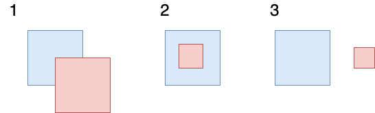
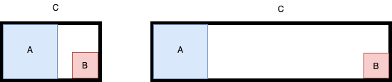
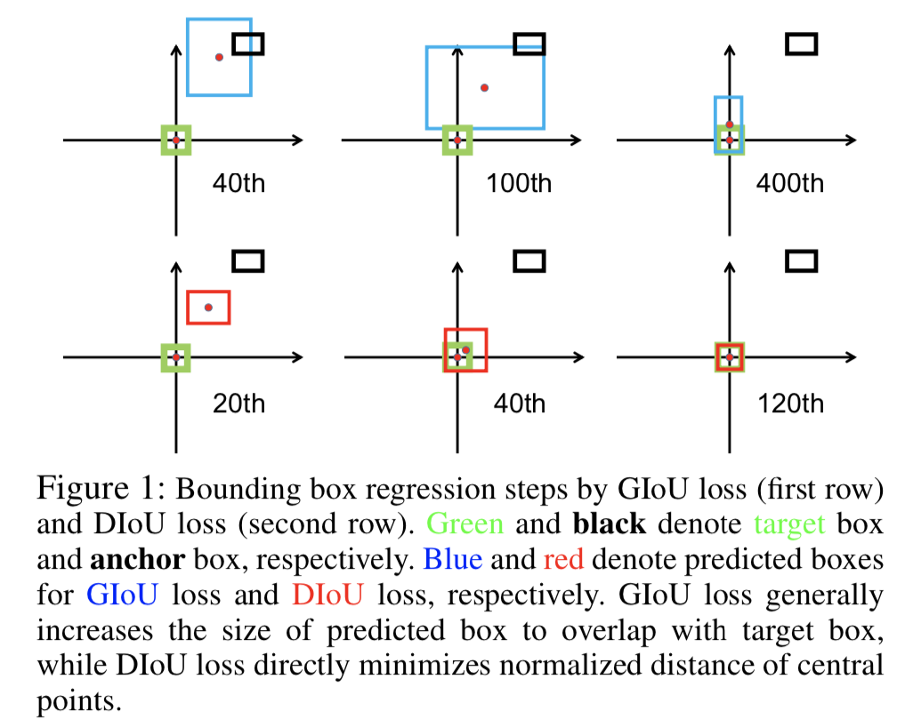
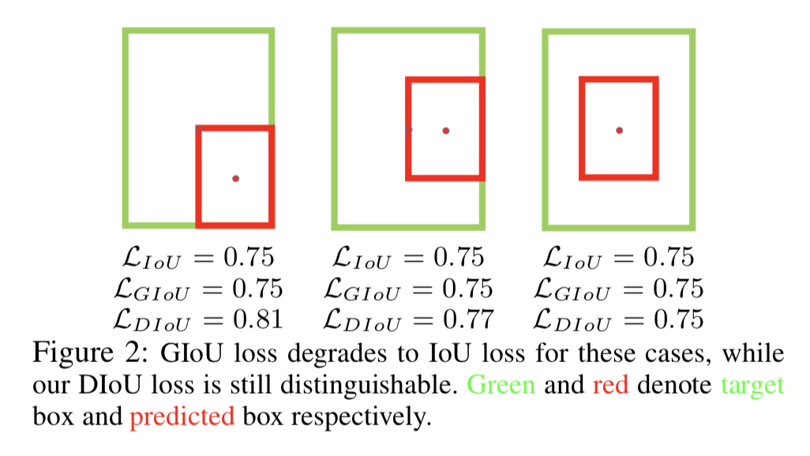

&ensp;&ensp;&ensp;&ensp;不论在one stage还是two stage的目标检测网络中，只要是anchor base的网络都需要进行bbox的回归，对于回归的结果我们通常用IoU指标来进行衡量，但是在回归的时候却采用l_n norm的形式，为了解决这两者的不一致性，我们可以直接采用IoU来作为Loss函数来进行回归。
<!--more-->
最直观的想法是可以直接使用IoU作为Loss，即LIoU = 1 - IoU。但是这种做法却有一个缺点，就是其无法解决non-overlapping 下的梯度不变的情况，就是在没有重叠的情况下，IoU始终为0，LIoU始终为1。为了改善这种情况Hamid Rezatofighi等人提出了GIoU（generalized IoU loss），在了解GIoU之前，我们首先分析一下目标框和预测框的所有可能的形式，如下图所示。

上图中第一种情况为部分相互重叠，第二种情况为相互包含，第三种情况为无重。对于最后一种情况，IoU为0，LIoU始终为1，这当然是不合理的，因为这时候的两者之间的距离也应该被考虑进去，在GIoU中作者就解决了这一问题，通过引入一个惩罚项来将距离纳入考量。具体的GIoU如下式所示：
$$ GIoU = IoU -  \frac{|C-(A\cupB)|}{|C|} $$
其中A、B分别代表目标框和预测框，C代表能够包含A和B的最小矩形。这时候如下图分析上面的第三种情况：

这时对于non-overlapping的情况下，GIoU为负值，当A和B非常远时，GIoU为-1。此时的LGIoU可以定义为：
$$ LGIoU = 1 - GIoU = 1 - IoU + \frac{|C-(A\cupB)|}{|C|} $$
这时的$0 \geq LGIoU \leq 2$。
但是GIoU Loss也有一个缺点就是其会逐渐退化成IoU Loss，因此Zhaohui Zheng等人提出了DIoU和CIoU，首先我们分析其退化情况，如下图所示：

从上图中我们可以看出GIoU的优化过程就是首先将预测框不断的放大使其能够和目标框产生重叠最后相互包含，然后进一步优化，但是当相互包含时的GIoU=IoU如下图所示，这样将会使收敛速度变慢。

基于此Zhaohui Zheng等人总结了边界框回归中的三个几何因素，即重叠区域，中心点距离和纵横比，在此基础上提出了完全IoU（CIoU）损失，从而实现更快的收敛和更好的性能。在IoU和GIoU中都考虑了重叠区域因素，在引入中心点距离后作者提出了LDIoU，
$$ LDIoU  = 1 - IoU + \frac{{\rho}^2(b,b^{gt})}{C^2} $$
其中$ {\rho}^2(b,b^{gt}) $代表预测框和目标框中心点的距离，C代表能够包含目标框和预测框最小矩形的对角线的距离，如下图所示：

在LDIoU的基础上作者考虑了纵横比之后提出了LCIoU，即：
$$  LCIoU  = 1 - IoU + \frac{{\rho}^2(b,b^{gt})}{C^2} + \alhpa\nu $$
其中
$$ \nu = \frac{4}{\pi^2}(arctan\frac{w^{gt}}{h^{gt}} - arctan\frac{w}{h})^2 $$
\alpha为平衡参数，为
$$ \alpha = \frac{\nu}{(1-IoU) + \nu} $$

参考：
   &ensp;https://arxiv.org/abs/1902.09630
  &ensp;https://arxiv.org/abs/1911.08287
 **注**：此博客内容为原创，转载请说明出处