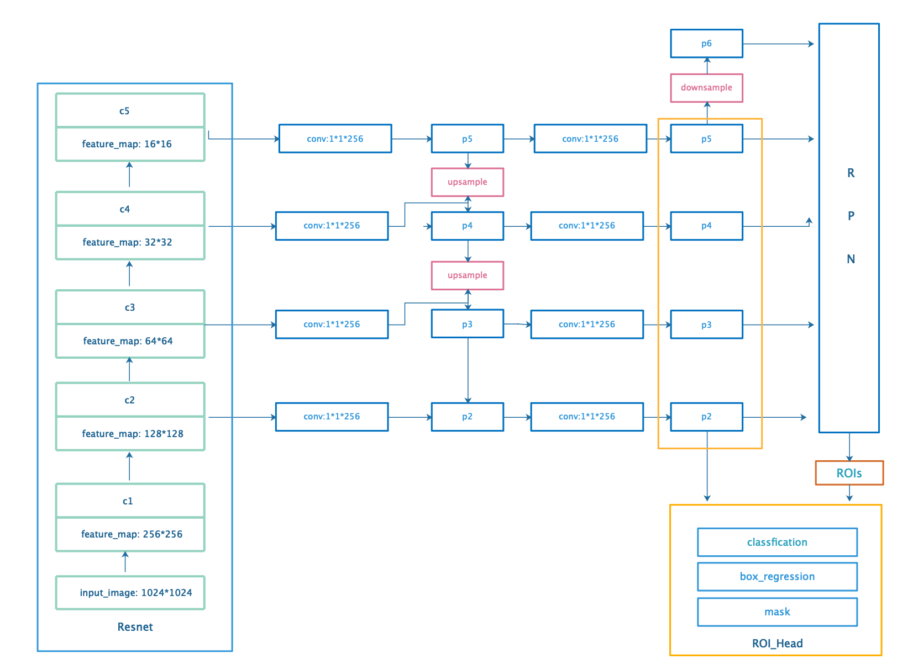
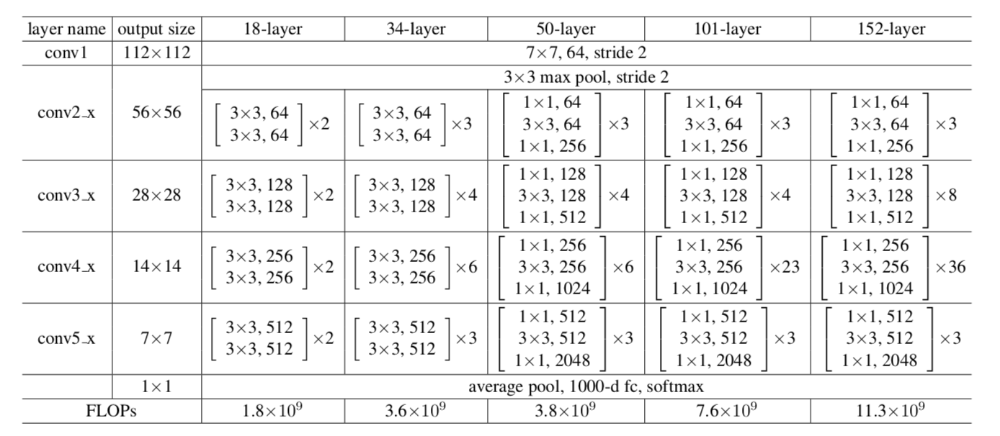
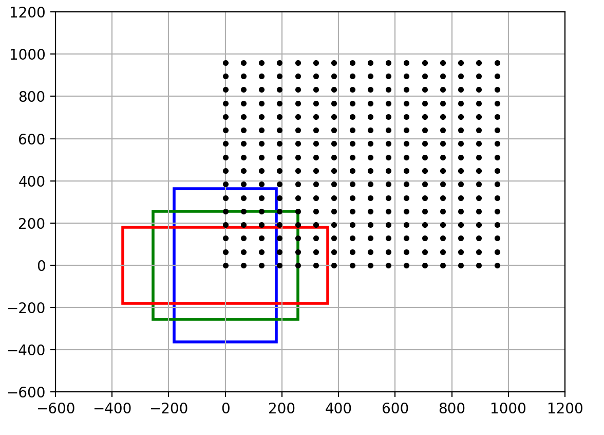
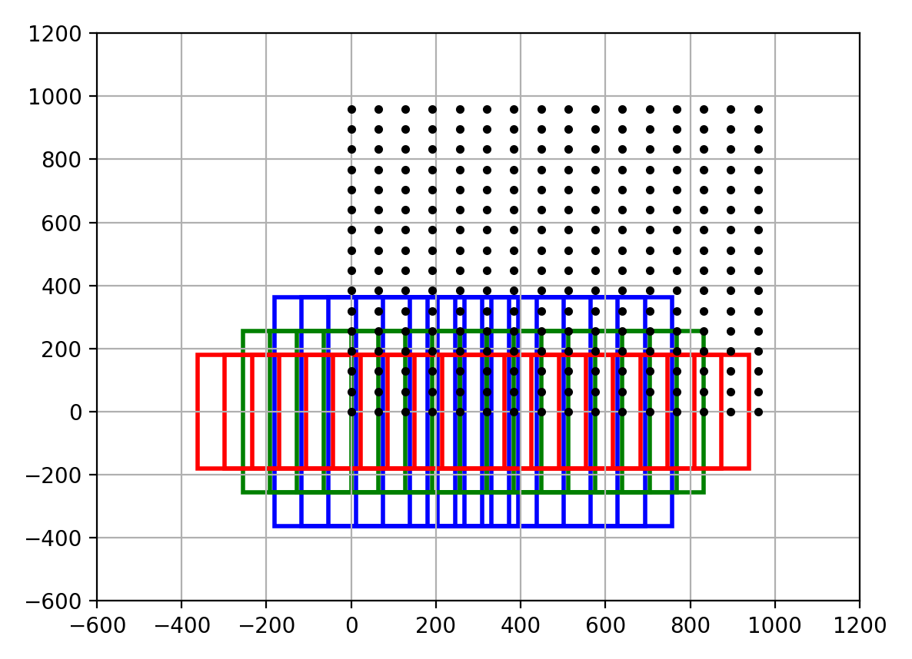
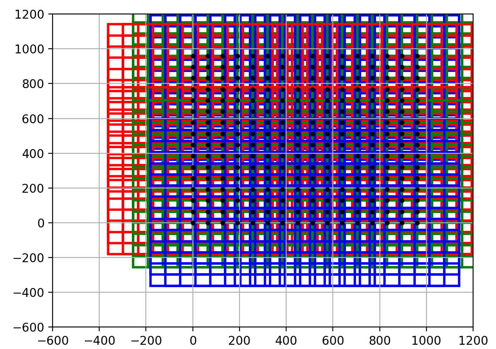
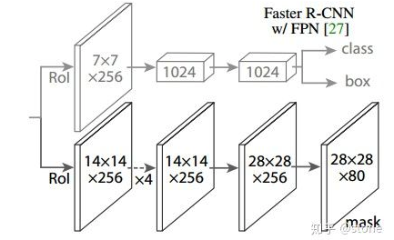

&ensp;&ensp;&ensp;&ensp;**With- out bells and whistles**,**Mask RCNN**是现在最流行的实例分割的深度学习模型之一，它是在**Faster RCNN**的**RPN**基础之上保留目标分类和边界框回归的两个分支，新增了一个**mask**分支来对**RPN**层得到的**ROI**实现像素级别的分类也就是分割任务的。
<!--more-->
&ensp;&ensp;&ensp;&ensp;虽说**Mask RCNN**是由**Faster RCNN**进行改进得到的，但是相对于**Faster RCNN**的主要任务已经改变，所以在**Mask RCNN**与**Faster RCNN**也有许多不同之处，首先**Mask RCNN**的网络结构主要借鉴了**FPN**的思想，采用了自底向上和自顶向下的思想，融合多级细粒度特征图来进行特征提取，再者在**Faster RCNN**中对得到的**ROI**采用**ROI Pooling**的方法来修整到统一的大小，而在**Mask RCNN**中对这种方法进行了修正，采用了**RoIAlign**的方法来**resize**得到的**ROI**的大小，其次模型的原始训练数据也有所不同，不仅需要目标的标签和边界框的信息还需要目标的分割信息。
&ensp;&ensp;&ensp;&ensp;现在对于**Mask RCNN**的复现有很多个版本，例如[tensorflow版本](https://github.com/matterport/Mask_RCNN),还有[pytorch版本](https://github.com/multimodallearning/pytorch-mask-rcnn),当然还有作者论文中给出的代码版本[Detectron](https://github.com/facebookresearch/Detectron)，本文所参考的的代码为上述给出的pytorch版本，下面还是按照**Dataset**和**Model**两个部分来进行代码和逻辑的梳理。

##### Dataset
&ensp;&ensp;&ensp;&ensp;从作者的README.md中的train命令行，我们可以定位到其训练的入口代码位于coco.py中：
```javascript
	python coco.py train --dataset=/path/to/coco/ --model=coco
```
在coco.py中的main函数中我们可以看到关于Dataset处理的代码：
```javascript
     if args.command == "train":
        # Training dataset. Use the training set and 35K from the
        # validation set, as as in the Mask RCNN paper.
        dataset_train = CocoDataset()
        dataset_train.load_coco(args.dataset, "train", year=args.year, auto_download=args.download)
        dataset_train.load_coco(args.dataset, "valminusminival", year=args.year, auto_download=args.download)
        dataset_train.prepare()

        # Validation dataset
        dataset_val = CocoDataset()
        dataset_val.load_coco(args.dataset, "minival", year=args.year, auto_download=args.download)
        dataset_val.prepare()
```
首先初始化了一个CocoDataset()类为dataset_train对象，然后调用该类的load_coco函数进行下载，这里的下载使用了一个python处理coco数据集的包pycocotools，该api的作用就是为了提取标注文件中的信息, 使其分别用于各自的场景, 比如图像检测使用的边界框参数, 图像分割使用的 mask 参数, 人体姿态检测使用的关节点参数等，更具体的内容可以看[pycocoDemo.ipynb](https://github.com/dengdan/coco/blob/master/PythonAPI/pycocoDemo.ipynb)和[COCO2017数据集api说明](https://blog.csdn.net/zym19941119/article/details/80241663?utm_source=blogxgwz7)。CocoDataset类继承自utils.py中定义的Dataset类，该类的代码如下：
```javascript
	class Dataset(object):
    """The base class for dataset classes.
    To use it, create a new class that adds functions specific to the dataset
    you want to use. For example:

    class CatsAndDogsDataset(Dataset):
        def load_cats_and_dogs(self):
            ...
        def load_mask(self, image_id):
            ...
        def image_reference(self, image_id):
            ...

    See COCODataset and ShapesDataset as examples.
    """

    def __init__(self, class_map=None):
        self._image_ids = []
        self.image_info = []
        # Background is always the first class
        self.class_info = [{"source": "", "id": 0, "name": "BG"}]
        self.source_class_ids = {}

    def add_class(self, source, class_id, class_name):
        assert "." not in source, "Source name cannot contain a dot"
        # Does the class exist already?
        for info in self.class_info:
            if info['source'] == source and info["id"] == class_id:
                # source.class_id combination already available, skip
                return
        # Add the class
        self.class_info.append({
            "source": source,
            "id": class_id,
            "name": class_name,
        })

    def add_image(self, source, image_id, path, **kwargs):
        image_info = {
            "id": image_id,
            "source": source,
            "path": path,
        }
        image_info.update(kwargs)
        self.image_info.append(image_info)

    def image_reference(self, image_id):
        """Return a link to the image in its source Website or details about
        the image that help looking it up or debugging it.

        Override for your dataset, but pass to this function
        if you encounter images not in your dataset.
        """
        return ""

    def prepare(self, class_map=None):
        """Prepares the Dataset class for use.

        TODO: class map is not supported yet. When done, it should handle mapping
              classes from different datasets to the same class ID.
        """
        def clean_name(name):
            """Returns a shorter version of object names for cleaner display."""
            return ",".join(name.split(",")[:1])

        # Build (or rebuild) everything else from the info dicts.
        self.num_classes = len(self.class_info)
        self.class_ids = np.arange(self.num_classes)
        self.class_names = [clean_name(c["name"]) for c in self.class_info]
        self.num_images = len(self.image_info)
        self._image_ids = np.arange(self.num_images)

        self.class_from_source_map = {"{}.{}".format(info['source'], info['id']): id
                                      for info, id in zip(self.class_info, self.class_ids)}

        # Map sources to class_ids they support
        self.sources = list(set([i['source'] for i in self.class_info]))
        self.source_class_ids = {}
        # Loop over datasets
        for source in self.sources:
            self.source_class_ids[source] = []
            # Find classes that belong to this dataset
            for i, info in enumerate(self.class_info):
                # Include BG class in all datasets
                if i == 0 or source == info['source']:
                    self.source_class_ids[source].append(i)

    def map_source_class_id(self, source_class_id):
        """Takes a source class ID and returns the int class ID assigned to it.

        For example:
        dataset.map_source_class_id("coco.12") -> 23
        """
        return self.class_from_source_map[source_class_id]

    def get_source_class_id(self, class_id, source):
        """Map an internal class ID to the corresponding class ID in the source dataset."""
        info = self.class_info[class_id]
        assert info['source'] == source
        return info['id']

    def append_data(self, class_info, image_info):
        self.external_to_class_id = {}
        for i, c in enumerate(self.class_info):
            for ds, id in c["map"]:
                self.external_to_class_id[ds + str(id)] = i

        # Map external image IDs to internal ones.
        self.external_to_image_id = {}
        for i, info in enumerate(self.image_info):
            self.external_to_image_id[info["ds"] + str(info["id"])] = i

    @property
    def image_ids(self):
        return self._image_ids

    def source_image_link(self, image_id):
        """Returns the path or URL to the image.
        Override this to return a URL to the image if it's availble online for easy
        debugging.
        """
        return self.image_info[image_id]["path"]

    def load_image(self, image_id):
        """Load the specified image and return a [H,W,3] Numpy array.
        """
        # Load image
        image = skimage.io.imread(self.image_info[image_id]['path'])
        # If grayscale. Convert to RGB for consistency.
        if image.ndim != 3:
            image = skimage.color.gray2rgb(image)
        return image

    def load_mask(self, image_id):
        """Load instance masks for the given image.

        Different datasets use different ways to store masks. Override this
        method to load instance masks and return them in the form of am
        array of binary masks of shape [height, width, instances].

        Returns:
            masks: A bool array of shape [height, width, instance count] with
                a binary mask per instance.
            class_ids: a 1D array of class IDs of the instance masks.
        """
        # Override this function to load a mask from your dataset.
        # Otherwise, it returns an empty mask.
        mask = np.empty([0, 0, 0])
        class_ids = np.empty([0], np.int32)
        return mask, class_ids

```
从上面代码可以看出，Dataset是定义了针对所有类别数据集的操作，在这里我们只需coco数据集，所以需要继承该类得到CocoDataset类，该类的代码如下：
```javascript
	class CocoDataset(utils.Dataset):
    def load_coco(self, dataset_dir, subset, year=DEFAULT_DATASET_YEAR, class_ids=None,
                  class_map=None, return_coco=False, auto_download=False):
        """Load a subset of the COCO dataset.
        dataset_dir: The root directory of the COCO dataset.
        subset: What to load (train, val, minival, valminusminival)
        year: What dataset year to load (2014, 2017) as a string, not an integer
        class_ids: If provided, only loads images that have the given classes.
        class_map: TODO: Not implemented yet. Supports maping classes from
            different datasets to the same class ID.
        return_coco: If True, returns the COCO object.
        auto_download: Automatically download and unzip MS-COCO images and annotations
        """

        if auto_download is True:
            self.auto_download(dataset_dir, subset, year)

        coco = COCO("{}/annotations/instances_{}{}.json".format(dataset_dir, subset, year))
        if subset == "minival" or subset == "valminusminival":
            subset = "val"
        image_dir = "{}/{}{}".format(dataset_dir, subset, year)

        # Load all classes or a subset?
        if not class_ids:
            # All classes
            class_ids = sorted(coco.getCatIds())#得到所有类的id

        # All images or a subset?
        if class_ids:
            image_ids = []
            for id in class_ids:
                image_ids.extend(list(coco.getImgIds(catIds=[id])))#得到所有的图片id
            # Remove duplicates
            image_ids = list(set(image_ids))
        else:
            # All images
            image_ids = list(coco.imgs.keys())

        # Add classes
        for i in class_ids:
            self.add_class("coco", i, coco.loadCats(i)[0]["name"])#将"coco",class_id,class_name,加入到class_info中

        # Add images
        for i in image_ids:
            self.add_image(
                "coco", image_id=i,
                path=os.path.join(image_dir, coco.imgs[i]['file_name']),
                width=coco.imgs[i]["width"],
                height=coco.imgs[i]["height"],
                annotations=coco.loadAnns(coco.getAnnIds(
                    imgIds=[i], catIds=class_ids, iscrowd=None)))#将以上信息加入到image_info中
        if return_coco:
            return coco
```
接着对初始化CocoDataset()类得到dataset_train对象调用load_coco()和prepare()成员函数构造数据集，当然这至此的Dataset的处理只是得到了class_info和image_info的一些数据集结构信息，要想得到真正使用的rpn_match, rpn_bbox, gt_class_ids, gt_boxes, gt_masks等数据还需经一步的处理，而这些都放在**model**部分，这是按照代码的逻辑顺序来进行说明。
###### model
对于**model**部分，框架结构基本上和**Faster RCNN**一致，分为**Extractor**,**RPN**,**ROIHead**三个部分，**Extractor**负责提取特征，**RPN**负责得到**ROI**，**ROIHead**又分为两个部分，分别是**classifier**，**mask**。
代码中model的定义部分位于model.py的MaskRCNN类中的build函数中，其代码如下：
```javascript
	class MaskRCNN(nn.Module):
    """Encapsulates the Mask RCNN model functionality.
    """

    def __init__(self, config, model_dir):
        """
        config: A Sub-class of the Config class
        model_dir: Directory to save training logs and trained weights
        """
        super(MaskRCNN, self).__init__()
        self.config = config
        self.model_dir = model_dir
        self.set_log_dir()
        self.build(config=config)
        self.initialize_weights()
        self.loss_history = []
        self.val_loss_history = []

    def build(self, config):
        """Build Mask R-CNN architecture.
        """

        # Image size must be dividable by 2 multiple times
        h, w = config.IMAGE_SHAPE[:2]
        if h / 2**6 != int(h / 2**6) or w / 2**6 != int(w / 2**6):
            raise Exception("Image size must be dividable by 2 at least 6 times "
                            "to avoid fractions when downscaling and upscaling."
                            "For example, use 256, 320, 384, 448, 512, ... etc. ")

        # Build the shared convolutional layers.
        # Bottom-up Layers
        # Returns a list of the last layers of each stage, 5 in total.
        # Don't create the thead (stage 5), so we pick the 4th item in the list.
        resnet = ResNet("resnet101", stage5=True)
        C1, C2, C3, C4, C5 = resnet.stages()

        # Top-down Layers
        # TODO: add assert to varify feature map sizes match what's in config
        self.fpn = FPN(C1, C2, C3, C4, C5, out_channels=256)

        # Generate Anchors
        self.anchors = Variable(torch.from_numpy(utils.generate_pyramid_anchors(config.RPN_ANCHOR_SCALES,
                                                                                config.RPN_ANCHOR_RATIOS,
                                                                                config.BACKBONE_SHAPES,
                                                                                config.BACKBONE_STRIDES,
                                                                                config.RPN_ANCHOR_STRIDE)).float(), requires_grad=False)
        if self.config.GPU_COUNT:
            self.anchors = self.anchors.cuda()

        # RPN
        self.rpn = RPN(len(config.RPN_ANCHOR_RATIOS), config.RPN_ANCHOR_STRIDE, 256)

        # FPN Classifier
        self.classifier = Classifier(256, config.POOL_SIZE, config.IMAGE_SHAPE, config.NUM_CLASSES)

        # FPN Mask
        self.mask = Mask(256, config.MASK_POOL_SIZE, config.IMAGE_SHAPE, config.NUM_CLASSES)

        # Fix batch norm layers
        def set_bn_fix(m):
            classname = m.__class__.__name__
            if classname.find('BatchNorm') != -1:
                for p in m.parameters(): p.requires_grad = False

        self.apply(set_bn_fix)
```
从上述代码可以看处，共定义了6个模块组件部分，第一个为**resnet**，第二个为**FPN**，第三个为**RPN**，第四个为**classifier**，第五个为**mask**，并且还生成了**anchors**，**Mask RCNN**的**Extractor**采用的是**FPN_Resnet101**,首先构建**resnet**得到五个将采样阶段的特征图[c1,c2,c3,c4,c5]，在得到这五个阶段的输出之后输入到**FPN**中得到[p2,p3,p4,p5,p6]这另外五个阶段然后输入到**RPN**中来得到**ROI**，整体的结构图如下所示：

<div align=center></div>

这里采用的是**resnet101**，其网络结构如下表所示：

<div align=center></div>
其主要代码位于model.py，，如下：
```javascript
	class Bottleneck(nn.Module):
    expansion = 4

    def __init__(self, inplanes, planes, stride=1, downsample=None):
        super(Bottleneck, self).__init__()
        self.conv1 = nn.Conv2d(inplanes, planes, kernel_size=1, stride=stride)
        self.bn1 = nn.BatchNorm2d(planes, eps=0.001, momentum=0.01)
        self.padding2 = SamePad2d(kernel_size=3, stride=1)
        self.conv2 = nn.Conv2d(planes, planes, kernel_size=3)
        self.bn2 = nn.BatchNorm2d(planes, eps=0.001, momentum=0.01)
        self.conv3 = nn.Conv2d(planes, planes * 4, kernel_size=1)
        self.bn3 = nn.BatchNorm2d(planes * 4, eps=0.001, momentum=0.01)
        self.relu = nn.ReLU(inplace=True)
        self.downsample = downsample
        self.stride = stride

    def forward(self, x):
        residual = x

        out = self.conv1(x)
        out = self.bn1(out)
        out = self.relu(out)

        out = self.padding2(out)
        out = self.conv2(out)
        out = self.bn2(out)
        out = self.relu(out)

        out = self.conv3(out)
        out = self.bn3(out)

        if self.downsample is not None:
            residual = self.downsample(x)

        out += residual
        out = self.relu(out)

        return out

class ResNet(nn.Module):

    def __init__(self, architecture, stage5=False):
        super(ResNet, self).__init__()
        assert architecture in ["resnet50", "resnet101"]
        self.inplanes = 64
        self.layers = [3, 4, {"resnet50": 6, "resnet101": 23}[architecture], 3]
        self.block = Bottleneck
        self.stage5 = stage5

        self.C1 = nn.Sequential(
            nn.Conv2d(3, 64, kernel_size=7, stride=2, padding=3),
            nn.BatchNorm2d(64, eps=0.001, momentum=0.01),
            nn.ReLU(inplace=True),
            SamePad2d(kernel_size=3, stride=2),
            nn.MaxPool2d(kernel_size=3, stride=2),
        )
        self.C2 = self.make_layer(self.block, 64, self.layers[0])
        self.C3 = self.make_layer(self.block, 128, self.layers[1], stride=2)
        self.C4 = self.make_layer(self.block, 256, self.layers[2], stride=2)
        if self.stage5:
            self.C5 = self.make_layer(self.block, 512, self.layers[3], stride=2)
        else:
            self.C5 = None

    def forward(self, x):
        x = self.C1(x)
        x = self.C2(x)
        x = self.C3(x)
        x = self.C4(x)
        x = self.C5(x)
        return x


    def stages(self):
        return [self.C1, self.C2, self.C3, self.C4, self.C5]

    def make_layer(self, block, planes, blocks, stride=1):
        downsample = None
        if stride != 1 or self.inplanes != planes * block.expansion:
            downsample = nn.Sequential(
                nn.Conv2d(self.inplanes, planes * block.expansion,
                          kernel_size=1, stride=stride),
                nn.BatchNorm2d(planes * block.expansion, eps=0.001, momentum=0.01),
            )

        layers = []
        layers.append(block(self.inplanes, planes, stride, downsample))
        self.inplanes = planes * block.expansion
        for i in range(1, blocks):
            layers.append(block(self.inplanes, planes))

        return nn.Sequential(*layers)
```
上述代码可以得到**resnet**的[c1,c2,c3,c4,c5]的五个阶段的输出，下面就要构建**FPN**，主要代码如下：
```javascript
	class FPN(nn.Module):
    def __init__(self, C1, C2, C3, C4, C5, out_channels):
        super(FPN, self).__init__()
        self.out_channels = out_channels
        self.C1 = C1
        self.C2 = C2
        self.C3 = C3
        self.C4 = C4
        self.C5 = C5
        self.P6 = nn.MaxPool2d(kernel_size=1, stride=2)
        self.P5_conv1 = nn.Conv2d(2048, self.out_channels, kernel_size=1, stride=1)
        self.P5_conv2 = nn.Sequential(
            SamePad2d(kernel_size=3, stride=1),
            nn.Conv2d(self.out_channels, self.out_channels, kernel_size=3, stride=1),
        )
        self.P4_conv1 =  nn.Conv2d(1024, self.out_channels, kernel_size=1, stride=1)
        self.P4_conv2 = nn.Sequential(
            SamePad2d(kernel_size=3, stride=1),
            nn.Conv2d(self.out_channels, self.out_channels, kernel_size=3, stride=1),
        )
        self.P3_conv1 = nn.Conv2d(512, self.out_channels, kernel_size=1, stride=1)
        self.P3_conv2 = nn.Sequential(
            SamePad2d(kernel_size=3, stride=1),
            nn.Conv2d(self.out_channels, self.out_channels, kernel_size=3, stride=1),
        )
        self.P2_conv1 = nn.Conv2d(256, self.out_channels, kernel_size=1, stride=1)
        self.P2_conv2 = nn.Sequential(
            SamePad2d(kernel_size=3, stride=1),
            nn.Conv2d(self.out_channels, self.out_channels, kernel_size=3, stride=1),
        )

    def forward(self, x):
        x = self.C1(x)
        x = self.C2(x)
        c2_out = x
        x = self.C3(x)
        c3_out = x
        x = self.C4(x)
        c4_out = x
        x = self.C5(x)
        p5_out = self.P5_conv1(x)
        p4_out = self.P4_conv1(c4_out) + F.upsample(p5_out, scale_factor=2)
        p3_out = self.P3_conv1(c3_out) + F.upsample(p4_out, scale_factor=2)
        p2_out = self.P2_conv1(c2_out) + F.upsample(p3_out, scale_factor=2)

        p5_out = self.P5_conv2(p5_out)
        p4_out = self.P4_conv2(p4_out)
        p3_out = self.P3_conv2(p3_out)
        p2_out = self.P2_conv2(p2_out)

        # P6 is used for the 5th anchor scale in RPN. Generated by
        # subsampling from P5 with stride of 2.
        p6_out = self.P6(p5_out)

        return [p2_out, p3_out, p4_out, p5_out, p6_out]
```
经过**FPN**之后得到了[p2,p3,p4,p5,p6]输入到**RPN**层，**FPN**的代码也位于model.py，其主要代码如下：
```javascript
	 class FPN(nn.Module):
    def __init__(self, C1, C2, C3, C4, C5, out_channels):
        super(FPN, self).__init__()
        self.out_channels = out_channels
        self.C1 = C1
        self.C2 = C2
        self.C3 = C3
        self.C4 = C4
        self.C5 = C5
        self.P6 = nn.MaxPool2d(kernel_size=1, stride=2)
        self.P5_conv1 = nn.Conv2d(2048, self.out_channels, kernel_size=1, stride=1)
        self.P5_conv2 = nn.Sequential(
            SamePad2d(kernel_size=3, stride=1),
            nn.Conv2d(self.out_channels, self.out_channels, kernel_size=3, stride=1),
        )
        self.P4_conv1 =  nn.Conv2d(1024, self.out_channels, kernel_size=1, stride=1)
        self.P4_conv2 = nn.Sequential(
            SamePad2d(kernel_size=3, stride=1),
            nn.Conv2d(self.out_channels, self.out_channels, kernel_size=3, stride=1),
        )
        self.P3_conv1 = nn.Conv2d(512, self.out_channels, kernel_size=1, stride=1)
        self.P3_conv2 = nn.Sequential(
            SamePad2d(kernel_size=3, stride=1),
            nn.Conv2d(self.out_channels, self.out_channels, kernel_size=3, stride=1),
        )
        self.P2_conv1 = nn.Conv2d(256, self.out_channels, kernel_size=1, stride=1)
        self.P2_conv2 = nn.Sequential(
            SamePad2d(kernel_size=3, stride=1),
            nn.Conv2d(self.out_channels, self.out_channels, kernel_size=3, stride=1),
        )

    def forward(self, x):
        x = self.C1(x)
        x = self.C2(x)
        c2_out = x
        x = self.C3(x)
        c3_out = x
        x = self.C4(x)
        c4_out = x
        x = self.C5(x)
        p5_out = self.P5_conv1(x)
        p4_out = self.P4_conv1(c4_out) + F.upsample(p5_out, scale_factor=2)
        p3_out = self.P3_conv1(c3_out) + F.upsample(p4_out, scale_factor=2)
        p2_out = self.P2_conv1(c2_out) + F.upsample(p3_out, scale_factor=2)

        p5_out = self.P5_conv2(p5_out)
        p4_out = self.P4_conv2(p4_out)
        p3_out = self.P3_conv2(p3_out)
        p2_out = self.P2_conv2(p2_out)

        # P6 is used for the 5th anchor scale in RPN. Generated by
        # subsampling from P5 with stride of 2.
        p6_out = self.P6(p5_out)

        return [p2_out, p3_out, p4_out, p5_out, p6_out]
```
从前面的代码可以看出，在构建完**FPN**之后调用了utils.generate_pyramid_anchor函数生成了**anchors**，这些**anchors**在经过筛选和微调之后构成了**ROI**，这些**anchors**是分别在5个尺度的特征图上生成的，分别是[[256,256],[128,128],[64,64],[32,32],[16,16]],每个特征图尺度上对应的scales为[32,64,128,256,512],每个scales又对应3个ratios[0.5,1,2],这些参数定义在config.py中，所以相当于每个尺度的特征图上的每个像素点分别生成3个**anchors**，所以共生成(256&times;256+128&times;128+64&times;64+32&times;32+16&times;16)&times;3=261888个**anchors**，以下为三个示意图，分别是尺度为[16]上一个像素点上的生成的**anchors**为1个像素点，10个像素点和所有像素点的情况。
偏移为1个像素点：
<div align=center></div>
偏移为10个像素点：
<div align=center></div>
得到所有的anchors：
<div align=center></div>
其中generate_anchors的代码位于utils.py中，其主要代码如下：
```javascript
	############################################################
#  Anchors
############################################################

def generate_anchors(scales, ratios, shape, feature_stride, anchor_stride):
    """
    scales: 1D array of anchor sizes in pixels. Example: [32, 64, 128]
    ratios: 1D array of anchor ratios of width/height. Example: [0.5, 1, 2]
    shape: [height, width] spatial shape of the feature map over which
            to generate anchors.
    feature_stride: Stride of the feature map relative to the image in pixels.
    anchor_stride: Stride of anchors on the feature map. For example, if the
        value is 2 then generate anchors for every other feature map pixel.
    """
    # Get all combinations of scales and ratios
    scales, ratios = np.meshgrid(np.array(scales), np.array(ratios))
    scales = scales.flatten()
    ratios = ratios.flatten()

    # Enumerate heights and widths from scales and ratios
    heights = scales / np.sqrt(ratios)
    widths = scales * np.sqrt(ratios)

    # Enumerate shifts in feature space
    shifts_y = np.arange(0, shape[0], anchor_stride) * feature_stride
    shifts_x = np.arange(0, shape[1], anchor_stride) * feature_stride
    shifts_x, shifts_y = np.meshgrid(shifts_x, shifts_y)

    # Enumerate combinations of shifts, widths, and heights
    box_widths, box_centers_x = np.meshgrid(widths, shifts_x)
    box_heights, box_centers_y = np.meshgrid(heights, shifts_y)

    # Reshape to get a list of (y, x) and a list of (h, w)
    box_centers = np.stack(
        [box_centers_y, box_centers_x], axis=2).reshape([-1, 2])
    box_sizes = np.stack([box_heights, box_widths], axis=2).reshape([-1, 2])

    # Convert to corner coordinates (y1, x1, y2, x2)
    boxes = np.concatenate([box_centers - 0.5 * box_sizes,
                            box_centers + 0.5 * box_sizes], axis=1)
    return boxes


def generate_pyramid_anchors(scales, ratios, feature_shapes, feature_strides,
                             anchor_stride):
    """Generate anchors at different levels of a feature pyramid. Each scale
    is associated with a level of the pyramid, but each ratio is used in
    all levels of the pyramid.

    Returns:
    anchors: [N, (y1, x1, y2, x2)]. All generated anchors in one array. Sorted
        with the same order of the given scales. So, anchors of scale[0] come
        first, then anchors of scale[1], and so on.
    """
    # Anchors
    # [anchor_count, (y1, x1, y2, x2)]
    anchors = []
    for i in range(len(scales)):
        anchors.append(generate_anchors(scales[i], ratios, feature_shapes[i],
                                        feature_strides[i], anchor_stride))
    return np.concatenate(anchors, axis=0)

```
在**anchors**生成结束之后，便开始定义**RPN**网络，这里的**RPN**网络的定义与**Faster RCNN**的一致，不同的是这里是要将一个特征图金字塔送入**RPN**中，而不是单个的特征图，这里现在只是定义**RPN**的网络结构，不同的是这里有三个输出分支，一个是前景和背景的分类，另一个是位置回归，还有一个是置信度的输出。代码位于model.py，其代码如下：
```javascript
    class RPN(nn.Module):
    """Builds the model of Region Proposal Network.

    anchors_per_location: number of anchors per pixel in the feature map
    anchor_stride: Controls the density of anchors. Typically 1 (anchors for
                   every pixel in the feature map), or 2 (every other pixel).

    Returns:
        rpn_logits: [batch, H*W*anchors per location, 2] Anchor classifier logits (before softmax)
        rpn_probs: [batch, H*W*anchors per location, 2] Anchor classifier probabilities.
        rpn_bbox: [batch, H*W*anchors per location, (dy, dx, log(dh), log(dw))] Deltas to be
                  applied to anchors.
    """

    def __init__(self, anchors_per_location, anchor_stride, depth):
        super(RPN, self).__init__()
        self.anchors_per_location = anchors_per_location
        self.anchor_stride = anchor_stride
        self.depth = depth

        self.padding = SamePad2d(kernel_size=3, stride=self.anchor_stride)
        self.conv_shared = nn.Conv2d(self.depth, 512, kernel_size=3, stride=self.anchor_stride)
        self.relu = nn.ReLU(inplace=True)
        self.conv_class = nn.Conv2d(512, 2 * anchors_per_location, kernel_size=1, stride=1)
        self.softmax = nn.Softmax(dim=2)
        self.conv_bbox = nn.Conv2d(512, 4 * anchors_per_location, kernel_size=1, stride=1)

    def forward(self, x):
        # Shared convolutional base of the RPN
        x = self.relu(self.conv_shared(self.padding(x)))

        # Anchor Score. [batch, anchors per location * 2, height, width].
        rpn_class_logits = self.conv_class(x)

        # Reshape to [batch, 2, anchors]
        rpn_class_logits = rpn_class_logits.permute(0,2,3,1)
        rpn_class_logits = rpn_class_logits.contiguous()
        rpn_class_logits = rpn_class_logits.view(x.size()[0], -1, 2)

        # Softmax on last dimension of BG/FG.
        rpn_probs = self.softmax(rpn_class_logits)

        # Bounding box refinement. [batch, H, W, anchors per location, depth]
        # where depth is [x, y, log(w), log(h)]
        rpn_bbox = self.conv_bbox(x)

        # Reshape to [batch, 4, anchors]
        rpn_bbox = rpn_bbox.permute(0,2,3,1)
        rpn_bbox = rpn_bbox.contiguous()
        rpn_bbox = rpn_bbox.view(x.size()[0], -1, 4)

        return [rpn_class_logits, rpn_probs, rpn_bbox]

```
在经过上述定义之后，便是**ROIHead**部分的定义，**ROIHead**又分为两个部分，分别是**classifier**，**mask**，其中**classifier**也分为三个部分，置信度，分类和位置回归。在经过**RPN**之后得到的rpn_box都需要先根据box的大小在对应的特征图上得到对应的**ROI**，再通过**ROI align**变为统一大小在进入后续的网络，其中**classifier**部分经过**ROI align**变为7&times;7大小，**mask**部分经过**ROI align**变为14&times;14大小，这由传入的参数决定，这些参数定义在config.py中为别为POOL_SIZE和MASK_POOL_SIZE，

<div align=center></div>
**ROI_Head**部分的代码位于model.py中，其代码为：
```javascript
class Classifier(nn.Module):
    def __init__(self, depth, pool_size, image_shape, num_classes):
        super(Classifier, self).__init__()
        self.depth = depth
        self.pool_size = pool_size
        self.image_shape = image_shape
        self.num_classes = num_classes
        self.conv1 = nn.Conv2d(self.depth, 1024, kernel_size=self.pool_size, stride=1)
        self.bn1 = nn.BatchNorm2d(1024, eps=0.001, momentum=0.01)
        self.conv2 = nn.Conv2d(1024, 1024, kernel_size=1, stride=1)
        self.bn2 = nn.BatchNorm2d(1024, eps=0.001, momentum=0.01)
        self.relu = nn.ReLU(inplace=True)

        self.linear_class = nn.Linear(1024, num_classes)
        self.softmax = nn.Softmax(dim=1)

        self.linear_bbox = nn.Linear(1024, num_classes * 4)

    def forward(self, x, rois):
        x = pyramid_roi_align([rois]+x, self.pool_size, self.image_shape)
        x = self.conv1(x)
        x = self.bn1(x)
        x = self.relu(x)
        x = self.conv2(x)
        x = self.bn2(x)
        x = self.relu(x)

        x = x.view(-1,1024)
        mrcnn_class_logits = self.linear_class(x)
        mrcnn_probs = self.softmax(mrcnn_class_logits)

        mrcnn_bbox = self.linear_bbox(x)
        mrcnn_bbox = mrcnn_bbox.view(mrcnn_bbox.size()[0], -1, 4)

        return [mrcnn_class_logits, mrcnn_probs, mrcnn_bbox]

class Mask(nn.Module):
    def __init__(self, depth, pool_size, image_shape, num_classes):
        super(Mask, self).__init__()
        self.depth = depth
        self.pool_size = pool_size
        self.image_shape = image_shape
        self.num_classes = num_classes
        self.padding = SamePad2d(kernel_size=3, stride=1)
        self.conv1 = nn.Conv2d(self.depth, 256, kernel_size=3, stride=1)
        self.bn1 = nn.BatchNorm2d(256, eps=0.001)
        self.conv2 = nn.Conv2d(256, 256, kernel_size=3, stride=1)
        self.bn2 = nn.BatchNorm2d(256, eps=0.001)
        self.conv3 = nn.Conv2d(256, 256, kernel_size=3, stride=1)
        self.bn3 = nn.BatchNorm2d(256, eps=0.001)
        self.conv4 = nn.Conv2d(256, 256, kernel_size=3, stride=1)
        self.bn4 = nn.BatchNorm2d(256, eps=0.001)
        self.deconv = nn.ConvTranspose2d(256, 256, kernel_size=2, stride=2)
        self.conv5 = nn.Conv2d(256, num_classes, kernel_size=1, stride=1)
        self.sigmoid = nn.Sigmoid()
        self.relu = nn.ReLU(inplace=True)

    def forward(self, x, rois):
        x = pyramid_roi_align([rois] + x, self.pool_size, self.image_shape)
        x = self.conv1(self.padding(x))
        x = self.bn1(x)
        x = self.relu(x)
        x = self.conv2(self.padding(x))
        x = self.bn2(x)
        x = self.relu(x)
        x = self.conv3(self.padding(x))
        x = self.bn3(x)
        x = self.relu(x)
        x = self.conv4(self.padding(x))
        x = self.bn4(x)
        x = self.relu(x)
        x = self.deconv(x)
        x = self.relu(x)
        x = self.conv5(x)
        x = self.sigmoid(x)

        return x

```
以上所有的部分只是定义了整个网络的各个组件部分，还并没有联系在一起构成一个完整的网络，下面就要将前面**Dataset**和**model**内容组合在一起，这一部分内容定义在model.py中的train_model函数中，代码如下：
```javascript
        def train_model(self, train_dataset, val_dataset, learning_rate, epochs, layers):
        """Train the model.
        train_dataset, val_dataset: Training and validation Dataset objects.
        learning_rate: The learning rate to train with
        epochs: Number of training epochs. Note that previous training epochs
                are considered to be done alreay, so this actually determines
                the epochs to train in total rather than in this particaular
                call.
        layers: Allows selecting wich layers to train. It can be:
            - A regular expression to match layer names to train
            - One of these predefined values:
              heaads: The RPN, classifier and mask heads of the network
              all: All the layers
              3+: Train Resnet stage 3 and up
              4+: Train Resnet stage 4 and up
              5+: Train Resnet stage 5 and up
        """

        # Pre-defined layer regular expressions
        layer_regex = {
            # all layers but the backbone
            "heads": r"(fpn.P5\_.*)|(fpn.P4\_.*)|(fpn.P3\_.*)|(fpn.P2\_.*)|(rpn.*)|(classifier.*)|(mask.*)",
            # From a specific Resnet stage and up
            "3+": r"(fpn.C3.*)|(fpn.C4.*)|(fpn.C5.*)|(fpn.P5\_.*)|(fpn.P4\_.*)|(fpn.P3\_.*)|(fpn.P2\_.*)|(rpn.*)|(classifier.*)|(mask.*)",
            "4+": r"(fpn.C4.*)|(fpn.C5.*)|(fpn.P5\_.*)|(fpn.P4\_.*)|(fpn.P3\_.*)|(fpn.P2\_.*)|(rpn.*)|(classifier.*)|(mask.*)",
            "5+": r"(fpn.C5.*)|(fpn.P5\_.*)|(fpn.P4\_.*)|(fpn.P3\_.*)|(fpn.P2\_.*)|(rpn.*)|(classifier.*)|(mask.*)",
            # All layers
            "all": ".*",
        }
        if layers in layer_regex.keys():
            layers = layer_regex[layers]

        # Data generators
        # train_set包含images, image_metas, rpn_match, rpn_bbox, gt_class_ids, gt_boxes, gt_masks
        train_set = Dataset(train_dataset, self.config, augment=True)
        train_generator = torch.utils.data.DataLoader(train_set, batch_size=1, shuffle=True, num_workers=4)
        val_set = Dataset(val_dataset, self.config, augment=True)
        val_generator = torch.utils.data.DataLoader(val_set, batch_size=1, shuffle=True, num_workers=4)

        # Train
        log("\nStarting at epoch {}. LR={}\n".format(self.epoch+1, learning_rate))
        log("Checkpoint Path: {}".format(self.checkpoint_path))
        self.set_trainable(layers)

        # Optimizer object
        # Add L2 Regularization
        # Skip gamma and beta weights of batch normalization layers.
        trainables_wo_bn = [param for name, param in self.named_parameters() if param.requires_grad and not 'bn' in name]
        trainables_only_bn = [param for name, param in self.named_parameters() if param.requires_grad and 'bn' in name]
        optimizer = optim.SGD([
            {'params': trainables_wo_bn, 'weight_decay': self.config.WEIGHT_DECAY},
            {'params': trainables_only_bn}
        ], lr=learning_rate, momentum=self.config.LEARNING_MOMENTUM)

        for epoch in range(self.epoch+1, epochs+1):
            log("Epoch {}/{}.".format(epoch,epochs))


            # Training
            loss, loss_rpn_class, loss_rpn_bbox, loss_mrcnn_class, loss_mrcnn_bbox, loss_mrcnn_mask = self.train_epoch(train_generator, optimizer, self.config.STEPS_PER_EPOCH)

            # Validation
            val_loss, val_loss_rpn_class, val_loss_rpn_bbox, val_loss_mrcnn_class, val_loss_mrcnn_bbox, val_loss_mrcnn_mask = self.valid_epoch(val_generator, self.config.VALIDATION_STEPS)

            # Statistics
            self.loss_history.append([loss, loss_rpn_class, loss_rpn_bbox, loss_mrcnn_class, loss_mrcnn_bbox, loss_mrcnn_mask])
            self.val_loss_history.append([val_loss, val_loss_rpn_class, val_loss_rpn_bbox, val_loss_mrcnn_class, val_loss_mrcnn_bbox, val_loss_mrcnn_mask])
            visualize.plot_loss(self.loss_history, self.val_loss_history, save=True, log_dir=self.log_dir)

            # Save model
            torch.save(self.state_dict(), self.checkpoint_path.format(epoch))

        self.epoch = epochs
```
首先将之前**Dataset**处理得到的class_info和image_info的数据集结构信息送入Dataset函数中得到images, image_metas, rpn_match, rpn_bbox, gt_class_ids, gt_boxes, gt_masks这些信息，Dataset类位于model.py中，其代码如下：
```javascript
    
class Dataset(torch.utils.data.Dataset):
    def __init__(self, dataset, config, augment=True):
        """A generator that returns images and corresponding target class ids,
            bounding box deltas, and masks.

            dataset: The Dataset object to pick data from
            config: The model config object
            shuffle: If True, shuffles the samples before every epoch
            augment: If True, applies image augmentation to images (currently only
                     horizontal flips are supported)

            Returns a Python generator. Upon calling next() on it, the
            generator returns two lists, inputs and outputs. The containtes
            of the lists differs depending on the received arguments:
            inputs list:
            - images: [batch, H, W, C]
            - image_metas: [batch, size of image meta]
            - rpn_match: [batch, N] Integer (1=positive anchor, -1=negative, 0=neutral)
            - rpn_bbox: [batch, N, (dy, dx, log(dh), log(dw))] Anchor bbox deltas.
            - gt_class_ids: [batch, MAX_GT_INSTANCES] Integer class IDs
            - gt_boxes: [batch, MAX_GT_INSTANCES, (y1, x1, y2, x2)]
            - gt_masks: [batch, height, width, MAX_GT_INSTANCES]. The height and width
                        are those of the image unless use_mini_mask is True, in which
                        case they are defined in MINI_MASK_SHAPE.

            outputs list: Usually empty in regular training. But if detection_targets
                is True then the outputs list contains target class_ids, bbox deltas,
                and masks.
            """
        self.b = 0  # batch item index
        self.image_index = -1
        self.image_ids = np.copy(dataset.image_ids)
        self.error_count = 0

        self.dataset = dataset
        self.config = config
        self.augment = augment

        # Anchors
        # [anchor_count, (y1, x1, y2, x2)]
        self.anchors = utils.generate_pyramid_anchors(config.RPN_ANCHOR_SCALES,
                                                 config.RPN_ANCHOR_RATIOS,
                                                 config.BACKBONE_SHAPES,
                                                 config.BACKBONE_STRIDES,
                                                 config.RPN_ANCHOR_STRIDE)

    def __getitem__(self, image_index):
        # Get GT bounding boxes and masks for image.
        image_id = self.image_ids[image_index]
        image, image_metas, gt_class_ids, gt_boxes, gt_masks = \
            load_image_gt(self.dataset, self.config, image_id, augment=self.augment,
                          use_mini_mask=self.config.USE_MINI_MASK)

        # Skip images that have no instances. This can happen in cases
        # where we train on a subset of classes and the image doesn't
        # have any of the classes we care about.
        if not np.any(gt_class_ids > 0):
            return None

        # RPN Targets
        rpn_match, rpn_bbox = build_rpn_targets(image.shape, self.anchors,
                                                gt_class_ids, gt_boxes, self.config)

        # If more instances than fits in the array, sub-sample from them.
        # MAX_GT_INSTANCES = 100
        if gt_boxes.shape[0] > self.config.MAX_GT_INSTANCES:
            ids = np.random.choice(
                np.arange(gt_boxes.shape[0]), self.config.MAX_GT_INSTANCES, replace=False)
            gt_class_ids = gt_class_ids[ids]
            gt_boxes = gt_boxes[ids]
            gt_masks = gt_masks[:, :, ids]

        # Add to batch
        rpn_match = rpn_match[:, np.newaxis]
        # subtraces the mean pixel and converts it to float.
        images = mold_image(image.astype(np.float32), self.config)

        # Convert
        images = torch.from_numpy(images.transpose(2, 0, 1)).float()
        image_metas = torch.from_numpy(image_metas)
        rpn_match = torch.from_numpy(rpn_match)
        rpn_bbox = torch.from_numpy(rpn_bbox).float()
        gt_class_ids = torch.from_numpy(gt_class_ids)
        gt_boxes = torch.from_numpy(gt_boxes).float()
        gt_masks = torch.from_numpy(gt_masks.astype(int).transpose(2, 0, 1)).float()

        return images, image_metas, rpn_match, rpn_bbox, gt_class_ids, gt_boxes, gt_masks

    def __len__(self):
        return self.image_ids.shape[0]

```
从上述代码可以看出，首先是通过load_image_gt函数得到image, image_metas, gt_class_ids, gt_boxes, gt_masks，下载的这些数据都是coco数据集里自带的标签信息，但是这里也要对原始的数据进行一些处理，对原始图片需要进行resize到1024&times;1024，原始的mask信息需要resize到56&times;56，这里还要注意一点，这里的box信息不是使用的coco数据集里自带的信息而是通过计算目标mask标签信息的外接最小矩形得到的，这主要是考虑到除了coco数据集意外有些数据集不提供box信息而采取的方案，load_image_gt的函数如下：
```javascript
    def load_image_gt(dataset, config, image_id, augment=False,
                  use_mini_mask=False):
					"""Load and return ground truth data for an image (image, mask, bounding boxes).

					augment: If true, apply random image augmentation. Currently, only
						horizontal flipping is offered.
					use_mini_mask: If False, returns full-size masks that are the same height
						and width as the original image. These can be big, for example
						1024x1024x100 (for 100 instances). Mini masks are smaller, typically,
						224x224 and are generated by extracting the bounding box of the
						object and resizing it to MINI_MASK_SHAPE.

					Returns:
					image: [height, width, 3]
					shape: the original shape of the image before resizing and cropping.
					class_ids: [instance_count] Integer class IDs
					bbox: [instance_count, (y1, x1, y2, x2)]
					mask: [height, width, instance_count]. The height and width are those
						of the image unless use_mini_mask is True, in which case they are
						defined in MINI_MASK_SHAPE.
					"""
					# Load image and mask
					image = dataset.load_image(image_id)
					mask, class_ids = dataset.load_mask(image_id)
					shape = image.shape
					#先resize然后padding到max_dim * max_dim,window代表padding之后原图在padding之后的坐标
					image, window, scale, padding = utils.resize_image(
						image,
						min_dim=config.IMAGE_MIN_DIM,
						max_dim=config.IMAGE_MAX_DIM,
						padding=config.IMAGE_PADDING)
					#将mask也resize到新的image大小，mask的shape为[h, w, num_instances]
					mask = utils.resize_mask(mask, scale, padding)

					# Random horizontal flips.
					if augment:
						if random.randint(0, 1):
							image = np.fliplr(image)
							mask = np.fliplr(mask)

					# Bounding boxes. Note that some boxes might be all zeros
					# if the corresponding mask got cropped out.
					# bbox: [num_instances, (y1, x1, y2, x2)]
					#使用mask得到boungding box,这里的mask是和图片大小一样，并且图片中的每一个instance对应一个mask，bbox array [num_instances, (y1, x1, y2, x2)].
					bbox = utils.extract_bboxes(mask)

					# Active classes
					# Different datasets have different classes, so track the
					# classes supported in the dataset of this image.
					active_class_ids = np.zeros([dataset.num_classes], dtype=np.int32)
					source_class_ids = dataset.source_class_ids[dataset.image_info[image_id]["source"]]
					active_class_ids[source_class_ids] = 1

					# Resize masks to smaller size to reduce memory usage
					if use_mini_mask:
						mask = utils.minimize_mask(bbox, mask, config.MINI_MASK_SHAPE)

					# Image meta data
					#将image的属性image_id, image_shape, window, active_class_ids组合为一个列表进行表示
					image_meta = compose_image_meta(image_id, shape, window, active_class_ids)

					return image, image_meta, class_ids, bbox, mask
```
在上述代码的load_mask函数中需要注意一下coco数据集的mask标签的存储形式，**主要是实例是一个单个的对象（即iscrowd=0，将使用polygons格式）还是一组对象（即iscrowd=1，将使用RLE格式）的区别**，	详细介绍请参考[COCO数据集的标注格式](https://zhuanlan.zhihu.com/p/29393415)。
从上面的代码可以看出首先将图片resize，resize的代码位于utils.py中如下：
```javascript
    def resize_image(image, min_dim=None, max_dim=None, padding=False):
    """
    Resizes an image keeping the aspect ratio.

    min_dim: if provided, resizes the image such that it's smaller
        dimension == min_dim
    max_dim: if provided, ensures that the image longest side doesn't
        exceed this value.
    padding: If true, pads image with zeros so it's size is max_dim x max_dim

    Returns:
    image: the resized image
    window: (y1, x1, y2, x2). If max_dim is provided, padding might
        be inserted in the returned image. If so, this window is the
        coordinates of the image part of the full image (excluding
        the padding). The x2, y2 pixels are not included.
    scale: The scale factor used to resize the image
    padding: Padding added to the image [(top, bottom), (left, right), (0, 0)]
    """
    # Default window (y1, x1, y2, x2) and default scale == 1.
    h, w = image.shape[:2]
    window = (0, 0, h, w)
    scale = 1

    # Scale?
    if min_dim:
        # Scale up but not down
        scale = max(1, min_dim / min(h, w))
    # Does it exceed max dim?
    if max_dim:
        image_max = max(h, w)
        if round(image_max * scale) > max_dim:
            scale = max_dim / image_max
    # Resize image and mask
    if scale != 1:
        image = scipy.misc.imresize(
            image, (round(h * scale), round(w * scale)))
    # Need padding?
    if padding:
        # Get new height and width
        h, w = image.shape[:2]
        top_pad = (max_dim - h) // 2
        bottom_pad = max_dim - h - top_pad
        left_pad = (max_dim - w) // 2
        right_pad = max_dim - w - left_pad
        padding = [(top_pad, bottom_pad), (left_pad, right_pad), (0, 0)]
        image = np.pad(image, padding, mode='constant', constant_values=0)
        window = (top_pad, left_pad, h + top_pad, w + left_pad)
    return image, window, scale, padding

```
从上面的代码可以看出对图片的resize过程总共经过了两个步骤，首先同**Faster RCNN**一样，对图片进行缩放，使得长边小于等于1024，短边小于等于800（至少有一个等于），在这一步需要记录缩放比例返回用于其对应的mask进行缩放。然后在将缩放之后的图片通过padding缩放到1024&times;1024，在图片缩放结束之后对对应的图片的mask标签信息也要进行缩放和padding到1024&times1024;，resize_mask的代码如下：
```javascript
    def resize_mask(mask, scale, padding):
    """Resizes a mask using the given scale and padding.
    Typically, you get the scale and padding from resize_image() to
    ensure both, the image and the mask, are resized consistently.

    scale: mask scaling factor
    padding: Padding to add to the mask in the form
            [(top, bottom), (left, right), (0, 0)]
    """
    h, w = mask.shape[:2]
    mask = scipy.ndimage.zoom(mask, zoom=[scale, scale, 1], order=0)
    mask = np.pad(mask, padding, mode='constant', constant_values=0)
    return mask
```
接下来就要根据图片中每个实例的mask信息来计算其外接最小矩阵来当作其ground truth box的标签信息，这是通过extract_bboxes的函数来计算得到的，extract_bboxes的代码如下：
```javascript
    def extract_bboxes(mask):
    """Compute bounding boxes from masks.
    mask: [height, width, num_instances]. Mask pixels are either 1 or 0.

    Returns: bbox array [num_instances, (y1, x1, y2, x2)].
    """
    boxes = np.zeros([mask.shape[-1], 4], dtype=np.int32)
    for i in range(mask.shape[-1]):
        m = mask[:, :, i]
        # Bounding box.
        horizontal_indicies = np.where(np.any(m, axis=0))[0]
        vertical_indicies = np.where(np.any(m, axis=1))[0]
        if horizontal_indicies.shape[0]:
            x1, x2 = horizontal_indicies[[0, -1]]
            y1, y2 = vertical_indicies[[0, -1]]
            # x2 and y2 should not be part of the box. Increment by 1.
            x2 += 1
            y2 += 1
        else:
            # No mask for this instance. Might happen due to
            # resizing or cropping. Set bbox to zeros
            x1, x2, y1, y2 = 0, 0, 0, 0
        boxes[i] = np.array([y1, x1, y2, x2])
    return boxes.astype(np.int32)
```
经过上一步之后，最后就是将mask的信息进行缩放到56&times;56的大小来减少内存，当然这个后续的使用会有相应的函数扩展到原来的大小，minimize_mask的代码定义在utils.py中如下：
```javascript
    def minimize_mask(bbox, mask, mini_shape):
    """Resize masks to a smaller version to cut memory load.
    Mini-masks can then resized back to image scale using expand_masks()

    See inspect_data.ipynb notebook for more details.
    """
    mini_mask = np.zeros(mini_shape + (mask.shape[-1],), dtype=bool)
    for i in range(mask.shape[-1]):
        m = mask[:, :, i]
        y1, x1, y2, x2 = bbox[i][:4]
        m = m[y1:y2, x1:x2]
        if m.size == 0:
            raise Exception("Invalid bounding box with area of zero")
        m = scipy.misc.imresize(m.astype(float), mini_shape, interp='bilinear')
        mini_mask[:, :, i] = np.where(m >= 128, 1, 0)
    return mini_mask
```
接下来便是要准备进行**RPN**训练时的数据了，这个过程和**Faster RCNN**的**AnchorTargetCreator**过程完全一样，将20000多个候选的anchor选出256个anchor进行分类和回归位置。选择过程如下：
    1）对于每一个ground truth bounding box (gt_bbox)，选择和它重叠度（IoU）最高的一个anchor作为正样本。
    2）对于剩下的anchor，从中选择和任意一个gt_bbox重叠度超过0.7的anchor，作为正样本，正样本的数目不超过128个。
    3）随机选择和gt_bbox重叠度小于0.3的anchor作为负样本。负样本和正样本的总数为256，其余的所有anchor标记为neutral。
这个过程在**Mask RCNN**中是通过调用build_rpn_targets函数实现的，其代码位于model.py中，如下：
```javascript
    def build_rpn_targets(image_shape, anchors, gt_class_ids, gt_boxes, config):
    """Given the anchors and GT boxes, compute overlaps and identify positive
    anchors and deltas to refine them to match their corresponding GT boxes.

    anchors: [num_anchors, (y1, x1, y2, x2)]
    gt_class_ids: [num_gt_boxes] Integer class IDs.
    gt_boxes: [num_gt_boxes, (y1, x1, y2, x2)]

    Returns:
    rpn_match: [N] (int32) matches between anchors and GT boxes.
               1 = positive anchor, -1 = negative anchor, 0 = neutral
    rpn_bbox: [N, (dy, dx, log(dh), log(dw))] Anchor bbox deltas.
    """
    # RPN Match: 1 = positive anchor, -1 = negative anchor, 0 = neutral
    rpn_match = np.zeros([anchors.shape[0]], dtype=np.int32)
    # RPN bounding boxes: [max anchors per image, (dy, dx, log(dh), log(dw))]
    # RPN_TRAIN_ANCHORS_PER_IMAGE = 256
    rpn_bbox = np.zeros((config.RPN_TRAIN_ANCHORS_PER_IMAGE, 4))

    # Handle COCO crowds
    # A crowd box in COCO is a bounding box around several instances. Exclude
    # them from training. A crowd box is given a negative class ID.
    crowd_ix = np.where(gt_class_ids < 0)[0]
    if crowd_ix.shape[0] > 0:
        # Filter out crowds from ground truth class IDs and boxes
        non_crowd_ix = np.where(gt_class_ids > 0)[0]
        crowd_boxes = gt_boxes[crowd_ix]
        gt_class_ids = gt_class_ids[non_crowd_ix]
        gt_boxes = gt_boxes[non_crowd_ix]
        # Compute overlaps with crowd boxes [anchors, crowds]
        #计算每一个anchor与crow_boxes的iou,输出的shape为[anchors_num, crow_boxes_num]
        crowd_overlaps = utils.compute_overlaps(anchors, crowd_boxes)
        #返回每一行的最大值，shape为[anchors_num]
        crowd_iou_max = np.amax(crowd_overlaps, axis=1)
        #返回一个mask矩阵，代表了该位置的anchor是否与crow_boxes重合，1代表没有，0代表有
        no_crowd_bool = (crowd_iou_max < 0.001)
    else:
        # All anchors don't intersect a crowd
        no_crowd_bool = np.ones([anchors.shape[0]], dtype=bool)

    # Compute overlaps [num_anchors, num_gt_boxes]，此处的gt_boxes已经是没有crow_box的了
    overlaps = utils.compute_overlaps(anchors, gt_boxes)

    # Match anchors to GT Boxes
    # If an anchor overlaps a GT box with IoU >= 0.7 then it's positive.
    # If an anchor overlaps a GT box with IoU < 0.3 then it's negative.
    # Neutral anchors are those that don't match the conditions above,
    # and they don't influence the loss function.
    # However, don't keep any GT box unmatched (rare, but happens). Instead,
    # match it to the closest anchor (even if its max IoU is < 0.3).
    #
    # 1. Set negative anchors first. They get overwritten below if a GT box is
    # matched to them. Skip boxes in crowd areas.
    # 计算每一行的最大值，如果小于0.3标记为负样本，并且跳过与crow_boxes重合的anchor
    anchor_iou_argmax = np.argmax(overlaps, axis=1)
    anchor_iou_max = overlaps[np.arange(overlaps.shape[0]), anchor_iou_argmax]
    rpn_match[(anchor_iou_max < 0.3) & (no_crowd_bool)] = -1
    # 2. Set an anchor for each GT box (regardless of IoU value).
    # TODO: If multiple anchors have the same IoU match all of them
    # 按列进行匹配
    gt_iou_argmax = np.argmax(overlaps, axis=0)
    rpn_match[gt_iou_argmax] = 1
    # 3. Set anchors with high overlap as positive.
    rpn_match[anchor_iou_max >= 0.7] = 1

    # Subsample to balance positive and negative anchors
    # Don't let positives be more than half the anchors
    ids = np.where(rpn_match == 1)[0]
    extra = len(ids) - (config.RPN_TRAIN_ANCHORS_PER_IMAGE // 2)
    if extra > 0:
        # Reset the extra ones to neutral
        ids = np.random.choice(ids, extra, replace=False)
        rpn_match[ids] = 0
    # Same for negative proposals
    ids = np.where(rpn_match == -1)[0]
    extra = len(ids) - (config.RPN_TRAIN_ANCHORS_PER_IMAGE -
                        np.sum(rpn_match == 1))
    if extra > 0:
        # Rest the extra ones to neutral
        ids = np.random.choice(ids, extra, replace=False)
        rpn_match[ids] = 0

    # For positive anchors, compute shift and scale needed to transform them
    # to match the corresponding GT boxes.
    ids = np.where(rpn_match == 1)[0]
    ix = 0  # index into rpn_bbox
    # TODO: use box_refinment() rather than duplicating the code here
    for i, a in zip(ids, anchors[ids]):
        # Closest gt box (it might have IoU < 0.7)
        gt = gt_boxes[anchor_iou_argmax[i]]

        # Convert coordinates to center plus width/height.
        # GT Box
        gt_h = gt[2] - gt[0]
        gt_w = gt[3] - gt[1]
        gt_center_y = gt[0] + 0.5 * gt_h
        gt_center_x = gt[1] + 0.5 * gt_w
        # Anchor
        a_h = a[2] - a[0]
        a_w = a[3] - a[1]
        a_center_y = a[0] + 0.5 * a_h
        a_center_x = a[1] + 0.5 * a_w

        # Compute the bbox refinement that the RPN should predict.
        rpn_bbox[ix] = [
            (gt_center_y - a_center_y) / a_h,
            (gt_center_x - a_center_x) / a_w,
            np.log(gt_h / a_h),
            np.log(gt_w / a_w),
        ]
        # Normalize
        rpn_bbox[ix] /= config.RPN_BBOX_STD_DEV
        ix += 1

    return rpn_match, rpn_bbox
```
接下来在准备好**RPN**的训练数据之后，便要准备**ROI_Head**部分的训练数据了，准备好这两部分数据之后就可以进行网络的训练了，整体的训练部分的代码位于model.py中的train_epoch函数，代码如下：
```javascript
        def train_epoch(self, datagenerator, optimizer, steps):
        batch_count = 0
        loss_sum = 0
        loss_rpn_class_sum = 0
        loss_rpn_bbox_sum = 0
        loss_mrcnn_class_sum = 0
        loss_mrcnn_bbox_sum = 0
        loss_mrcnn_mask_sum = 0
        step = 0

        optimizer.zero_grad()

        for inputs in datagenerator:
            batch_count += 1

            images = inputs[0]
            image_metas = inputs[1]
            rpn_match = inputs[2]
            rpn_bbox = inputs[3]
            gt_class_ids = inputs[4]
            gt_boxes = inputs[5]
            gt_masks = inputs[6]

            # image_metas as numpy array
            image_metas = image_metas.numpy()

            # Wrap in variables
            images = Variable(images)
            rpn_match = Variable(rpn_match)
            rpn_bbox = Variable(rpn_bbox)
            gt_class_ids = Variable(gt_class_ids)
            gt_boxes = Variable(gt_boxes)
            gt_masks = Variable(gt_masks)

            # To GPU
            if self.config.GPU_COUNT:
                images = images.cuda()
                rpn_match = rpn_match.cuda()
                rpn_bbox = rpn_bbox.cuda()
                gt_class_ids = gt_class_ids.cuda()
                gt_boxes = gt_boxes.cuda()
                gt_masks = gt_masks.cuda()

            # Run object detection
            rpn_class_logits, rpn_pred_bbox, target_class_ids, mrcnn_class_logits, target_deltas, mrcnn_bbox, target_mask, mrcnn_mask = \
                self.predict([images, image_metas, gt_class_ids, gt_boxes, gt_masks], mode='training')

            # Compute losses
            rpn_class_loss, rpn_bbox_loss, mrcnn_class_loss, mrcnn_bbox_loss, mrcnn_mask_loss = compute_losses(rpn_match, rpn_bbox, rpn_class_logits, rpn_pred_bbox, target_class_ids, mrcnn_class_logits, target_deltas, mrcnn_bbox, target_mask, mrcnn_mask)
            loss = rpn_class_loss + rpn_bbox_loss + mrcnn_class_loss + mrcnn_bbox_loss + mrcnn_mask_loss

            # Backpropagation
            loss.backward()
            torch.nn.utils.clip_grad_norm(self.parameters(), 5.0)
            if (batch_count % self.config.BATCH_SIZE) == 0:
                optimizer.step()
                optimizer.zero_grad()
                batch_count = 0

            # Progress
            printProgressBar(step + 1, steps, prefix="\t{}/{}".format(step + 1, steps),
                             suffix="Complete - loss: {:.5f} - rpn_class_loss: {:.5f} - rpn_bbox_loss: {:.5f} - mrcnn_class_loss: {:.5f} - mrcnn_bbox_loss: {:.5f} - mrcnn_mask_loss: {:.5f}".format(
                                 loss.data.cpu()[0], rpn_class_loss.data.cpu()[0], rpn_bbox_loss.data.cpu()[0],
                                 mrcnn_class_loss.data.cpu()[0], mrcnn_bbox_loss.data.cpu()[0],
                                 mrcnn_mask_loss.data.cpu()[0]), length=10)

            # Statistics
            loss_sum += loss.data.cpu()[0]/steps
            loss_rpn_class_sum += rpn_class_loss.data.cpu()[0]/steps
            loss_rpn_bbox_sum += rpn_bbox_loss.data.cpu()[0]/steps
            loss_mrcnn_class_sum += mrcnn_class_loss.data.cpu()[0]/steps
            loss_mrcnn_bbox_sum += mrcnn_bbox_loss.data.cpu()[0]/steps
            loss_mrcnn_mask_sum += mrcnn_mask_loss.data.cpu()[0]/steps

            # Break after 'steps' steps
            if step==steps-1:
                break
            step += 1

        return loss_sum, loss_rpn_class_sum, loss_rpn_bbox_sum, loss_mrcnn_class_sum, loss_mrcnn_bbox_sum, loss_mrcnn_mask_sum
```
从上述代码可以看出，首先调用了predict函数得到了**RPN**训练所需的rpn_class_logits, rpn_pred_bbox预测，和**ROI_Head**部分训练所需的标签数据target_class_ids,target_deltas,target_mask和预测数据mrcnn_class_logits,mrcnn_bbox,mrcnn_mask，在得到这些预测数据和标签数据对之后便可进行loss的计算从而进行网络的训练，predict的函数代码如下：
```javascript
        def predict(self, input, mode):
        molded_images = input[0]
        image_metas = input[1]

        if mode == 'inference':
            self.eval()
        elif mode == 'training':
            self.train()

            # Set batchnorm always in eval mode during training
            def set_bn_eval(m):
                classname = m.__class__.__name__
                if classname.find('BatchNorm') != -1:
                    m.eval()

            self.apply(set_bn_eval)

        # Feature extraction
        [p2_out, p3_out, p4_out, p5_out, p6_out] = self.fpn(molded_images)

        # Note that P6 is used in RPN, but not in the classifier heads.
        rpn_feature_maps = [p2_out, p3_out, p4_out, p5_out, p6_out]
        mrcnn_feature_maps = [p2_out, p3_out, p4_out, p5_out]

        # Loop through pyramid layers
        layer_outputs = []  # list of lists
        for p in rpn_feature_maps:
            layer_outputs.append(self.rpn(p))

        # Concatenate layer outputs
        # Convert from list of lists of level outputs to list of lists
        # of outputs across levels.
        # e.g. [[a1, b1, c1], [a2, b2, c2]] => [[a1, a2], [b1, b2], [c1, c2]]
        outputs = list(zip(*layer_outputs))
        outputs = [torch.cat(list(o), dim=1) for o in outputs]
        rpn_class_logits, rpn_class, rpn_bbox = outputs

        # Generate proposals
        # Proposals are [batch, N, (y1, x1, y2, x2)] in normalized coordinates
        # and zero padded.
        proposal_count = self.config.POST_NMS_ROIS_TRAINING if mode == "training" \
            else self.config.POST_NMS_ROIS_INFERENCE
        rpn_rois = proposal_layer([rpn_class, rpn_bbox],
                                 proposal_count=proposal_count,
                                 nms_threshold=self.config.RPN_NMS_THRESHOLD,
                                 anchors=self.anchors,
                                 config=self.config)

        if mode == 'inference':
            # Network Heads
            # Proposal classifier and BBox regressor heads
            mrcnn_class_logits, mrcnn_class, mrcnn_bbox = self.classifier(mrcnn_feature_maps, rpn_rois)

            # Detections
            # output is [batch, num_detections, (y1, x1, y2, x2, class_id, score)] in image coordinates
            detections = detection_layer(self.config, rpn_rois, mrcnn_class, mrcnn_bbox, image_metas)

            # Convert boxes to normalized coordinates
            # TODO: let DetectionLayer return normalized coordinates to avoid
            #       unnecessary conversions
            h, w = self.config.IMAGE_SHAPE[:2]
            scale = Variable(torch.from_numpy(np.array([h, w, h, w])).float(), requires_grad=False)
            if self.config.GPU_COUNT:
                scale = scale.cuda()
            detection_boxes = detections[:, :4] / scale

            # Add back batch dimension
            detection_boxes = detection_boxes.unsqueeze(0)

            # Create masks for detections
            mrcnn_mask = self.mask(mrcnn_feature_maps, detection_boxes)

            # Add back batch dimension
            detections = detections.unsqueeze(0)
            mrcnn_mask = mrcnn_mask.unsqueeze(0)

            return [detections, mrcnn_mask]

        elif mode == 'training':

            gt_class_ids = input[2]
            gt_boxes = input[3]
            gt_masks = input[4]

            # Normalize coordinates
            h, w = self.config.IMAGE_SHAPE[:2]
            scale = Variable(torch.from_numpy(np.array([h, w, h, w])).float(), requires_grad=False)
            if self.config.GPU_COUNT:
                scale = scale.cuda()
            # 将gt_boxes进行归一化
            gt_boxes = gt_boxes / scale

            # Generate detection targets
            # Subsamples proposals and generates target outputs for training
            # Note that proposal class IDs, gt_boxes, and gt_masks are zero
            # padded. Equally, returned rois and targets are zero padded.
            # 再继续选出200个roi
            rois, target_class_ids, target_deltas, target_mask = \
                detection_target_layer(rpn_rois, gt_class_ids, gt_boxes, gt_masks, self.config)

            if not rois.size():
                mrcnn_class_logits = Variable(torch.FloatTensor())
                mrcnn_class = Variable(torch.IntTensor())
                mrcnn_bbox = Variable(torch.FloatTensor())
                mrcnn_mask = Variable(torch.FloatTensor())
                if self.config.GPU_COUNT:
                    mrcnn_class_logits = mrcnn_class_logits.cuda()
                    mrcnn_class = mrcnn_class.cuda()
                    mrcnn_bbox = mrcnn_bbox.cuda()
                    mrcnn_mask = mrcnn_mask.cuda()
            else:
                # Network Heads
                # Proposal classifier and BBox regressor heads
                mrcnn_class_logits, mrcnn_class, mrcnn_bbox = self.classifier(mrcnn_feature_maps, rois)

                # Create masks for detections
                mrcnn_mask = self.mask(mrcnn_feature_maps, rois)

            return [rpn_class_logits, rpn_bbox, target_class_ids, mrcnn_class_logits, target_deltas, mrcnn_bbox, target_mask, mrcnn_mask]

```
从predict函数可以看出，首先将提取出的金字塔特征分为了两个部分，第一部分为[p2,p3,p4,p5,p6]作为**RPN**的输入，第二部分为[p2,p3,p4,p5]作为**ROI_Head**的输入，然后将[p2,p3,p4,p5,p6]依次通过构建好的**RPN**网络并将它们的输出结果合并在一起得到了预测结果rpn_class_logits, rpn_class, rpn_bbox，接着便要进行下一步得到**ROI_Head**的训练所要用的标签数据，这一过程和**Faster RCNN**的ProposalCreator和proposal_target_creator一样，在**Mask RCNN**中对应的是predicte函数中调用的proposal_layer和detection_target_layer函数，proposal_layer生成roi的过程如下：
    1）选取概率较大的6000个anchor。
    2）利用回归的位置参数，修正这6000个anchor的位置，得到RoIs。
    3）利用非极大值（(Non-maximum suppression, NMS）抑制，选出概率最大的2000个RoIs。
proposal_layer的代码如下：
```javascript
    def proposal_layer(inputs, proposal_count, nms_threshold, anchors, config=None):
    """Receives anchor scores and selects a subset to pass as proposals
    to the second stage. Filtering is done based on anchor scores and
    non-max suppression to remove overlaps. It also applies bounding
    box refinment detals to anchors.

    Inputs:
        rpn_probs: [batch, anchors, (bg prob, fg prob)]
        rpn_bbox: [batch, anchors, (dy, dx, log(dh), log(dw))]

    Returns:
        Proposals in normalized coordinates [batch, rois, (y1, x1, y2, x2)]
    """

    # Currently only supports batchsize 1
    inputs[0] = inputs[0].squeeze(0)
    inputs[1] = inputs[1].squeeze(0)

    # Box Scores. Use the foreground class confidence. [Batch, num_rois, 1]
    scores = inputs[0][:, 1]

    # Box deltas [batch, num_rois, 4]
    deltas = inputs[1]
    std_dev = Variable(torch.from_numpy(np.reshape(config.RPN_BBOX_STD_DEV, [1, 4])).float(), requires_grad=False)
    if config.GPU_COUNT:
        std_dev = std_dev.cuda()
    deltas = deltas * std_dev

    # Improve performance by trimming to top anchors by score
    # and doing the rest on the smaller subset.
    pre_nms_limit = min(6000, anchors.size()[0])
    scores, order = scores.sort(descending=True)
    order = order[:pre_nms_limit]
    scores = scores[:pre_nms_limit]
    deltas = deltas[order.data, :] # TODO: Support batch size > 1 ff.
    anchors = anchors[order.data, :]

    # Apply deltas to anchors to get refined anchors.
    # [batch, N, (y1, x1, y2, x2)]
    boxes = apply_box_deltas(anchors, deltas)

    # Clip to image boundaries. [batch, N, (y1, x1, y2, x2)]
    height, width = config.IMAGE_SHAPE[:2]
    window = np.array([0, 0, height, width]).astype(np.float32)
    # 将超出图片大小的boxes部分裁掉
    boxes = clip_boxes(boxes, window)

    # Filter out small boxes
    # According to Xinlei Chen's paper, this reduces detection accuracy
    # for small objects, so we're skipping it.

    # Non-max suppression
    keep = nms(torch.cat((boxes, scores.unsqueeze(1)), 1).data, nms_threshold)
    keep = keep[:proposal_count]
    boxes = boxes[keep, :]

    # Normalize dimensions to range of 0 to 1.
    norm = Variable(torch.from_numpy(np.array([height, width, height, width])).float(), requires_grad=False)
    if config.GPU_COUNT:
        norm = norm.cuda()
    normalized_boxes = boxes / norm

    # Add back batch dimension
    normalized_boxes = normalized_boxes.unsqueeze(0)

    return normalized_boxes

```
在这一步选出2000个Roi之后并不是将这2000个都送入**ROI_Head**中进行训练，还需要进一步选出200个Roi来送入到后续的网络当中，这个选取过程是由detection_target_layer函数完成的，选择的规则如下：
    1）RoIs和gt_bboxes 的IoU大于0.5的，选择33%。
    2）选择 RoIs和gt_bboxes的IoU小于等于0.5的选择一些（比如 200-66=134个）作为负样本。
但是这里与**Faster RCNN**也有不同之处，因为这里的Roi的数据不仅包括类别和边界框的信息，还包括mask的信息，所以有对mask的进一步处理，mask的分配与gt_boxes的分配序号一致，现在的mask是56&times;56大小，但其包含的是整张图片大小的mask信息，所以需要将box的区域裁剪下来并且resize为MASK_SHAPE = [28, 28]大小,这是为了和预测的输出结果尺度一致，从而来进行loss计算。
detection_target_laye函数的代码如下：
```javascript
    def detection_target_layer(proposals, gt_class_ids, gt_boxes, gt_masks, config):
    """Subsamples proposals and generates target box refinment, class_ids,
    and masks for each.

    Inputs:
    proposals: [batch, N, (y1, x1, y2, x2)] in normalized coordinates. Might
               be zero padded if there are not enough proposals.
    gt_class_ids: [batch, MAX_GT_INSTANCES] Integer class IDs.
    gt_boxes: [batch, MAX_GT_INSTANCES, (y1, x1, y2, x2)] in normalized
              coordinates.
    gt_masks: [batch, height, width, MAX_GT_INSTANCES] of boolean type

    Returns: Target ROIs and corresponding class IDs, bounding box shifts,
    and masks.
    rois: [batch, TRAIN_ROIS_PER_IMAGE, (y1, x1, y2, x2)] in normalized
          coordinates
    target_class_ids: [batch, TRAIN_ROIS_PER_IMAGE]. Integer class IDs.
    target_deltas: [batch, TRAIN_ROIS_PER_IMAGE, NUM_CLASSES,
                    (dy, dx, log(dh), log(dw), class_id)]
                   Class-specific bbox refinments.
    target_mask: [batch, TRAIN_ROIS_PER_IMAGE, height, width)
                 Masks cropped to bbox boundaries and resized to neural
                 network output size.
    """

    # Currently only supports batchsize 1
    proposals = proposals.squeeze(0)
    gt_class_ids = gt_class_ids.squeeze(0)
    gt_boxes = gt_boxes.squeeze(0)
    gt_masks = gt_masks.squeeze(0)

    # Handle COCO crowds
    # A crowd box in COCO is a bounding box around several instances. Exclude
    # them from training. A crowd box is given a negative class ID.
    if torch.nonzero(gt_class_ids < 0).size():
        crowd_ix = torch.nonzero(gt_class_ids < 0)[:, 0]
        non_crowd_ix = torch.nonzero(gt_class_ids > 0)[:, 0]
        crowd_boxes = gt_boxes[crowd_ix.data, :]
        crowd_masks = gt_masks[crowd_ix.data, :, :]
        gt_class_ids = gt_class_ids[non_crowd_ix.data]
        gt_boxes = gt_boxes[non_crowd_ix.data, :]
        gt_masks = gt_masks[non_crowd_ix.data, :]

        # Compute overlaps with crowd boxes [anchors, crowds]
        crowd_overlaps = bbox_overlaps(proposals, crowd_boxes)
        crowd_iou_max = torch.max(crowd_overlaps, dim=1)[0]
        no_crowd_bool = crowd_iou_max < 0.001
    else:
        no_crowd_bool =  Variable(torch.ByteTensor(proposals.size()[0]*[True]), requires_grad=False)
        if config.GPU_COUNT:
            no_crowd_bool = no_crowd_bool.cuda()

    # Compute overlaps matrix [proposals, gt_boxes]
    overlaps = bbox_overlaps(proposals, gt_boxes)

    # Determine postive and negative ROIs
    roi_iou_max = torch.max(overlaps, dim=1)[0]

    # 1. Positive ROIs are those with >= 0.5 IoU with a GT box
    positive_roi_bool = roi_iou_max >= 0.5

    # Subsample ROIs. Aim for 33% positive
    # Positive ROIs
    if torch.nonzero(positive_roi_bool).size():
        positive_indices = torch.nonzero(positive_roi_bool)[:, 0]

        positive_count = int(config.TRAIN_ROIS_PER_IMAGE *
                             config.ROI_POSITIVE_RATIO)
        rand_idx = torch.randperm(positive_indices.size()[0])
        # 这的positive_count如果超出了rand_idx的大小不会报错，只会保留rand_idx
        rand_idx = rand_idx[:positive_count]
        if config.GPU_COUNT:
            rand_idx = rand_idx.cuda()
        positive_indices = positive_indices[rand_idx]
        positive_count = positive_indices.size()[0]
        positive_rois = proposals[positive_indices.data,:]

        # Assign positive ROIs to GT boxes.
        positive_overlaps = overlaps[positive_indices.data,:]
        roi_gt_box_assignment = torch.max(positive_overlaps, dim=1)[1]
        roi_gt_boxes = gt_boxes[roi_gt_box_assignment.data,:]
        roi_gt_class_ids = gt_class_ids[roi_gt_box_assignment.data]

        # Compute bbox refinement for positive ROIs
        deltas = Variable(utils.box_refinement(positive_rois.data, roi_gt_boxes.data), requires_grad=False)
        std_dev = Variable(torch.from_numpy(config.BBOX_STD_DEV).float(), requires_grad=False)
        if config.GPU_COUNT:
            std_dev = std_dev.cuda()
        deltas /= std_dev

        # Assign positive ROIs to GT masks，这里的mask都是和原图大小一样
        roi_masks = gt_masks[roi_gt_box_assignment.data,:,:]

        # Compute mask targets
        boxes = positive_rois
        if config.USE_MINI_MASK:
            # Transform ROI corrdinates from normalized image space
            # to normalized mini-mask space.
            y1, x1, y2, x2 = positive_rois.chunk(4, dim=1)
            gt_y1, gt_x1, gt_y2, gt_x2 = roi_gt_boxes.chunk(4, dim=1)
            gt_h = gt_y2 - gt_y1
            gt_w = gt_x2 - gt_x1
            y1 = (y1 - gt_y1) / gt_h
            x1 = (x1 - gt_x1) / gt_w
            y2 = (y2 - gt_y1) / gt_h
            x2 = (x2 - gt_x1) / gt_w
            boxes = torch.cat([y1, x1, y2, x2], dim=1)
        box_ids = Variable(torch.arange(roi_masks.size()[0]), requires_grad=False).int()
        if config.GPU_COUNT:
            box_ids = box_ids.cuda()
        # 现在的mask是56*56大小，但其包含的是整张图片大小的mask信息，所以需要将box的区域裁剪下来并且resize为MASK_SHAPE = [28, 28]大小
        masks = Variable(CropAndResizeFunction(config.MASK_SHAPE[0], config.MASK_SHAPE[1], 0)(roi_masks.unsqueeze(1), boxes, box_ids).data, requires_grad=False)
        masks = masks.squeeze(1)

        # Threshold mask pixels at 0.5 to have GT masks be 0 or 1 to use with
        # binary cross entropy loss.
        # 在inference时使用
        masks = torch.round(masks)
    else:
        positive_count = 0

    # 2. Negative ROIs are those with < 0.5 with every GT box. Skip crowds.
    negative_roi_bool = roi_iou_max < 0.5
    negative_roi_bool = negative_roi_bool & no_crowd_bool
    # Negative ROIs. Add enough to maintain positive:negative ratio.
    if torch.nonzero(negative_roi_bool).size() and positive_count>0:
        negative_indices = torch.nonzero(negative_roi_bool)[:, 0]
        r = 1.0 / config.ROI_POSITIVE_RATIO
        negative_count = int(r * positive_count - positive_count)
        rand_idx = torch.randperm(negative_indices.size()[0])
        rand_idx = rand_idx[:negative_count]
        if config.GPU_COUNT:
            rand_idx = rand_idx.cuda()
        negative_indices = negative_indices[rand_idx]
        negative_count = negative_indices.size()[0]
        negative_rois = proposals[negative_indices.data, :]
    else:
        negative_count = 0

    # Append negative ROIs and pad bbox deltas and masks that
    # are not used for negative ROIs with zeros.
    if positive_count > 0 and negative_count > 0:
        rois = torch.cat((positive_rois, negative_rois), dim=0)
        zeros = Variable(torch.zeros(negative_count), requires_grad=False).int()
        if config.GPU_COUNT:
            zeros = zeros.cuda()
        roi_gt_class_ids = torch.cat([roi_gt_class_ids, zeros], dim=0)
        zeros = Variable(torch.zeros(negative_count,4), requires_grad=False)
        if config.GPU_COUNT:
            zeros = zeros.cuda()
        deltas = torch.cat([deltas, zeros], dim=0)
        zeros = Variable(torch.zeros(negative_count,config.MASK_SHAPE[0],config.MASK_SHAPE[1]), requires_grad=False)
        if config.GPU_COUNT:
            zeros = zeros.cuda()
        masks = torch.cat([masks, zeros], dim=0)
    elif positive_count > 0:
        rois = positive_rois
    elif negative_count > 0:
        rois = negative_rois
        zeros = Variable(torch.zeros(negative_count), requires_grad=False)
        if config.GPU_COUNT:
            zeros = zeros.cuda()
        roi_gt_class_ids = zeros
        zeros = Variable(torch.zeros(negative_count,4), requires_grad=False).int()
        if config.GPU_COUNT:
            zeros = zeros.cuda()
        deltas = zeros
        zeros = Variable(torch.zeros(negative_count,config.MASK_SHAPE[0],config.MASK_SHAPE[1]), requires_grad=False)
        if config.GPU_COUNT:
            zeros = zeros.cuda()
        masks = zeros
    else:
        rois = Variable(torch.FloatTensor(), requires_grad=False)
        roi_gt_class_ids = Variable(torch.IntTensor(), requires_grad=False)
        deltas = Variable(torch.FloatTensor(), requires_grad=False)
        masks = Variable(torch.FloatTensor(), requires_grad=False)
        if config.GPU_COUNT:
            rois = rois.cuda()
            roi_gt_class_ids = roi_gt_class_ids.cuda()
            deltas = deltas.cuda()
            masks = masks.cuda()

    return rois, roi_gt_class_ids, deltas, masks
```
在这一步得到了**ROI_Head**部分训练所需的标签数据，接下来还需要得到对应的预测数据，这就要调用之前定义好的**ROI_Head**的头部网络classifier和mask，在这个网络中还需要注意的一点是**RPN**得到的roi坐标需要在特征图上进行裁剪才能得到roi并且还要进行**roi align**，这一步骤在这两个网络里都通过调用pyramid_roi_align来实现的，因为这里输入的是一个特征图金字塔[p2,p3,p4,p5]，所以选择那个特征图来裁剪这些roi区域还需要遵循一定的规则，这里是和**FPN**中的规则一致，通过一个公式来决定：
$$ k = \lfloor{k_0 + log_{2}{sqrt{wh}/224}}\rfloor $$
这里224表示用于预训练的ImageNet图片的大小。$k_0$表示面积为w&times;h = 224&times;224的roi所在的层级，作者将$k_0$设置为4，也就是说w&times;h = 224&times;224的roi应该从p4中裁剪，假设ROI的scale小于224（比如说是112&times;112）， $k = k_0 - 1 = 4 - 1 = 3$，就意味着要从更高分辨率的p3中产生。另外,k值会做取整处理，防止结果不是整数。这种做法很合理，大尺度的ROI要从低分辨率的feature map上切，有利于检测大目标，小尺度的ROI要从高分辨率的feature map上切，有利于检测小目标。关于**roi align**的解释可以参考[令人拍案称奇的Mask RCNN](https://zhuanlan.zhihu.com/p/37998710),pyramid_roi_align的代码如下：
```javascript
    def pyramid_roi_align(inputs, pool_size, image_shape):
    """Implements ROI Pooling on multiple levels of the feature pyramid.

    Params:
    - pool_size: [height, width] of the output pooled regions. Usually [7, 7]
    - image_shape: [height, width, channels]. Shape of input image in pixels

    Inputs:
    - boxes: [batch, num_boxes, (y1, x1, y2, x2)] in normalized
             coordinates.
    - Feature maps: List of feature maps from different levels of the pyramid.
                    Each is [batch, channels, height, width]

    Output:
    Pooled regions in the shape: [num_boxes, height, width, channels].
    The width and height are those specific in the pool_shape in the layer
    constructor.
    """

    # Currently only supports batchsize 1
    for i in range(len(inputs)):
        inputs[i] = inputs[i].squeeze(0)

    # Crop boxes [batch, num_boxes, (y1, x1, y2, x2)] in normalized coords
    boxes = inputs[0]

    # Feature Maps. List of feature maps from different level of the
    # feature pyramid. Each is [batch, height, width, channels]
    feature_maps = inputs[1:]

    # Assign each ROI to a level in the pyramid based on the ROI area.
    # 这里的boxes的坐标为归一化大小
    y1, x1, y2, x2 = boxes.chunk(4, dim=1)
    h = y2 - y1
    w = x2 - x1

    # Equation 1 in the Feature Pyramid Networks paper. Account for
    # the fact that our coordinates are normalized here.
    # e.g. a 224x224 ROI (in pixels) maps to P4
    image_area = Variable(torch.FloatTensor([float(image_shape[0]*image_shape[1])]), requires_grad=False)
    if boxes.is_cuda:
        image_area = image_area.cuda()
    # 相当于4 + log2(sqrt(h*1024*w*1024)/224)
    roi_level = 4 + log2(torch.sqrt(h*w)/(224.0/torch.sqrt(image_area)))
    roi_level = roi_level.round().int()
    roi_level = roi_level.clamp(2,5)


    # Loop through levels and apply ROI pooling to each. P2 to P5.
    pooled = []
    box_to_level = []
    for i, level in enumerate(range(2, 6)):
        ix  = roi_level==level
        if not ix.any():
            continue
        ix = torch.nonzero(ix)[:,0]
        level_boxes = boxes[ix.data, :]

        # Keep track of which box is mapped to which level
        box_to_level.append(ix.data)

        # Stop gradient propogation to ROI proposals
        level_boxes = level_boxes.detach()

        # Crop and Resize
        # From Mask R-CNN paper: "We sample four regular locations, so
        # that we can evaluate either max or average pooling. In fact,
        # interpolating only a single value at each bin center (without
        # pooling) is nearly as effective."
        #
        # Here we use the simplified approach of a single value per bin,
        # which is how it's done in tf.crop_and_resize()
        # Result: [batch * num_boxes, pool_height, pool_width, channels]
        ind = Variable(torch.zeros(level_boxes.size()[0]),requires_grad=False).int()
        if level_boxes.is_cuda:
            ind = ind.cuda()
        feature_maps[i] = feature_maps[i].unsqueeze(0)  #CropAndResizeFunction needs batch dimension
        pooled_features = CropAndResizeFunction(pool_size, pool_size, 0)(feature_maps[i], level_boxes, ind)
        pooled.append(pooled_features)

    # Pack pooled features into one tensor
    pooled = torch.cat(pooled, dim=0)

    # Pack box_to_level mapping into one array and add another
    # column representing the order of pooled boxes
    box_to_level = torch.cat(box_to_level, dim=0)

    # Rearrange pooled features to match the order of the original boxes
    _, box_to_level = torch.sort(box_to_level)
    pooled = pooled[box_to_level, :, :]

    return pooled
```
在得到**ROI_Head**的预测数据之后便可以开始计算loss了，这里的loss计算共分为五部分，分别包括rpn_class_loss，pn_bbox_loss，mrcnn_class_loss，mrcnn_bbox_loss和mrcnn_mask_loss。前面四种都和**Faster RCNN**的计算方式一样，这里主要需要讲的是mrcnn_mask_los的计算，虽然预测得到的是每个像素点多个种类的score值，但这里用的并不是多分类损失，而是二分类损失，比如输入的标签数据的格式为target_masks: [ num_rois, height, width]，而预测得到的数据格式为pred_masks: [proposals,num_classes,height, width] ，那么拿出来做loss的第i个target_masks的target_masks[i, :, :]的class类别为class_i,则其对应的预测数据为抽取pred_masks的classes为class_i那个维度的数据即pred_masks: [proposals,classes_i,:,:] 。这与FCN方法是不同，FCN是对每个像素进行多类别softmax分类，然后计算交叉熵损失，很明显，这种做法是会造成类间竞争的，而每个类别使用sigmoid输出并计算二值损失，可以避免类间竞争。实验表明，通过这种方法，可以较好地提升性能。
compute_mrcnn_mask_loss的代码为：
```javascript
    def compute_mrcnn_mask_loss(target_masks, target_class_ids, pred_masks):
    """Mask binary cross-entropy loss for the masks head.

    target_masks: [batch, num_rois, height, width].
        A float32 tensor of values 0 or 1. Uses zero padding to fill array.
    target_class_ids: [batch, num_rois]. Integer class IDs. Zero padded.
    pred_masks: [batch, proposals, height, width, num_classes] float32 tensor
                with values from 0 to 1.
    """
    if target_class_ids.size():
        # Only positive ROIs contribute to the loss. And only
        # the class specific mask of each ROI.
        positive_ix = torch.nonzero(target_class_ids > 0)[:, 0]
        positive_class_ids = target_class_ids[positive_ix.data].long()
        indices = torch.stack((positive_ix, positive_class_ids), dim=1)

        # Gather the masks (predicted and true) that contribute to loss
        y_true = target_masks[indices[:,0].data,:,:]
        y_pred = pred_masks[indices[:,0].data,indices[:,1].data,:,:]

        # Binary cross entropy
        loss = F.binary_cross_entropy(y_pred, y_true)
    else:
        loss = Variable(torch.FloatTensor([0]), requires_grad=False)
        if target_class_ids.is_cuda:
            loss = loss.cuda()

    return loss
```
参考：
  &ensp;https://arxiv.org/abs/1703.06870
  &ensp;https://arxiv.org/abs/1612.03144
  &ensp;https://baiboat.github.io/2019/06/16/faster_rcnn/
  &ensp;https://zhuanlan.zhihu.com/p/37998710
  &ensp;https://cloud.tencent.com/info/4e9edbaff0a2b08bd62277fc182a86f5.html
  &ensp;https://zhuanlan.zhihu.com/p/29393415
  
 
  
 **注**：此博客内容为原创，转载请说明出处


