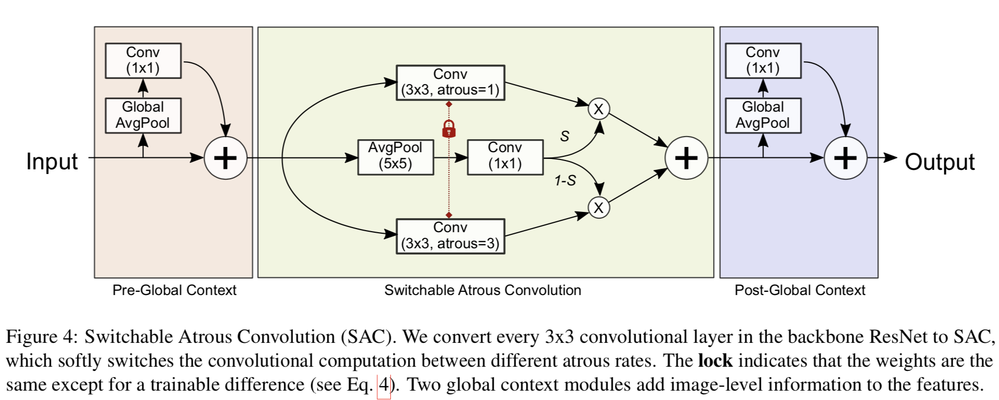

&ensp;&ensp;&ensp;&ensp;虽然最近的anchor free模型势头正猛，有许多大量优秀的工作，也进一步缩减了one stage方法与two stage之间的差距，但是two stage还是凭借其thinking twice的工作机制稳坐目标检测性能的头一把交椅。
<!--more-->
two stage的家族成员有很多，今天只记录最新的三部曲：Cascade RCNN、HTC和DetectoRS。

###### Cascade RCNN
我们都知道在faster rcnn中经过RPN筛选得到的候选框还需要进行进一步的挑选才用来训练roi head，这时候的挑选采用的iou阈值是0.5，并且以3:1的比例进行选择，iou的选择直接决定了正样本和负样本的数量和质量，当iou为0.5时会产生很多的与gt不是很匹配的正样本，但是仅仅简单的提高iou的值，却会导致正样本的数量大量减少，造成过拟合，同样会降低检测器的性能。在cascade RCNN中，作者通过实验发现了一个很有意思的现象，在提升iou的阈值之后，同时提升inference阶段的iou的阈值，检测器性能会达到最优，也就是检测器的只有在训练和输入的分布接近时，效果最好，如下图所示。

因此作者设计了一个cascade结构来逐渐的调整输入roi的分布，并且相应的提升训练的iou阈值来提升最终的检测性能，其结构如下图所示。

其具体的操作也十分简单，首先在原来的FPN的roi head之后再串联两个head，并且分别设置其iou为0.6和0.7，然后在训练的时候将前一个head的输出作为下一个head的输入。

###### HTC
在经过cascade rcnn的改进之后，其目标检测性能得到了很大的提升，但是这种改进单纯运用在实例分割任务上却提升效果不明显，所以为了弥补这两个任务之间的性能差异，作者提出了HTC(Hybrid Task Cascade for Instance Segmentation
)，HTC的相对于cascade rcnn的改进总共包括三个部分，第一在每个cascade阶段引入了mask head，第二增加了不同阶段的mask information flow，也就是上一阶段到下一阶段的直接相连，第三引入了语义分支，并将其与box和mask两个任务的输入直接相加，需要注意的是这里的语义分支最后也是通过roi align来在其上crop对应的区域然后相加的而不是直接将整个语义信息加到这两个head之上。整体的改进结构如图所示。

mask information flow的流程图如下所示：

还有一点需要说明的是HTC中语义信息的获取方式，如下图所示，这里的语义信息是通过FPN的neck部分输出的特征金字塔中{p2,p3,p4,p5,p6}阶段的输出以p3的特征图空间大小为准，将其他阶段的特征图通过上采样或者下采样然后直接向加得到的。

###### DetectoRS
DetectoRS是目前的目标检测和实例分割的冠军算法，它将look and thinking twice的思想应用在了FPN上提出了RFP(Recursive Feature Pyramid),将原本HTC的FPN扩展为两个阶段，并将前一个阶段的FPN中top-down的输出通过ASPP(Atrous Spatial Pyramid Pooling)反馈到下一个阶段的bottom-up的backbone中去，同时将其与下一个阶段的top-down的输出对应相加融合。另外，这篇论文中还提出了SAC(Switchable Atrous Convolution)替换掉backbone网络中所有的$3\times3$卷积,其将同一特征图类似于ASPP使用不同空洞率的卷积层相卷积，然后通过选择机制相加。其直接思想是小的空洞率的卷积层因为其感受野较小对小目标比较注重，而大的空洞率的卷积层拥有更大的感受野可以更好的检测大目标，但其在具体的实施中采用的是DCN。

RFP的结构图如下所示：

并且在与backbone相连时采用了ASPP结构，但是不同于原始的ASPP在其四个分支合并之后没有使用额外的卷积层。
不同阶段的top-down输出与bottom-up的resnet backbone的融合方式如下图所示：

不同阶段的top-down结构相融合的过程如下图所示：

SAC的结构图如下所示：

在SAC之前和之后还分别添加了类似于SEnet的全局上下文信息，还需要注意的是不同Recursive阶段中backbone中特征是不共享的。
