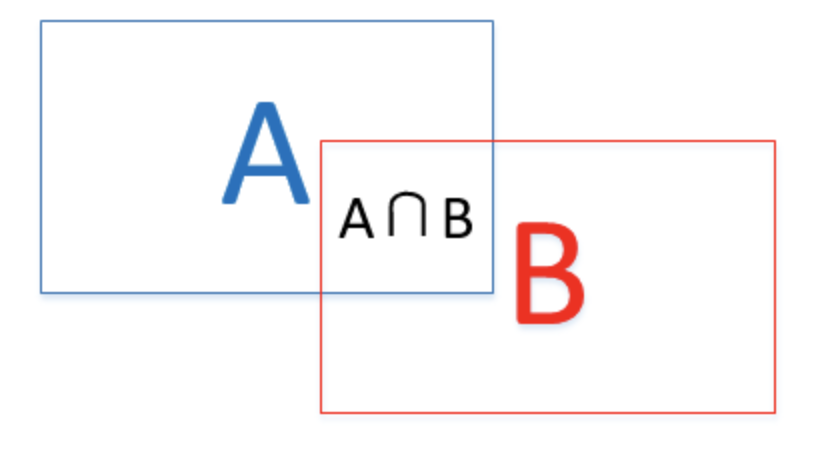
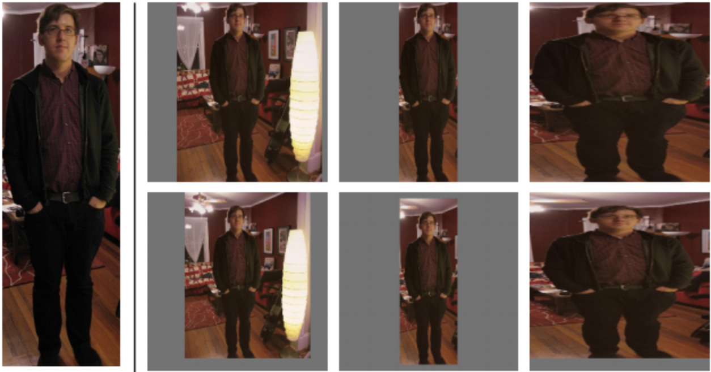
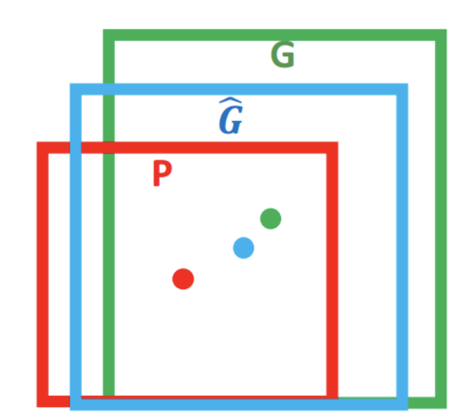

&ensp;&ensp;&ensp;&ensp;目标检测是**cv**的一个重要领域，**RCNN**的出现将目标检测的准确率提高了一个档次，虽然其过程较为复杂和繁琐，现在早已被其它网络所替代，但其中的一些思想一直被其它网络所借鉴。
<!--more-->
&ensp;&ensp;&ensp;&ensp;接下来从**RCNN**的训练和检测两个阶段来介绍一下其基本流程：
###### 一.训练阶段（假设网络的**backbone**为**Alexnet**）
1.在**Imagenet**数据集上对**Alexnet**进行预训练，这时最后的分类为1000类。
2.使用**PASCALVOC 2007**数据集来进行**fine-tune**。
1）首先使用**selective search**方法从每张图片中提取出2000个建议框，并将每个建议框与该张图片中的所有**groung truth**计算**IOU**，这时分两种情况，第一种计算得到的**IOU**列表中有的大于0.5，有的小于0.5，则将该建议框的**Label**标为大于0.5中的最大值所对应的**ground truth**的**Label**，第二种计算得到的**IOU**列表中的所有值都小于**0.5**，则将其**Label**设置为**negative**。这时可以建立两个文件夹，第一个文件夹保存正样本，其文件夹下可按类别分为多个自文件夹。第二个文件夹中保存负样本。
2）预处理，这时共得到N&times;2000个建议框（假设有N张图片），然后对所有的建议框进行resize处理，使用各向异性变形Padding=16（padding的值为建议框像素平均值）对N&times;2000个建议框进行处理最后每个大小为227&times;227（为了符合Alexnet输入大小），并且减去该建议框像素平均值。
3）进行**fine-tune**，每个mini-batch取32个正样本（包含所有类别），96个负样本，共128个样例进行训练，此时将最后的分类输出由1000类改为21类（PASCALVOC 2007中共有20类再加上背景类）。
3.训练SVM分类器
&ensp;&ensp;&ensp;&ensp;SVM需要为每一个类训练一个分类器，有20类，则共需20个SVM，每一个SVM都是一个2分类，此时可以将ground truth的按类分文件夹分别存储，然后再使用selective search方法对每一张图片生成建议框，将所有IOU小于0.3的建议框的Label标为negative，并将其保存在一个负例文件夹下（当然可以在步骤2的第一步就预先保存下来）。然后分别使用每一类的ground truth为positives和得到的negtive分别使用**standard hard negative mining method**方法训练20个SVM，这个过程首先需要将预处理之后的positives和negtive送入步骤2中已经fine-tune的Alexnet分类器，并将每个全连接的输出保存，即每个positives和negtive样例得到4096&times;1维的向量，然后在用其作为SVM的输入，每个SVM得到一个维度为1的输出（例如分数大于0.5的为positive，反之为negtive）。
4.训练**BBox**回归
&ensp;&ensp;&ensp;&ensp;与训练SVM一样，对每一个目标类分别训练一个BBox回归模型，共20个**BBox**回归模型，首先使用selective search方法得到每一类IOU大于0.6的建议框，并计算这些建议框与其对应的**ground truth**的缩放和偏移值t*，并按照分类文件夹保存，然后将每一个建议框经过预处理后送入步骤2中**fine-tune**后的**Alexnet**,得到每一个**pooling 5**之后的6&times;6&times;256的特征张量，然后将每一个(特征张量，t*)送入回归模型进行训练。
###### 二.测试阶段
&ensp;&ensp;&ensp;&ensp;对每一张输入图片进行selective search产生2000个建议框，经过预处理之后送入训练好的Alexnet，得到2000&times;4096维的输出向量，将其与得到的输入为4096&times;1的20个分类进行计算，得到2000&times;20的输出，然后对每一类进行NMS处理去掉冗余框，并将剩下的建议框送入Alexnet得到pooling 5后的特征张量，送入该类对应的BBox回归模型得到最后的位置信息。
###### 三.概念解释
1.**IOU**
&ensp;&ensp;&ensp;&ensp;IOU的计算基于Jaccard相似系数，其主要衡量了两个边界框的重叠率。它的计算需要真实框Bgt和预测框Bp这两个值的参与，通过计算IOU值就可以判定一个检测是**TP**（True Positive）还是**FP**（False Positive）。IOU的值可以通过计算真实框和预测框交集和并集的比值得到：
$$ IOU = /frac{area(B_{gt}\bigcapB_p)}{area(B_{gt}\bigcupB_p)} $$

&ensp;&ensp;&ensp;&ensp;一般而言，在判定一个检测目标是TP还是FP时会设定一个置信度阈值，当IOU值超过这个阈值时，判定其为TP，反之，则为FP。此外，当某个真实框没有被检测出时定义其为FN（False Negative）。
2.各向异性变形Padding=16
&ensp;&ensp;&ensp;&ensp;作者共提出了四种变形方式：
1）考虑context【图像中context指RoI周边像素】的各向同性变形，建议框像周围像素扩充到227×227，若遇到图像边界则用建议框像素均值填充，下图第二列；
2）不考虑context的各向同性变形，直接用建议框像素均值填充至227×227，下图第三列； 
3）各向异性变形，简单粗暴对图像就行缩放至227×227，下图第四列；
4）变形前先进行边界像素填充【padding】处理，即向外扩展建议框边界，以上三种方法中分别采用padding=0下图第一行，padding=16下图第二行进行处理；
经过作者一系列实验表明采用padding=16的各向异性变形即下图第二行第三列效果最好，能使mAP提升3-5%。 

3.对应ground truth的缩放和偏移值t*<\sup>
&ensp;&ensp;&ensp;&ensp; 对于窗口一般使用四维向量(x,y,w,h) 来表示， 分别表示窗口的中心点坐标和宽高。红色的框 P 代表原始的Proposal, 绿色的框 G 代表目标的 Ground Truth， 我们的目标是寻找一种关系使得输入原始的窗口 P 经过映射得到一个跟真实窗口 G 更接近的回归窗口Ĝ 。

&ensp;&ensp;&ensp;&ensp; 边框回归的目的就是找到一种映射f,使得预测得到的建议框对应的坐标(Px,Py,Pw,Ph)通过f(Px,Py,Pw,Ph)=(\hat{Gx},\hat{Gy},\hat{Gw},\hat{Gh})且(\hat{Gx},\hat{Gy},\hat{Gw}&approx;(Gx,Gy,Gw,Gh)
&ensp;&ensp;&ensp;&ensp; 因此使用平移和缩放来得到这种映射关系，即在回归中要学习其预测框相对与真实框的平移值和缩放值：
$$ t_x = (G_x - P_x)/P_w $$
$$ t_y = (G_y - P_y)/P_h $$
$$ t_w = log(G_w/P_w) $$
$$ t_h = log(G_h/P_h) $$
&ensp;&ensp;&ensp;&ensp; 那么目标函数就可以用d*P=WT&Phi;5(P),&Phi;5(P)对应建议框经过pooling 5输出的向量，d*P是得到的预测值。回归的目的是让预测值与真实值的差距变小，其代价函数为：
$$ Loss = \sum_{i}^{N}(t_{*}^{i}-\hat{w}_{*}^{T}/phi_{5})^2 $$
&ensp;&ensp;&ensp;&ensp; 在得到d*P之后，便可得到调整之后的(\hat{Gx},\hat{Gy},\hat{Gw},\hat{Gh})：
$$ \hat{G}_x = P_wd_x(P) + P_x  $$
$$ \hat{G}_y = P_hd_y(P) + P_y  $$
$$ \hat{G}_w = P_wexp(d_w(P))  $$
$$ \hat{G}_h = P_hexp(d_h(P))  $$
4. standard hard negative mining method
&ensp;&ensp;&ensp;&ensp; 在训练过程中会出现 正样本的数量远远小于负样本，这样训练出来的分类器的效果总是有限的，会出现许多false positive。采取办法可以是，先将正样本与一部分的负样本投入模型进行训练，然后将训练出来的模型去预测剩下未加入训练过程的负样本，当负样本被预测为正样本时，则它就为false positive，就把它加入训练的负样本集，进行下一次训练，知道模型的预测精度不再提升这就好比错题集，做错了一道题，把它加入错题集进行学习，学会了这道题，成绩就能得到稍微提升，把自己的错题集都学过去，成绩就达到了相对最优。
4.非极大值抑制（Non-Maximum Suppression，NMS）
&ensp;&ensp;&ensp;&ensp; 目标检测的过程中在同一目标的位置上会产生大量的候选框，这些候选框相互之间可能会有重叠，此时需要利用非极大值抑制找到最佳的目标边界框，消除冗余的边界框。假设已经有了目标边界框列表及其对应的置信度得分列表，设定阈值，阈值用来删除重叠较大的边界框。其计算流程为1）将目标边界框列表根据置信度得分进行排序；2）选择置信度最高的比边界框添加到最终输出列表中，将其从边界框列表中删除；3）计算置信度最高的边界框与其它候选框的IoU；4）删除IoU大于阈值的边界框。然后重复这一过程直至边界框列表为空。

   
参考：
  &ensp;https://arxiv.org/abs/1311.2524v3
  &ensp;https://blog.csdn.net/zijin0802034/article/details/77685438
  &ensp;https://github.com/Liu-Yicheng/R-CNN
  &ensp;https://blog.csdn.net/qq_33221533/article/details/81312880
  
  
 **注**：此博客内容为原创，转载请说明出处

