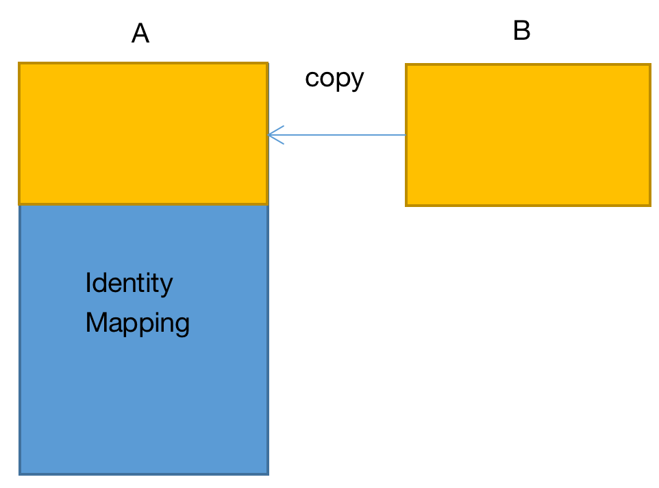
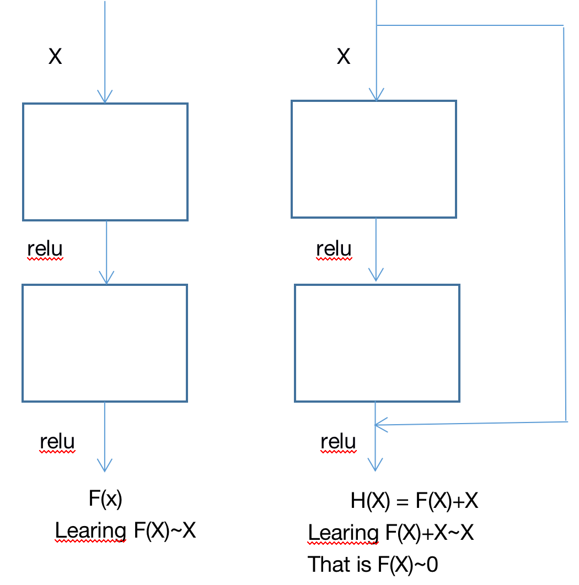

&ensp;&ensp;&ensp;&ensp;**Resnet**是何凯明的一部神作，残差结构的出现真正让卷积神经网络**gooing deeper**，通过残差结构可以达到152层(resnetv1的1202层效果并不是很好，resnetv2达到了1000层以上），这种结构的改进可以说是和BN一样具有网络通用性。那么大神是怎么想到这一点的呢，这篇论文的动机来自于作者观察到的一个普遍现象，在较深的卷积神经网络训练过程中精度会慢慢达到饱和然后快速退化，而这种退化不是因为过拟合(因为这种现象同样发生在训练阶段)或者梯度消失(作者在实验阶段证实了这一点)等原因造成。
&ensp;&ensp;&ensp;&ensp;在介绍这篇论文之前还需要搞清楚几个概念恒等映射(**Identity Mapping**)和残差(**Residual**)。
1.恒等映射
`!$$ G(x) = x $$`
2.残差
`!$$ f(X) = b $$`
假设x0是x的近似值，则残差为：
`!$$ b-x_0 $$`
&ensp;&ensp;&ensp;&ensp;其实残差就是系统观测值和系统估计值的差值。
&ensp;&ensp;&ensp;&ensp;作者提出了一种假设如果深度较大的网络效果不好，那我们将一个已经训练好的浅层网络的参数复制到一个深度网络的浅层，再让深度网络的其它层保证恒等映射，那么这个深度网络的效果起码应该不比浅层网络差吧。

&ensp;&ensp;&ensp;&ensp;但是这种恒等映射绝非将A网络的其它层的参数全都置为0，那样就成了恒等了而不是恒等映射了，所以作者就在寻找这种恒等映射的路上提出了残差结构，通过短路连接将残差引入到系统当中。

&ensp;&ensp;&ensp;&ensp;上面的结构之所能称之为残差是因为恒等映射，输入为X，输出为H(X)~X，这里的输入X就是观测值，H(X)就是估计值。因为作者认为这样学习F(X)~0,比学习F(X)~X更容易，下面就通过一个不太恰当的例子说明一下：

假设输入为X=10，分别通过两种映射F(X)=W和H(X)，得到的输出为11。
`!$$ F(X) = W_F * X $$`
`!$$ H(X) = F(x) + x $$`
`!$$ H(X) = W_H * X + X $$`
则,WF为1.1，WH为0.1，假设真实值为y = 12，学习率为0.1，则通过反向传播链式法则，
`!$$ L_F = y - F(X) $$`
`!$$ L_H = y - H(X) $$`
`!$$ \frac{\partial L_F}{\partial W_F} = \frac{\partial L}{\partial F}·\frac{\partial F}{\partial W_F} = -X $$`
`!$$ \frac{\partial L_H}{\partial W_H} = \frac{\partial L}{\partial H}·\frac{\partial H}{\partial W_H} = -X $$`
`!$$ W_H = 0.1 + 10*0.1 = 1.1 $$`
`!$$ W_F = 1.1 + 10*0.1 = 2.1 $$`
&ensp;&ensp;&ensp;&ensp;从上式中我们能看出WH由原来的0.1变为了1.1增加了10倍，WF由原来的1.1变为了2.1。W_H对于结果的变化更加敏感，这也就是作者为什么说学习F(X)~0,比学习F(X)~X更容易。
&ensp;&ensp;&ensp;&ensp;此外，作者提出了三种形式的残差网络结构，1.对于结构未改变的使用恒等映射，对于结构改变的使用0填充;2.对于结构未改变的使用恒等映射，对于网络结构改变的使用学习参数来改变维度;3.对于所有的结构都使用学习参数。实验结果表明第三种的效果最好，但是与第二种的差别也不是很大，第三种的参数也会相应增多论文所以采用了第二种方式。
参考：
  &ensp;https://arxiv.org/abs/1512.03385
  &ensp;https://en.wikipedia.org/wiki/Residual_(numerical_analysis)
   &ensp; https://zhuanlan.zhihu.com/p/32085715
 **注**：此博客内容为原创，转载请说明出处

