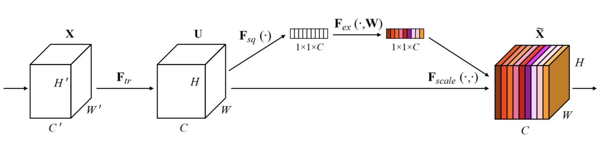
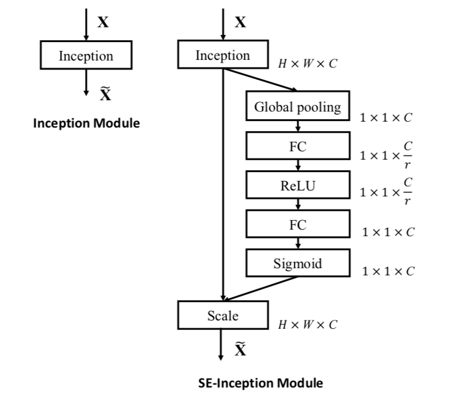
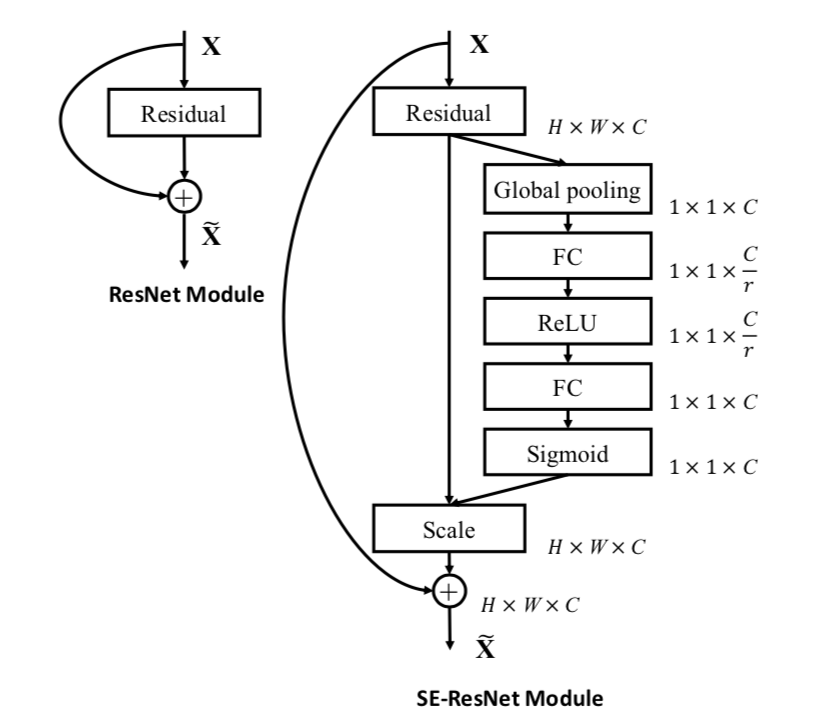
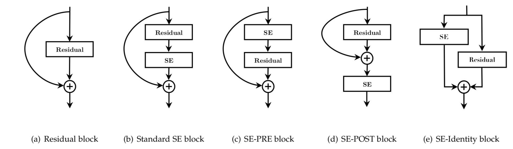
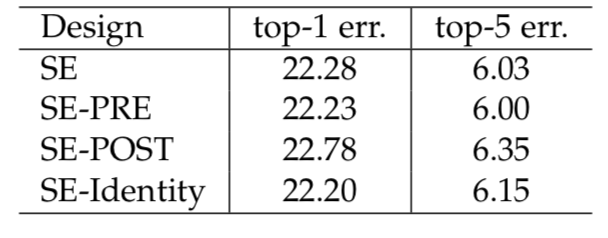

&ensp;&ensp;&ensp;&ensp; 作者提出了一种新的**SE block**挤压-激发式模块，可以嵌入在多种网络模型中提升性能。因为在普通的卷积操作中，滤波器只能捕获到局部空间之间的依赖关系而不能利用其全局相互性关系。作者希望通过挤压和激发两个步骤来模仿通道的内部联系来校准滤波器响应。每个滤波器的卷积操作只是在局部感受野上，因此不能获取到此区域之外的上下文信息，因此可以通过将全局空间信息“挤压”进一个全局描述符，通过全局平均池化，然后将得到的一维张量通过两个全连接操作，第一个全连接将输入通道c缩减r倍，通常r取16，然后在通过另一个全连接将通道扩展到c，然后将c的每一个通道与未进行全局平均池化的u的每一个通道相乘来进行特征校准。

1.**Squeeze: Global Information Embedding**
    `!$$ Z_c = F_sq(u_c) = \frac{1}{H&times;W}\sum_{i=1}^{H}\sum_{j=1}^{W}u_c(i,j) $$`
2.**Excitation: Adaptive Recalibration**
`!$$ s=F_ex(z,W) = \sigma(g(z,W)) = \sigma(W_2\delta(W_1z)) $$`
`!$$ F_{scale}(u_c,s_c)=s_c·u_c $$`

&delta;代表**relu**，&sigma;代表**sigmoid**。
&ensp;&ensp;&ensp;&ensp; 整合**SE-Block**示例：

同时作者做了将**SE-Block**整合在**resnet**不同位置的实验，其结果如下：

&ensp;&ensp;&ensp;&ensp; 作者通过实验观察到SE模块不断提高不同深度的性能，计算复杂度极小。并且做了使用全局最大池化代替全局平均池化的实验，发现结果有所降低。并且通过去掉全局平均池化，使用1x1卷积代替两个全连接网络来进行了无“挤压”对比，性能有所降低。