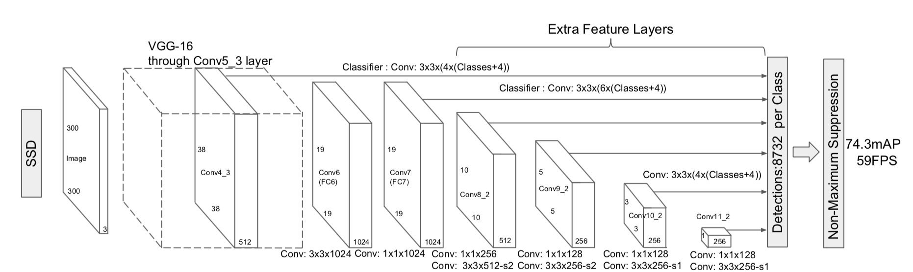
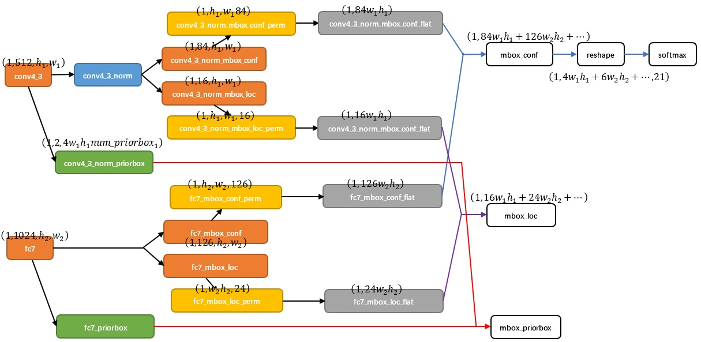
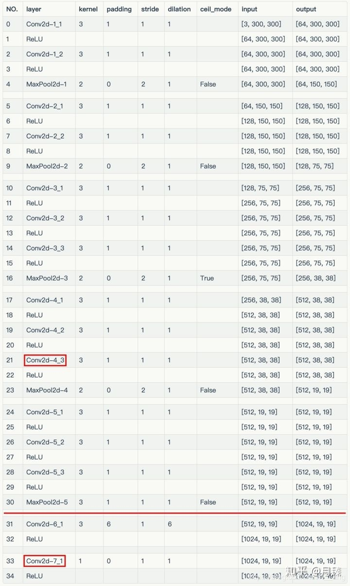
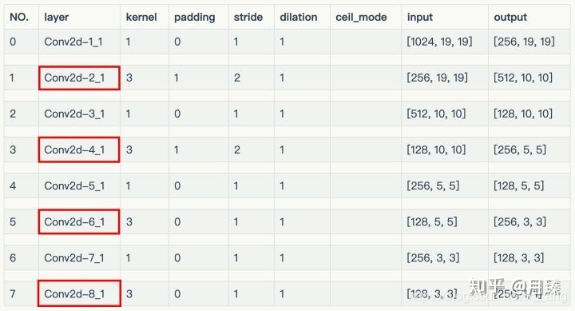
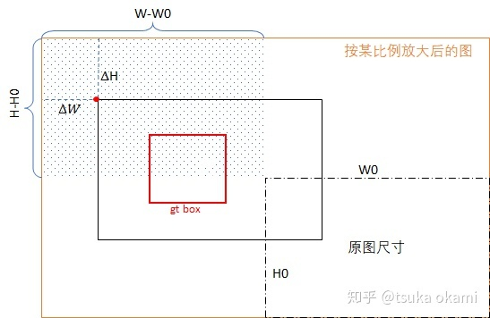
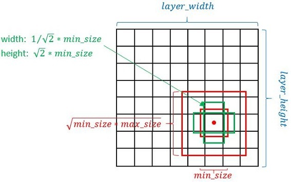
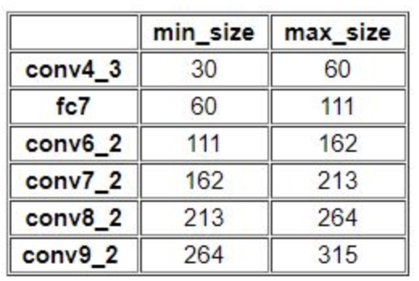

&ensp;&ensp;&ensp;&ensp;**SSD**(Single Shot MultiBox Detector)是典型的one stage目标检测方法的代表，相对于RCNN系列需要首先产生proposals，**SSD**没有了proposal generation和后续的roi pooling步骤，它将整个计算过程都封装在了单个网络中。
<!--more-->
&ensp;&ensp;&ensp;&ensp;Wei Liu的caffe版本的源代码见[weiliu89/caffe](https://github.com/weiliu89/caffe/tree/ssd),其较好的讲解见[知乎目标检测专栏SSD 分析](https://zhuanlan.zhihu.com/p/51217002),这篇博客是参考的是lufficc的pytorch版本见[lufficc/ssd](https://github.com/lufficc/SSD),虽然这个版本的star不太多，但是比较新，而且作者的readme中的实验结果竟然比原论文的结果还要好，这当然要学习一下。
&ensp;&ensp;&ensp;&ensp;**SSD**主要使用了多级特征图来共同参与目标分类和位置回归，并且使用了数据增广来扩充样本和**Hard negative mining**方法来解决正负样本不均衡的问题，**SSD**使用**VGG-16**作为主干网络，并且在其后添加了扩展层来构成整个网络。其论文中给出的网络结构如下图。
<div align=center></div>

#### Network model
<div align=center></div>
上图为主要的网络结构，这个图看起来很复杂，其实很简单，conv4_3layer之前以及之后一直到conv5_3与VGG一致，接着便是fc, conv6, conv7, conv8, conv9五个子卷积网络， 这五个子卷积网络与conv4子网络加起来共6个，其feature map 大小是不同的，在图中已经标注出来，这些feature map分别送入一个子网络，在图中使用虚线框圈住，并联合初始输入数据blobdata，用于生成prior box，坐标loc以及分类置信度conf 三组数据（每组当然是6个），然后这三组数据分别concatenate形成三个blob，并联合初始输入数据label，送入最后一个Layer。当然conv4_3的数据还经过了normalization，因为这个feature map尺寸较大。
那么接下来以conv4_3和fc7为例分析SSD是如何将不同size的feature map组合在一起进行prediction。下图展示了conv4_3和fc7合并在一起的过程中caffe blob shape变化（其他层类似，考虑到图片大小没有画出来，请脑补）。
<div align=center></div>
**注意**：mbox_loc输出的维度为（1，4w1h1+6w1h1..., 4）,而不是上图中的（1，16w1h1+24w1h1）
&ensp;&ensp;&ensp;&ensp;1）对于conv4_3 feature map，conv4_3_norm_priorbox（priorbox层）设置了每个点共有4个prior box。由于SSD 300共有21个分类，所以conv4_3_norm_mbox_conf的channel值为num_priorbox&times;num_class = 4&times;21 = 84；而每个prior box都要回归出4个位置变换量，所以conv4_3_norm_mbox_loc的caffe blob channel值为4&times;4 = 16。
&ensp;&ensp;&ensp;&ensp;2）fc7每个点有6个prior box，其他feature map同理。
&ensp;&ensp;&ensp;&ensp;3）经过一系列上图展示的caffe blob shape变化后，最后拼接成mbox_conf和mbox_loc。而mbox_conf后接reshape，再进行softmax。

&ensp;&ensp;&ensp;&ensp;接下来还是从理论结合源码分析一下整个**SSD**的流程，从作者的**Single GPU training**输入命令行：
```javascript
	python train_ssd.py --config-file configs/ssd300_voc0712.yaml --vgg vgg16_reducedfc.pth
```
可以看出其入口程序为train_ssd.py,在这个文件中的main函数中前面的程序为解析参数和一些写入日志的操作，其最后调用了train函数，在train函数中首先是调用build_ssd_model对整个网络的结构进行了定义，build_ssd_model.py定义在modeling/vgg_ssd.py中，其代码如下：
```javascript
	def build_ssd_model(cfg):
		num_classes = cfg.MODEL.NUM_CLASSES
		size = cfg.INPUT.IMAGE_SIZE
		#vgg网络配置文件
		vgg_base = {
			'300': [64, 64, 'M', 128, 128, 'M', 256, 256, 256, 'C', 512, 512, 512, 'M',
					512, 512, 512],
			'512': [64, 64, 'M', 128, 128, 'M', 256, 256, 256, 'C', 512, 512, 512, 'M',
					512, 512, 512],
		}
		#扩展层网络配置文件
		extras_base = {
			'300': [256, 'S', 512, 128, 'S', 256, 128, 256, 128, 256],
			'512': [256, 'S', 512, 128, 'S', 256, 128, 'S', 256, 128, 'S', 256],
		}

		boxes_per_location = cfg.MODEL.PRIORS.BOXES_PER_LOCATION

		vgg_config = vgg_base[str(size)]
		extras_config = extras_base[str(size)]

		vgg = nn.ModuleList(add_vgg(vgg_config))#返回vgg的网络模型
		extras = nn.ModuleList(add_extras(extras_config, i=1024, size=size))#返回扩展层网络模型
        #为conv4-3/conv-7/conv6-2/conv7-2/conv8_2/conv9_2添加分类和回归
		regression_headers, classification_headers = add_header(vgg, extras, boxes_per_location, num_classes=num_classes)
		regression_headers = nn.ModuleList(regression_headers)
		classification_headers = nn.ModuleList(classification_headers)

		return SSD(cfg=cfg,
				   vgg=vgg,
				   extras=extras,
				   classification_headers=classification_headers,
				   regression_headers=regression_headers)
```
&ensp;&ensp;&ensp;&ensp;其中，cfg为整个工程的配置参数文件，位于config/defaults.py中，首先，分别通过add_vgg函数和add_extras函数定义了网络的vgg和扩展层的网络结构，然后为conv4-3/conv-7/conv6-2/conv7-2/conv8_2/conv9_2添加分类和回归输出，最后将这些构建好的网络部件通过SSD函数整合成了一个完整的网络，这些文件也都定义在vgg_ssd.py中，其代码为：
```javascript
	# borrowed from https://github.com/amdegroot/ssd.pytorch/blob/master/ssd.py
	def add_vgg(cfg, batch_norm=False):
		layers = []
		in_channels = 3
		for v in cfg:
			if v == 'M':
				layers += [nn.MaxPool2d(kernel_size=2, stride=2)]
			elif v == 'C':
				"""ceil_mode - 如果等于True，计算输出信号大小的时候，会使用向上取整，代替默认的向下取整的操作
				输入: (N, C, H_{in}, W_in)
				输出: (N, C, H_out, W_out)
				$$H_{out} = floor((H_{in} + 2padding[0] - dilation[0](kernel_size[0] - 1) - 1) / stride[0] + 1$$
				$$W_{out} = floor((W_{in} + 2padding[1] - dilation[1](kernel_size[1] - 1) - 1) / stride[1] + 1$$
				"""
				layers += [nn.MaxPool2d(kernel_size=2, stride=2, ceil_mode=True)]
			else:
				conv2d = nn.Conv2d(in_channels, v, kernel_size=3, padding=1)
				if batch_norm:
					layers += [conv2d, nn.BatchNorm2d(v), nn.ReLU(inplace=True)]
				else:
					layers += [conv2d, nn.ReLU(inplace=True)]
				in_channels = v
		pool5 = nn.MaxPool2d(kernel_size=3, stride=1, padding=1)
		#dilation(int or tuple, optional) – 卷积核元素之间的间距
		conv6 = nn.Conv2d(512, 1024, kernel_size=3, padding=6, dilation=6)
		conv7 = nn.Conv2d(1024, 1024, kernel_size=1)
		layers += [pool5, conv6,
				   nn.ReLU(inplace=True), conv7, nn.ReLU(inplace=True)]
		return layers

	def add_extras(cfg, i, size=300):
		# Extra layers added to VGG for feature scaling
		layers = []
		in_channels = i
		flag = False
		for k, v in enumerate(cfg):
			if in_channels != 'S':
				if v == 'S':
					layers += [nn.Conv2d(in_channels, cfg[k + 1], kernel_size=(1, 3)[flag], stride=2, padding=1)]
				else:
					layers += [nn.Conv2d(in_channels, v, kernel_size=(1, 3)[flag])]
				flag = not flag
			in_channels = v
		if size == 512:
			layers.append(nn.Conv2d(in_channels, 128, kernel_size=1, stride=1))
			layers.append(nn.Conv2d(128, 256, kernel_size=4, stride=1, padding=1))
		return layers

	#为参与分类与回归的conv4-3/conv-7/conv6-2/conv7-2/conv8_2/conv9_2添加分类和回归输出
	def add_header(vgg, extra_layers, boxes_per_location, num_classes):
		regression_headers = []
		classification_headers = []
		vgg_source = [21, -2]
		for k, v in enumerate(vgg_source):
			regression_headers += [nn.Conv2d(vgg[v].out_channels,
											 boxes_per_location[k] * 4, kernel_size=3, padding=1)]
			classification_headers += [nn.Conv2d(vgg[v].out_channels,
												 boxes_per_location[k] * num_classes, kernel_size=3, padding=1)]
		for k, v in enumerate(extra_layers[1::2], 2):#2代表k值从2开始
			regression_headers += [nn.Conv2d(v.out_channels, boxes_per_location[k]
											 * 4, kernel_size=3, padding=1)]
			classification_headers += [nn.Conv2d(v.out_channels, boxes_per_location[k]
												 * num_classes, kernel_size=3, padding=1)]
		return regression_headers, classification_headers
```
其定义好的vgg结构如下图(来自[SSD-PyTorch源码解析](https://zhuanlan.zhihu.com/p/66332452))，
<div align=center></div>
其定义好的扩展层结构如下图(来自[SSD-PyTorch源码解析](https://zhuanlan.zhihu.com/p/66332452))，
<div align=center></div>
**注意**其中conv2d-6_1使用了间距为6的dilation卷积，dilation的卷积方式如下图，更多的卷积方式见[vdumoulin/conv_arithmetic](https://github.com/vdumoulin/conv_arithmetic/blob/master/README.md).
<div align=center></div>
在定义好vgg,extras,classification_headers,egression_headers这四个组件之后就要通过SSD函数将这四个组件整合为一个完整的网络，SSD函数定义在modeling/ssd.py中，其代码为：
```javascript
	class SSD(nn.Module):
		def __init__(self, cfg,
					 vgg: nn.ModuleList,
					 extras: nn.ModuleList,
					 classification_headers: nn.ModuleList,
					 regression_headers: nn.ModuleList):
			"""Compose a SSD model using the given components.
			"""
			super(SSD, self).__init__()
			self.cfg = cfg
			self.num_classes = cfg.MODEL.NUM_CLASSES
			self.vgg = vgg
			self.extras = extras
			self.classification_headers = classification_headers
			self.regression_headers = regression_headers
			self.l2_norm = L2Norm(512, scale=20)#需要对conv4_3进行L2Norm
			self.criterion = MultiBoxLoss(neg_pos_ratio=cfg.MODEL.NEG_POS_RATIO)
			self.priors = None
			self.reset_parameters()

		def reset_parameters(self):
			def weights_init(m):
				if isinstance(m, nn.Conv2d):
					nn.init.xavier_uniform_(m.weight)
					nn.init.zeros_(m.bias)

			self.vgg.apply(weights_init)
			self.extras.apply(weights_init)
			self.classification_headers.apply(weights_init)
			self.regression_headers.apply(weights_init)

		def forward(self, x, targets=None):
			"""
			:param x: input image
			:param targets: (gt_boxes, gt_labels)
			:return:
			"""
			sources = []
			confidences = []
			locations = []
			for i in range(23):
				x = self.vgg[i](x)
			s = self.l2_norm(x)  # Conv4_3 L2 normalization
			sources.append(s)#加入conv2d-4_3

			# apply vgg up to fc7
			for i in range(23, len(self.vgg)):
				x = self.vgg[i](x)
			sources.append(x)#加入conv2d-7_1
   
			for k, v in enumerate(self.extras):
				x = F.relu(v(x), inplace=True)
				if k % 2 == 1:
					sources.append(x)#加入conv2d-2-1,conv2d-4-1,conv2d-6-1,conv2d-8-1
			#转换维度[batch_num, channel, height, width]为[batch_num, height, width, channel]
			for (x, l, c) in zip(sources, self.regression_headers, self.classification_headers):
				locations.append(l(x).permute(0, 2, 3, 1).contiguous())
				confidences.append(c(x).permute(0, 2, 3, 1).contiguous())
            
			confidences = torch.cat([o.view(o.size(0), -1) for o in confidences], 1)
			locations = torch.cat([o.view(o.size(0), -1) for o in locations], 1)
            #(1, 4w1h1 + 6w2h2 + ...., 21)
			confidences = confidences.view(confidences.size(0), -1, self.num_classes)
			#(1, 4w1h1 + 6w2h2+..., 4)
			locations = locations.view(locations.size(0), -1, 4)

			if not self.training:
				# when evaluating, decode predictions
				if self.priors is None:
					self.priors = PriorBox(self.cfg)().to(locations.device)
				confidences = F.softmax(confidences, dim=2)
				boxes = box_utils.convert_locations_to_boxes(
					locations, self.priors, self.cfg.MODEL.CENTER_VARIANCE, self.cfg.MODEL.SIZE_VARIANCE
				)
				boxes = box_utils.center_form_to_corner_form(boxes)
				return confidences, boxes
			else:
				# when training, compute losses
				gt_boxes, gt_labels = targets
				regression_loss, classification_loss = self.criterion(confidences, locations, gt_labels, gt_boxes)
				loss_dict = dict(
					regression_loss=regression_loss,
					classification_loss=classification_loss,
				)
				return loss_dict

		def init_from_base_net(self, model):
			vgg_weights = torch.load(model, map_location=lambda storage, loc: storage)
			self.vgg.load_state_dict(vgg_weights, strict=True)

		def load(self, model):
			self.load_state_dict(torch.load(model, map_location=lambda storage, loc: storage))

		def save(self, model_path):
			torch.save(self.state_dict(), model_path)
```
对conv4_3输出数据进行归一化，所以输出blob与输入blob的shape相同，沿着通道轴进行归一化，下面给出归一化的公式：
$$ S_{i} = \sqrt{\sum_{c}X_{i,c}^{2}+\epsilon} $$
$$ X_{i,c}: = X_{i,c}/S_{i}, C=1,2,...C $$
其中，i表示空间平面（ W,H）某点坐标，c表示某个通道，$\epsilon$代表一个极小数。
其中，L2Norm定义在module/__init__.py中，其代码如下：
```javascript
	class L2Norm(nn.Module):
		def __init__(self, n_channels, scale):
			super(L2Norm, self).__init__()
			self.n_channels = n_channels
			self.gamma = scale or None
			self.eps = 1e-10
			self.weight = nn.Parameter(torch.Tensor(self.n_channels))
			self.reset_parameters()

		def reset_parameters(self):
			init.constant_(self.weight, self.gamma)

		def forward(self, x):
			norm = x.pow(2).sum(dim=1, keepdim=True).sqrt() + self.eps
			x = torch.div(x, norm)
			out = self.weight.unsqueeze(0).unsqueeze(2).unsqueeze(3).expand_as(x) * x
			return out
```

从上面代码可以看出，在将输入图片数据经过网络之后最终得到了(1, 4w1h1 + 6w2h2 + ...., 21)的confidences值和(1, 4w1h1 + 6w2h2+..., 4)的 locations值，接下来就要将结合gt_labels, gt_boxes来计算loss,**注意**此处的gt_labels, gt_boxes不是ground truth对应的label和box，而是在生成priors box之后已经和ground truth绑定完的priors box和priors labels，计算loss的MultiBoxLoss函数定义在modeling/multibox_loss中，其代码如下：
```javascript
	class MultiBoxLoss(nn.Module):
		def __init__(self, neg_pos_ratio):
			"""Implement SSD MultiBox Loss.

			Basically, MultiBox loss combines classification loss
			 and Smooth L1 regression loss.
			"""
			super(MultiBoxLoss, self).__init__()
			self.neg_pos_ratio = neg_pos_ratio

		def forward(self, confidence, predicted_locations, labels, gt_locations):
			"""Compute classification loss and smooth l1 loss.

			Args:
				confidence (batch_size, num_priors, num_classes): class predictions.
				predicted_locations (batch_size, num_priors, 4): predicted locations.
				labels (batch_size, num_priors): real labels of all the priors.
				gt_locations (batch_size, num_priors, 4): real boxes corresponding all the priors.
			"""
			num_classes = confidence.size(2)
			with torch.no_grad():
				# derived from cross_entropy=sum(log(p))
				loss = -F.log_softmax(confidence, dim=2)[:, :, 0]
				mask = box_utils.hard_negative_mining(loss, labels, self.neg_pos_ratio)

			confidence = confidence[mask, :]
			classification_loss = F.cross_entropy(confidence.view(-1, num_classes), labels[mask], reduction='sum')

			pos_mask = labels > 0
			predicted_locations = predicted_locations[pos_mask, :].view(-1, 4)
			gt_locations = gt_locations[pos_mask, :].view(-1, 4)
			smooth_l1_loss = F.smooth_l1_loss(predicted_locations, gt_locations, reduction='sum')
			num_pos = gt_locations.size(0)
			return smooth_l1_loss / num_pos, classification_loss / num_pos
```
由上代码可以看出，总的loss共包含两部分，一部分是分类的loss，使用cross_entropy，另一类是位置回归的loss，使用smooth_l1_loss。
**注意**：在计算位置回归是的输出的是偏移值$t_x,t_y,t_w,t_h$
在计算loss之前首先需要通过**Hard negative mining**方法来选择参与训练的正样本和负样本，对batch内的每个image上得到的prior box，对每个prior box，计算置信度损失。根据softmax分类，可知其计算式为： 

$$ L_{i,j}^{conf} = -log(P_{i,j}) $$
$$ S_{i,j} = \sum_{c=0}^{20}exp(V_{i,j,c})$$
$$ P_{i,j}= expV_{i,j,k}/S_{i,j} $$

其中，i表示image 的batch index，j表示image上的prior index，k表示这个prior所匹配的gt box的分类id，如果prior 没有匹配的gt box，则k=0， $v_{i,j,c}$为第i个image上的第j个prior box 预测分类为c的非归一化置信度。
从上面三个式子可见，当这个prior box分类id为p 与匹配的gt box 分类一致时，其分类损失最小，说明这个置信度损失计算式是合适的。当然，为了避免数值计算的溢出等问题，通常首先采取如下变换，
$$ V_{i,j,c} := V_{i,j,c} - max_{d\epsilon{0,1,...,20}}V_{i,j,d}  $$
**但是这个代码里没有进行此操作**。
这样就得到所有prior 的置信度损失。然后再：
&ensp;&ensp;&ensp;&ensp;1）找出合适的负例对应的prior 以及对应的loss，记负例的数量为num_neg。合适的负例判断标准是：如果一个prior box，其没有匹配的gt box，并且与所有gt box的IOU最大值小于0.5（这是负例最大IOU配置的阈值）。
&ensp;&ensp;&ensp;&ensp;2）prior 有匹配的gt box，记数量为num_pos。正负例使用比例设置为1:3，所以num_neg=num_pos * neg_pos_ratio。
&ensp;&ensp;&ensp;&ensp;3）将第1步中找到的合适负例按置信度损失倒序排序，选取置信度损失最大的num_neg个负例prior。
**Hard negative mining**定义在utils/box_utils.py中，其代码如下：
```javascript
	def hard_negative_mining(loss, labels, neg_pos_ratio):
		"""
		It used to suppress the presence of a large number of negative prediction.
		It works on image level not batch level.
		For any example/image, it keeps all the positive predictions and
		 cut the number of negative predictions to make sure the ratio
		 between the negative examples and positive examples is no more
		 the given ratio for an image.

		Args:
			loss (N, num_priors): the loss for each example.
			labels (N, num_priors): the labels.
			neg_pos_ratio:  the ratio between the negative examples and positive examples.
		"""
		pos_mask = labels > 0
		num_pos = pos_mask.long().sum(dim=1, keepdim=True)#pos_mask是什么数据类型，ndarray没有long属性
		num_neg = num_pos * neg_pos_ratio

		loss[pos_mask] = -math.inf
		_, indexes = loss.sort(dim=1, descending=True)#这都是什么数据类型，nadarray的sort没有dim参数
		_, orders = indexes.sort(dim=1)
		neg_mask = orders < num_neg
		return pos_mask | neg_mask
```
最后在SSD类中对预测的location$(t_x,t_y,t_w,t_h)$转换为相应的box($\hat{G_x}$,$\hat{G_y}$,$\hat{G_w}$,$\hat{G_h}$)，其代码如下：
```javascript
	def convert_locations_to_boxes(locations, priors, center_variance,
								   size_variance):
		"""Convert regressional location results of SSD into boxes in the form of (center_x, center_y, h, w).

		The conversion:
			$$predicted\_center * center_variance = \frac {real\_center - prior\_center} {prior\_hw}$$
			$$exp(predicted\_hw * size_variance) = \frac {real\_hw} {prior\_hw}$$
		We do it in the inverse direction here.
		Args:
			locations (batch_size, num_priors, 4): the regression output of SSD. It will contain the outputs as well.
			priors (num_priors, 4) or (batch_size/1, num_priors, 4): prior boxes.
			center_variance: a float used to change the scale of center.
			size_variance: a float used to change of scale of size.
		Returns:
			boxes:  priors: [[center_x, center_y, h, w]]. All the values
				are relative to the image size.
		"""
		# priors can have one dimension less.
		if priors.dim() + 1 == locations.dim():
			priors = priors.unsqueeze(0)
		return torch.cat([
			locations[..., :2] * center_variance * priors[..., 2:] + priors[..., :2],
			torch.exp(locations[..., 2:] * size_variance) * priors[..., 2:]
		], dim=locations.dim() - 1)
```
然后通过center_form_to_corner_form函数将[x_center, y_center, w, h]形式转换为[x_min, y_min, x_max, y_max]的形式，center_form_to_corner_form定义在utils/box_utils.py中，其代码如下：
```javascript
	def center_form_to_corner_form(locations):
		return torch.cat([locations[..., :2] - locations[..., 2:] / 2,
						  locations[..., :2] + locations[..., 2:] / 2], locations.dim() - 1)


	def corner_form_to_center_form(boxes):
		return torch.cat([
			(boxes[..., :2] + boxes[..., 2:]) / 2,
			boxes[..., 2:] - boxes[..., :2]
		], boxes.dim() - 1)
```
**注意**：这里得到的box也是归一化大小的，所以在draw_box是需要恢复到原图大小，恢复原图大小的代码位于modeling/post_processer.py中，如下：
```javascript
	class PostProcessor:
		def __init__(self,
					 iou_threshold,
					 score_threshold,
					 image_size,
					 max_per_class=200,
					 max_per_image=-1):
			self.confidence_threshold = score_threshold
			self.iou_threshold = iou_threshold
			self.width = image_size
			self.height = image_size
			self.max_per_class = max_per_class
			self.max_per_image = max_per_image

		def __call__(self, confidences, locations, width=None, height=None, batch_ids=None):
			"""filter result using nms
			Args:
				confidences: (batch_size, num_priors, num_classes)
				locations: (batch_size, num_priors, 4)
				width(int): un-normalized using width
				height(int): un-normalized using height
				batch_ids: which batch to filter ?
			Returns:
				List[(boxes, labels, scores)],
				boxes: (n, 4)
				labels: (n, )
				scores: (n, )
			"""
			if width is None:
				width = self.width
			if height is None:
				height = self.height

			batch_size = confidences.size(0)
			if batch_ids is None:
				batch_ids = torch.arange(batch_size, device=confidences.device)
			else:
				batch_ids = torch.tensor(batch_ids, device=confidences.device)

			locations = locations[batch_ids]
			confidences = confidences[batch_ids]

			results = []
			for decoded_boxes, scores in zip(locations, confidences):
				# per batch
				filtered_boxes = []
				filtered_labels = []
				filtered_probs = []
				for class_index in range(1, scores.size(1)):
					probs = scores[:, class_index]
					mask = probs > self.confidence_threshold
					probs = probs[mask]
					if probs.size(0) == 0:
						continue
					boxes = decoded_boxes[mask, :]
					boxes[:, 0] *= width
					boxes[:, 2] *= width
					boxes[:, 1] *= height
					boxes[:, 3] *= height

					keep = boxes_nms(boxes, probs, self.iou_threshold, self.max_per_class)

					boxes = boxes[keep, :]
					labels = torch.tensor([class_index] * keep.size(0))
					probs = probs[keep]

					filtered_boxes.append(boxes)
					filtered_labels.append(labels)
					filtered_probs.append(probs)

				# no object detected
				if len(filtered_boxes) == 0:
					filtered_boxes = torch.empty(0, 4)
					filtered_labels = torch.empty(0)
					filtered_probs = torch.empty(0)
				else:  # cat all result
					filtered_boxes = torch.cat(filtered_boxes, 0)
					filtered_labels = torch.cat(filtered_labels, 0)
					filtered_probs = torch.cat(filtered_probs, 0)
				if 0 < self.max_per_image < filtered_probs.size(0):
					keep = torch.argsort(filtered_probs, dim=0, descending=True)[:self.max_per_image]
					filtered_boxes = filtered_boxes[keep, :]
					filtered_labels = filtered_labels[keep]
					filtered_probs = filtered_probs[keep]
				results.append((filtered_boxes, filtered_labels, filtered_probs))
			return results

```

#### Dataset
##### TrainAugmentation
上面这些定义好了网络的结构，接下来便是数据的输入和预处理，数据的处理共包含**TrainAugmentation**和**MatchPrior**两个部分,**TrainAugmentation**定义在modeling/data_preprocessing.py中，其代码如下：
```javascript
	class TrainAugmentation:
		def __init__(self, size, mean=0):
			"""
			Args:
				size: the size the of final image.
				mean: mean pixel value per channel.
			"""
			self.mean = mean
			self.size = size
			self.augment = Compose([
				ConvertFromInts(),#转换数据类型
				PhotometricDistort(),#图像变换，包括色调，饱和度，对比度
				Expand(self.mean),#图像放缩
				RandomSampleCrop(),
				RandomMirror(),
				ToPercentCoords(),#归一化
				Resize(self.size),
				SubtractMeans(self.mean),
				ToTensor(),
			])
		def __call__(self, img, boxes, labels):
			"""

			Args:
				img: the output of cv.imread in RGB layout.
				boxes: boundding boxes in the form of (x1, y1, x2, y2).
				labels: labels of boxes.
			"""
			return self.augment(img, boxes, labels)

```
这些图像变换函数都定义在transform/transforms.py中，ConvertFromInts()的定义如下：
```javascript
	class ConvertFromInts(object):
		def __call__(self, image, boxes=None, labels=None):
			return image.astype(np.float32), boxes, labels
```
PhotometricDistort()的定义如下,以1/2的概率对图像进行两种形式不同的组合变换，一种是亮度变换之后先进行对比度变换，另一种是最后进行对比度变换：
```javascript
	class PhotometricDistort(object):
		def __init__(self):
			self.pd = [
				RandomContrast(),  # RGB
				ConvertColor(current="RGB", transform='HSV'),  # HSV
				RandomSaturation(),  # HSV
				RandomHue(),  # HSV
				ConvertColor(current='HSV', transform='RGB'),  # RGB
				RandomContrast()  # RGB
			]
			self.rand_brightness = RandomBrightness()
			self.rand_light_noise = RandomLightingNoise()

		def __call__(self, image, boxes, labels):
			im = image.copy()
			im, boxes, labels = self.rand_brightness(im, boxes, labels)
			if random.randint(2):
				distort = Compose(self.pd[:-1])
			else:
				distort = Compose(self.pd[1:])
			im, boxes, labels = distort(im, boxes, labels)
			return self.rand_light_noise(im, boxes, labels)
```
其中，亮度变换、对比度变换、色彩空间转换、饱和度变换、加噪声的类分别定义如下：
```javascript
	class RandomBrightness(object):
		def __init__(self, delta=32):
			assert delta >= 0.0
			assert delta <= 255.0
			self.delta = delta

		def __call__(self, image, boxes=None, labels=None):
			if random.randint(2):
				delta = random.uniform(-self.delta, self.delta)
				image += delta
			return image, boxes, labels
			
	class RandomContrast(object):
		def __init__(self, lower=0.5, upper=1.5):
			self.lower = lower
			self.upper = upper
			assert self.upper >= self.lower, "contrast upper must be >= lower."
			assert self.lower >= 0, "contrast lower must be non-negative."
			
	class ConvertColor(object):
		def __init__(self, current, transform):
			self.transform = transform
			self.current = current

		def __call__(self, image, boxes=None, labels=None):
			if self.current == 'BGR' and self.transform == 'HSV':
				image = cv2.cvtColor(image, cv2.COLOR_BGR2HSV)
			elif self.current == 'RGB' and self.transform == 'HSV':
				image = cv2.cvtColor(image, cv2.COLOR_RGB2HSV)
			elif self.current == 'BGR' and self.transform == 'RGB':
				image = cv2.cvtColor(image, cv2.COLOR_BGR2RGB)
			elif self.current == 'HSV' and self.transform == 'BGR':
				image = cv2.cvtColor(image, cv2.COLOR_HSV2BGR)
			elif self.current == 'HSV' and self.transform == "RGB":
				image = cv2.cvtColor(image, cv2.COLOR_HSV2RGB)
			else:
				raise NotImplementedError
			return image, boxes, labels
			
	#将图像的饱和度随机变化为原图亮度的 50% （即 1−0.5 ） ∼150% （即 1+0.5 ）
	class RandomSaturation(object):
		def __init__(self, lower=0.5, upper=1.5):
			self.lower = lower
			self.upper = upper
			assert self.upper >= self.lower, "contrast upper must be >= lower."
			assert self.lower >= 0, "contrast lower must be non-negative."

		def __call__(self, image, boxes=None, labels=None):
			if random.randint(2):
				image[:, :, 1] *= random.uniform(self.lower, self.upper)

			return image, boxes, labels
			
	#随机变化图像的色调
	class RandomHue(object):
		def __init__(self, delta=18.0):
			assert delta >= 0.0 and delta <= 360.0
			self.delta = delta

		def __call__(self, image, boxes=None, labels=None):
			if random.randint(2):
				image[:, :, 0] += random.uniform(-self.delta, self.delta)
				image[:, :, 0][image[:, :, 0] > 360.0] -= 360.0
				image[:, :, 0][image[:, :, 0] < 0.0] += 360.0
			return image, boxes, labels
			
	class RandomLightingNoise(object):
    def __init__(self):
        self.perms = ((0, 1, 2), (0, 2, 1),
                      (1, 0, 2), (1, 2, 0),
                      (2, 0, 1), (2, 1, 0))

    def __call__(self, image, boxes=None, labels=None):
        if random.randint(2):
            swap = self.perms[random.randint(len(self.perms))]
            shuffle = SwapChannels(swap)  # shuffle channels
            image = shuffle(image)
        return image, boxes, labels
```
接下来按1/2的概率放大图像，放大比例为[1,4]均匀分布的随机数。大体如图所示：
<div align=center></div>
在 放大的图上先填充颜色(104,117,123)，然后在图中阴影部分随机找到一点，如图中红点，将此点作为原图的左上角位置，这样能保证原图完全置于放大图内部，然后将原图叠加到放大的图上，就得到最终最大后图的数据了。
```javascript
	class Expand(object):
		def __init__(self, mean):
			self.mean = mean

		def __call__(self, image, boxes, labels):
			if random.randint(2):
				return image, boxes, labels

			height, width, depth = image.shape
			ratio = random.uniform(1, 4)
			left = random.uniform(0, width * ratio - width)
			top = random.uniform(0, height * ratio - height)

			expand_image = np.zeros(
				(int(height * ratio), int(width * ratio), depth),
				dtype=image.dtype)
			expand_image[:, :, :] = self.mean
			expand_image[int(top):int(top + height),
			int(left):int(left + width)] = image
			image = expand_image

			boxes = boxes.copy()
			boxes[:, :2] += (int(left), int(top))
			boxes[:, 2:] += (int(left), int(top))

			return image, boxes, labels
```
接下来就要进行随机crop，为了使模型对各种输入对象大小和形状更加健壮，每个训练图像通过以下选项之一随机采样：
&ensp;&ensp;&ensp;&ensp;1）使用原输入图像。
&ensp;&ensp;&ensp;&ensp;2）对原图进行采样，并且保证至少与原图中某一个gorund truth的iou不小于0.1，0.3，0.5，0.7或0.9。
&ensp;&ensp;&ensp;&ensp;3）随机选择一个patch。
每个采样patch的大小是原始图像大小的[0.1,1]，纵横比在1和2之间。如果它的中心位于采样patch中，保留ground truth的重叠部分。这个过程如下图：
<div align=center></div>
假设gt1,gt2的中心在采样patch中，gt3的中心不在patch中。
<div align=center></div>
保留gt1,gt2的重叠部分,并将其边框裁剪到patch范围内。
在上述采样步骤之后，除了应用光度尺度失真之外，每个采样的patch被调整大小为固定大小并且以0.5的概率水平翻转。
其代码定义如下：
```javascript
	class RandomSampleCrop(object):
		"""Crop
		Arguments:
			img (Image): the image being input during training
			boxes (Tensor): the original bounding boxes in pt form
			labels (Tensor): the class labels for each bbox
			mode (float tuple): the min and max jaccard overlaps
		Return:
			(img, boxes, classes)
				img (Image): the cropped image
				boxes (Tensor): the adjusted bounding boxes in pt form
				labels (Tensor): the class labels for each bbox
		"""

		def __init__(self):
			self.sample_options = (
				# using entire original input image
				None,
				# sample a patch s.t. MIN jaccard w/ obj in .1,.3,.4,.7,.9
				(0.1, None),
				(0.3, None),
				(0.7, None),
				(0.9, None),
				# randomly sample a patch
				(None, None),
			)


		def __call__(self, image, boxes=None, labels=None):
			# guard against no boxes
			if boxes is not None and boxes.shape[0] == 0:
				return image, boxes, labels
			height, width, _ = image.shape
			while True:
				# randomly choose a mode
				mode = random.choice(self.sample_options)
				if mode is None:
					return image, boxes, labels

				min_iou, max_iou = mode
				if min_iou is None:
					min_iou = float('-inf')
				if max_iou is None:
					max_iou = float('inf')

				# max trails (50)
				for _ in range(50):
					current_image = image

					w = random.uniform(0.3 * width, width)
					h = random.uniform(0.3 * height, height)

					# aspect ratio constraint b/t .5 & 2
					if h / w < 0.5 or h / w > 2:
						continue

					left = random.uniform(width - w)
					top = random.uniform(height - h)

					# convert to integer rect x1,y1,x2,y2
					rect = np.array([int(left), int(top), int(left + w), int(top + h)])

					# calculate IoU (jaccard overlap) b/t the cropped and gt boxes
					overlap = jaccard_numpy(boxes, rect)

					# is min and max overlap constraint satisfied? if not try again
					if overlap.max() < min_iou or overlap.min() > max_iou:
						continue

					# cut the crop from the image
					current_image = current_image[rect[1]:rect[3], rect[0]:rect[2],
									:]

					# keep overlap with gt box IF center in sampled patch
					centers = (boxes[:, :2] + boxes[:, 2:]) / 2.0

					# mask in all gt boxes that above and to the left of centers
					m1 = (rect[0] < centers[:, 0]) * (rect[1] < centers[:, 1])

					# mask in all gt boxes that under and to the right of centers
					m2 = (rect[2] > centers[:, 0]) * (rect[3] > centers[:, 1])

					# mask in that both m1 and m2 are true
					mask = m1 * m2

					# have any valid boxes? try again if not
					if not mask.any():
						continue

					# take only matching gt boxes
					current_boxes = boxes[mask, :].copy()

					# take only matching gt labels
					current_labels = labels[mask]

					# should we use the box left and top corner or the crop's
					current_boxes[:, :2] = np.maximum(current_boxes[:, :2],
													  rect[:2])
					# adjust to crop (by substracting crop's left,top)
					current_boxes[:, :2] -= rect[:2]

					current_boxes[:, 2:] = np.minimum(current_boxes[:, 2:],
													  rect[2:])
					# adjust to crop (by substracting crop's left,top)
					current_boxes[:, 2:] -= rect[:2]

					return current_image, current_boxes, current_labels
```
然后将上面得到的sample以1/2的概率进行反转,接着将boxes归一化，最后将其resize为输入的大小尺寸并且减去通道均值并且转换为tensor，其代码如下：
```javascript
	class RandomMirror(object):
		def __call__(self, image, boxes, classes):
			_, width, _ = image.shape
			if random.randint(2):
				image = image[:, ::-1]
				boxes = boxes.copy()
				boxes[:, 0::2] = width - boxes[:, 2::-2]
			return image, boxes, classes
			

	class ToPercentCoords(object):
		def __call__(self, image, boxes=None, labels=None):
			height, width, channels = image.shape
			boxes[:, 0] /= width
			boxes[:, 2] /= width
			boxes[:, 1] /= height
			boxes[:, 3] /= height

			return image, boxes, labels


	class Resize(object):
		def __init__(self, size=300):
			self.size = size

		def __call__(self, image, boxes=None, labels=None):
			image = cv2.resize(image, (self.size,
									   self.size))
			return image, boxes, labels
			
	class SubtractMeans(object):
		def __init__(self, mean):
			self.mean = np.array(mean, dtype=np.float32)

		def __call__(self, image, boxes=None, labels=None):
			image = image.astype(np.float32)
			image -= self.mean
			return image.astype(np.float32), boxes, labels
		
	class ToTensor(object):
		def __call__(self, cvimage, boxes=None, labels=None):
			return torch.from_numpy(cvimage.astype(np.float32)).permute(2, 0, 1), boxes, labels
```
##### MatchPrior
在处理完输入数据之后，便需要为每个参与回归的特征图生成如Faster RCNN中的anchor的prior_box，并且按照一定的策略与ground truth进行匹配。
在SSD300中引入了Prior Box，实际上与Faster RCNN Anchor非常类似，就是一些目标的预选框，后续通过classification+bounding box regression获得真实目标的位置。SSD按照如下规则生成prior box：
&ensp;&ensp;&ensp;&ensp;1）以feature map上每个点的中点为中心，生成一些列同心的prior box。
&ensp;&ensp;&ensp;&ensp;2）正方形prior box最小边长为和最大边长为：
$$ minsize $$
$$ \sqrt{minsize \times maxsize} $$
&ensp;&ensp;&ensp;&ensp;3）每在prototxt设置一个aspect ratio，会生成2个长方形，长宽为：
$$ \sqrt{aspect ratio \times minsize} $$
$$  1/\sqrt{aspect ratio \times minsize} $$

<div align=center></div>

而每个feature map对应prior box的min_size和max_size由以下公式决定：
$$ S_{k} = S_{min} + \frac{S_{max}-S_{min}}{m-1}(k-1)  , k \epsilon [1,m] $$
公式中的m是指进行预测时使用feature map的数量，如SSD300使用conv4-3等6个feature maps进行预测，所以 m=6。同时原文设定$S_{min}=0.2$ ,$S_{max} = 0.9$。
那么：
对于conv4-3： k=1, $minsize = s_{1} \times 300$ , $maxsize = s_{2} \times 300$
对于conv-7:  k=2, $minsize = s_{2} \times 300$, $maxsize = s_{3} \times 300$
.......

显然可以用上述公式推导出每个feature maps使用的Prior Box size。但是在SSD300中prior box设置并不能完全和上述公式对应：

<div align=center></div>

不过依然可以看出：SSD使用感受野小的feature map检测小目标，使用感受野大的feature map检测更大目标。
总共生成$(38 \times 38 + 3 \times 3 + 1 \times 1 ) \times 4 + (19 \times 19 + 10 \times 10 + 5 \times 5) \times = 8732$个prior box。
这个是提前算出来并且在congfig文件中直接设置，而不是在程序中进行计算。
其操作定义在module/prior_box.py中，其代码如下：
```javascript
	class PriorBox(nn.Module):
		def __init__(self, cfg):
			super(PriorBox, self).__init__()
			self.image_size = cfg.INPUT.IMAGE_SIZE
			prior_config = cfg.MODEL.PRIORS
			self.feature_maps = prior_config.FEATURE_MAPS
			self.min_sizes = prior_config.MIN_SIZES
			self.max_sizes = prior_config.MAX_SIZES
			self.strides = prior_config.STRIDES
			self.aspect_ratios = prior_config.ASPECT_RATIOS
			self.clip = prior_config.CLIP

		def forward(self):
			"""Generate SSD Prior Boxes.
				It returns the center, height and width of the priors. The values are relative to the image size
				Returns:
					priors (num_priors, 4): The prior boxes represented as [[center_x, center_y, w, h]]. All the values
						are relative to the image size.
			"""
			priors = []
			for k, f in enumerate(self.feature_maps):
				scale = self.image_size / self.strides[k]
				for i, j in product(range(f), repeat=2):
					# unit center x,y
					cx = (j + 0.5) / scale
					cy = (i + 0.5) / scale

					# small sized square box
					size = self.min_sizes[k]
					h = w = size / self.image_size#不是相对于原图大小，而是相对于特征图大小的
					priors.append([cx, cy, w, h])

					# big sized square box
					size = sqrt(self.min_sizes[k] * self.max_sizes[k])
					h = w = size / self.image_size
					priors.append([cx, cy, w, h])

					# change h/w ratio of the small sized box
					size = self.min_sizes[k]
					h = w = size / self.image_size
					for ratio in self.aspect_ratios[k]:
						ratio = sqrt(ratio)
						priors.append([cx, cy, w * ratio, h / ratio])
						priors.append([cx, cy, w / ratio, h * ratio])

			priors = torch.Tensor(priors)
			if self.clip:
				priors.clamp_(max=1, min=0)
			return priors

```
**注意**：这里生成的prior_box不是相对于原图大小，而是相对于对应的特征图大小的。
寻找匹配的prior box（正例），假设一个image中，prior box数量为m，gt box数量为n，那么寻找过程为：
&ensp;&ensp;&ensp;&ensp;1）遍历所有prior，对 m 个prior，其与n个gt box求IOU，得到一个 mxn的IOU矩阵 X。
&ensp;&ensp;&ensp;&ensp;2）**X**按每列找出最大值，共得到n个最大值，记为 x ，对应的n个行号记为 i ，每个行号就是一个prior 编号，这 n 个prior 显然是匹配的。
&ensp;&ensp;&ensp;&ensp;3）**X** 按行，如果某行在第2步中已经是匹配的，则跳过。否则，找出这一行中超过阈值s的IOU的最大值，阈值配置为0.5，如果存在这样的最大IOU，则认为这个prior也是匹配的，其匹配的gt box编号为这个最大IOU所在的列。
上述操作定义在MatchPrior类中，其定义在modeling/ssd.py中，其代码如下：
```javascript
	class MatchPrior(object):
		def __init__(self, center_form_priors, center_variance, size_variance, iou_threshold):
			self.center_form_priors = center_form_priors
			#center_form[[center_x, center_y, w, h]]，corner_form[[x_min, y_min, x_max, y_max]]
			self.corner_form_priors = box_utils.center_form_to_corner_form(center_form_priors)
			self.center_variance = center_variance
			self.size_variance = size_variance
			self.iou_threshold = iou_threshold

		def __call__(self, gt_boxes, gt_labels):
			if type(gt_boxes) is np.ndarray:
				gt_boxes = torch.from_numpy(gt_boxes)
			if type(gt_labels) is np.ndarray:
				gt_labels = torch.from_numpy(gt_labels)
			boxes, labels = box_utils.assign_priors(gt_boxes, gt_labels,
													self.corner_form_priors, self.iou_threshold)
			boxes = box_utils.corner_form_to_center_form(boxes)
			locations = box_utils.convert_boxes_to_locations(boxes, self.center_form_priors, self.center_variance, self.size_variance)
			return locations, labels
```
上述代码通过调用assign_priors来进行piror match，为每一个priors分配一个label和与其对应的ground truth，如果label为0则代表其为背景，则在计算位置回归时也会跳过其对应的位置回归。assign_priors定义在utils/box_utils.py,其代码如下：
```javascript
	def assign_priors(gt_boxes, gt_labels, corner_form_priors,
					  iou_threshold):
		"""Assign ground truth boxes and targets to priors.

		Args:
			gt_boxes (num_targets, 4): ground truth boxes.
			gt_labels (num_targets): labels of targets.
			priors (num_priors, 4): corner form priors
		Returns:
			boxes (num_priors, 4): real values for priors.
			labels (num_priros): labels for priors.
		"""
		# size: num_priors x num_targets
		#unsqueeze函数在（x）维上增加维度
		ious = iou_of(gt_boxes.unsqueeze(0), corner_form_priors.unsqueeze(1))
		# size: num_priors
		#每行最大的
		best_target_per_prior, best_target_per_prior_index = ious.max(1)
		# size: num_targets
		#每列最大的
		best_prior_per_target, best_prior_per_target_index = ious.max(0)

		for target_index, prior_index in enumerate(best_prior_per_target_index):
			best_target_per_prior_index[prior_index] = target_index
		# 2.0 is used to make sure every target has a prior assigned
		best_target_per_prior.index_fill_(0, best_prior_per_target_index, 2)
		# size: num_priors
		labels = gt_labels[best_target_per_prior_index]
		labels[best_target_per_prior < iou_threshold] = 0  # the backgournd id
		boxes = gt_boxes[best_target_per_prior_index]
		return boxes, labels
```
其中，计算iou_of也定义在utils/box_utils.py中，其代码如下：
```javascript
	def iou_of(boxes0, boxes1, eps=1e-5):
		"""Return intersection-over-union (Jaccard index) of boxes.

		Args:
			boxes0 (N, 4): ground truth boxes.
			boxes1 (N or 1, 4): predicted boxes.
			eps: a small number to avoid 0 as denominator.
		Returns:
			iou (N): IoU values.
		"""
		overlap_left_top = torch.max(boxes0[..., :2], boxes1[..., :2])
		overlap_right_bottom = torch.min(boxes0[..., 2:], boxes1[..., 2:])

		overlap_area = area_of(overlap_left_top, overlap_right_bottom)
		area0 = area_of(boxes0[..., :2], boxes0[..., 2:])
		area1 = area_of(boxes1[..., :2], boxes1[..., 2:])
		return overlap_area / (area0 + area1 - overlap_area + eps)
```
在为每一个priors分配一个label和与其对应的ground truth之后，还需计算其与ground  truth的偏移值$t_x,t_y,t_w,t_h$,在模型预测时得到的也是这四个对应的偏移值。每个prior的中心点坐标以及宽高，记为$x_p,y_p,w_p,h_p$,并获取这个prior box对应的坐标方差 $v_x,v_y,v_h,v_w$（实际上所有prior 的坐标方差值均为(0.1,0.1,0.2,0.2)）。每个prior 其匹配的gt box其中心点坐标以及宽高，记为$x_g,y_g,w_g,h_g$ ，于是prior box与gt box坐标偏移值可计算如下，
$$ t_x = (x_{g} - x_{p})/(w_{p}v_{x}) $$
$$ t_y = (y_{g} - y_{p})/(h_{p}v_{y}) $$
$$ t_w = log(w_{g}/w_{p})/v_{w} $$
$$ t_h = log(h_{g}/h_{p})/v_{h} $$
上述操作在MatchPrior中通过调用convert_boxes_to_location实现，其定义在utils/box_utils中，代码为：
```javascript
	def convert_boxes_to_locations(center_form_boxes, center_form_priors, center_variance, size_variance):
		# priors can have one dimension less
		#_C.MODEL.CENTER_VARIANCE = 0.1，_C.MODEL.SIZE_VARIANCE = 0.2
		if center_form_priors.dim() + 1 == center_form_boxes.dim():
			center_form_priors = center_form_priors.unsqueeze(0)
		return torch.cat([
			(center_form_boxes[..., :2] - center_form_priors[..., :2]) / center_form_priors[..., 2:] / center_variance,
			torch.log(center_form_boxes[..., 2:] / center_form_priors[..., 2:]) / size_variance
		], dim=center_form_boxes.dim() - 1)
```
参考：
  &ensp;https://arxiv.org/pdf/1512.02325.pdf
  &ensp;https://zhuanlan.zhihu.com/p/51217002
  &ensp;https://zhuanlan.zhihu.com/p/31427288
  &ensp;https://zhuanlan.zhihu.com/p/66332452
  &ensp;https://github.com/lufficc/SSD
 
  
 **注**：此博客内容为原创，转载请说明出处


