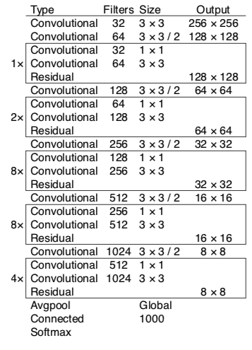

&ensp;&ensp;&ensp;&ensp;**YOLO**系列是**one stage**检测算法的又一个典型代表，共经历了v1,v2和v3三个版本的发展，v2相对比与v1版本的改进比较多，比如使用了**k-means**聚类来得到5个尺寸的**anchor box**，使用了**passthrough**层来结合更精细的特征图，使用了**Darknet-19**作为主干网络等等。v3在v2的基础上又做了一些调整，最主要的一个改变就是借鉴**FPN**的多尺度特征图检测抽取不同尺度的特征图来进行预测，**YOLOv3**在保证检测精度的基础上极大的提高了检测速度，这主要应该归功于其利用多尺度特征预测和其使用了更加厉害的主干网络**Darknet-53**。
<!--more-->
<div align=center></div>
&ensp;&ensp;&ensp;&ensp;**YOLOv3**的官方代码论文中已经给出[YOLOv3](https://pjreddie.com/yolo/),此博客参考的代码是其**pytorch**版本的实现[eriklindernoren/PyTorch-YOLOv3](https://github.com/eriklindernoren/PyTorch-YOLOv3),**YOLOv3**的数据处理并没有**SSD**那么多样，其主要的理解难点为其Bounding box的偏移，loss的构成形式和参与训练的Bounding box的选择，**YOLOv3**的论文只是作者的一个**report**，看完之后总会充满疑惑，但是结合代码我们就会一目了然，所以下面还是**let the code say**。
从作者的README.md中的train命令行，我们可以定位到其训练的入口代码位于train.py中：
```javascript
	$ python3 train.py --model_def config/yolov3-custom.cfg --data_config config/custom.data
```
在其main函数中开始是一些参数解析和写入日志代码，在此不再赘述。首先看一下其初始化模型的代码：
```javascript
	model = Darknet(opt.model_def).to(device)#构建模型
	model.apply(weights_init_normal)#模型参数初始化
```
由上述代码可以看出，其使用Darknet类来进行模型构建，在分析其构建代码之前首先来看看其主干网络**Darknet-53**和整体网络的模型结构，其结构分别如下图所示：
<div align=center></div>
从上图可以看出，**Darknet-53**主要借鉴了**resnet**的思想使用残差结构，**注意**上图中的输入大小是256&times;256，共经过32次降采样，其最后的输出特征图的大小为8&times;8,并且最后使用了**Avgpool**和**softmax**，**Darknet-53**的分类效果甚至超过了RseNet-101,并且速度是其1.5倍，感觉其就算单独出一片论文也不为过啊，而在**YOLOv3**中的输入大小为416&times;416,因此其最后的输出大小为13&times;13,也就是相当于将原始图片分为了13&times;13的**cell**。
<div align=center></div>
从上图可以看出**YOLOv3**共使用了三个尺寸的特征图13&times;13,26&times;26,52&times;52来进行检测,每一个尺度特征图的**cell**中都分别生成三个尺寸的bounding box priors，共有九个尺寸的bounding box priors，这九个box也是从coco数据集中聚类得到的。

<div align=center></div>
从上图中的分配可以看出，与**SSD**类似，使用感受野小的feature map检测小目标，使用感受野大的feature map检测更大目标,对于一个416&times;416的输入图像，在每个尺度的特征图的每个网格设置三个先验框，共有13&times;13&times;3+26&times;26&times;3+52&times;52&times;3=10647个先验框。
下面来具体看一下Darknet类的定义，其位于models.py中，主要代码如下：
```javascript
	class Darknet(nn.Module):
		"""YOLOv3 object detection model"""

		def x__init__(self, config_path, img_size=416):
			super(Darknet, self).__init__()
			self.module_defs = parse_model_config(config_path)#解析网络配置文件
			self.hyperparams, self.module_list = create_modules(self.module_defs)#创建模型
			self.yolo_layers = [layer[0] for layer in self.module_list if hasattr(layer[0], "metrics")]
			self.img_size = img_size
			self.seen = 0
			self.header_info = np.array([0, 0, 0, self.seen, 0], dtype=np.int32)

		def forward(self, x, targets=None):
			img_dim = x.shape[2]
			loss = 0
			layer_outputs, yolo_outputs = [], []
			for i, (module_def, module) in enumerate(zip(self.module_defs, self.module_list)):
				if module_def["type"] in ["convolutional", "upsample", "maxpool"]:
					x = module(x)
				elif module_def["type"] == "route":
					x = torch.cat([layer_outputs[int(layer_i)] for layer_i in module_def["layers"].split(",")], 1)
				elif module_def["type"] == "shortcut":
					layer_i = int(module_def["from"])
					x = layer_outputs[-1] + layer_outputs[layer_i]
				elif module_def["type"] == "yolo":
					x, layer_loss = module[0](x, targets, img_dim)
					loss += layer_loss
					yolo_outputs.append(x)
				layer_outputs.append(x)
			yolo_outputs = to_cpu(torch.cat(yolo_outputs, 1))
			return yolo_outputs if targets is None else (loss, yolo_outputs)
```
**YOLOv3**的网络模型结构定义是通过一个配置文件来描述的，通过解析这个网络配置文件得到网络结构，然后创建模型，其配置文件位于config/yolov3.cfg中，其定义共有700多行代码，在此就不展示了，大家可以去自行看源码。其实这个配置文件就是一个文本文件，解析它之后可以得到一个结构列表，列表中包含每一层的定义字典。parse_model_config函数定义在utils/parse_config.py中，其代码如下：
```javascript
	def parse_model_config(path):
		"""Parses the yolo-v3 layer configuration file and returns module definitions"""
		file = open(path, 'r')
		lines = file.read().split('\n')#逐行读入
		lines = [x for x in lines if x and not x.startswith('#')]#去掉注释行
		lines = [x.rstrip().lstrip() for x in lines] # get rid of fringe whitespaces
		module_defs = []
		for line in lines:
			if line.startswith('['): # This marks the start of a new block
				module_defs.append({})
				module_defs[-1]['type'] = line[1:-1].rstrip()
				if module_defs[-1]['type'] == 'convolutional':
					module_defs[-1]['batch_normalize'] = 0#三个yolo层之前的最后一个conv没有bn层
			else:
				key, value = line.split("=")
				value = value.strip()
				module_defs[-1][key.rstrip()] = value.strip()

		return module_defs
```
上面通过解析得到了定义字典，下面就要通过这个定义字典用create_modules函数来构建网络，create_modules函数定义在models.py中，其代码如下：
```javascript
	def create_modules(module_defs):
		"""
		Constructs module list of layer blocks from module configuration in module_defs
		"""
		hyperparams = module_defs.pop(0)
		output_filters = [int(hyperparams["channels"])]
		module_list = nn.ModuleList()
		for module_i, module_def in enumerate(module_defs):
			modules = nn.Sequential()

			if module_def["type"] == "convolutional":
				bn = int(module_def["batch_normalize"])
				filters = int(module_def["filters"])
				kernel_size = int(module_def["size"])
				pad = (kernel_size - 1) // 2
				modules.add_module(
					f"conv_{module_i}",
					nn.Conv2d(
						in_channels=output_filters[-1],
						out_channels=filters,
						kernel_size=kernel_size,
						stride=int(module_def["stride"]),
						padding=pad,
						bias=not bn,#当卷积层后跟batch normalization层时不要偏置b
					),
				)
				if bn:
					modules.add_module(f"batch_norm_{module_i}", nn.BatchNorm2d(filters, momentum=0.9, eps=1e-5))
				if module_def["activation"] == "leaky":
					modules.add_module(f"leaky_{module_i}", nn.LeakyReLU(0.1))

			elif module_def["type"] == "maxpool":#yolov3没有maxpooling
				kernel_size = int(module_def["size"])
				stride = int(module_def["stride"])
				if kernel_size == 2 and stride == 1:
					modules.add_module(f"_debug_padding_{module_i}", nn.ZeroPad2d((0, 1, 0, 1)))
				maxpool = nn.MaxPool2d(kernel_size=kernel_size, stride=stride, padding=int((kernel_size - 1) // 2))
				modules.add_module(f"maxpool_{module_i}", maxpool)

			elif module_def["type"] == "upsample":#没有用deconvlution,而是用的插值
				upsample = Upsample(scale_factor=int(module_def["stride"]), mode="nearest")
				modules.add_module(f"upsample_{module_i}", upsample)

			elif module_def["type"] == "route":#定义需要concat的层,通过EmptyLayer()占位
				layers = [int(x) for x in module_def["layers"].split(",")]
				filters = sum([output_filters[1:][i] for i in layers])
				#print([output_filters[1:][i] for i in layers])
				#print(filters)
				modules.add_module(f"route_{module_i}", EmptyLayer())

			elif module_def["type"] == "shortcut":#shortcut的from值都为-3，意思是将-1层和倒数第三层的输入进行add，通过EmptyLayer())占位
				filters = output_filters[1:][int(module_def["from"])]
				modules.add_module(f"shortcut_{module_i}", EmptyLayer())

			elif module_def["type"] == "yolo":
				anchor_idxs = [int(x) for x in module_def["mask"].split(",")]
				# Extract anchors
				anchors = [int(x) for x in module_def["anchors"].split(",")]
				anchors = [(anchors[i], anchors[i + 1]) for i in range(0, len(anchors), 2)]
				anchors = [anchors[i] for i in anchor_idxs]
				num_classes = int(module_def["classes"])
				img_size = int(hyperparams["height"])
				# Define detection layer
				print(anchors)
				"""
				anchors=[(116, 90), (156, 198), (373, 326)]或者
                               [(30, 61), (62, 45), (59, 119)]或者
                               [(10, 13), (16, 30), (33, 23)]
				"""
				yolo_layer = YOLOLayer(anchors, num_classes, img_size)
				modules.add_module(f"yolo_{module_i}", yolo_layer)
			# Register module list and number of output filters
			module_list.append(modules)
			output_filters.append(filters)#包含每一层的channel输出维度[3,32,64,32.....]
			#print(output_filters)
    return hyperparams, module_list
```
**注意**上面的代码又一个小细节，在定义conv层的时候设置了**bias=not bn**，即意味着当卷积层后跟batch normalization层时不要偏置bias，其解释见[当卷积层后跟batch normalization层时为什么不要偏置b](https://blog.csdn.net/zxyhhjs2017/article/details/90035238),前面这些定义都比较容易理解，当定义的结构列表中包含什么定义字典就将对应的层加入到module_list中，**route**和**shortcut**类型的层都使用了EmptyLayer()占位，然后在Darknet类的forward函数中进行添加，最主要的是**YOLOLayer**的定义，这一层主要是分别计算整体结构图中对应的三个尺寸的预测输出和对应的loss，在定义的结构列表中有对应的三个type为‘yolo’的不同尺寸的层定义字典，对每一个‘yolo’层都分别计算其预测输出和loss，YOLOLayer的定义位于models.py，其代码如下：
```javascript
	class YOLOLayer(nn.Module):
		"""Detection layer"""

		def __init__(self, anchors, num_classes, img_dim=416):
			super(YOLOLayer, self).__init__()
			self.anchors = anchors
			self.num_anchors = len(anchors)
			self.num_classes = num_classes
			self.ignore_thres = 0.5
			self.mse_loss = nn.MSELoss()
			self.bce_loss = nn.BCELoss()
			self.obj_scale = 1
			self.noobj_scale = 100
			self.metrics = {}
			self.img_dim = img_dim
			self.grid_size = 0  # grid size

		def compute_grid_offsets(self, grid_size, cuda=True):
			self.grid_size = grid_size
			g = self.grid_size
			FloatTensor = torch.cuda.FloatTensor if cuda else torch.FloatTensor
			self.stride = self.img_dim / self.grid_size
			# Calculate offsets for each grid
			self.grid_x = torch.arange(g).repeat(g, 1).view([1, 1, g, g]).type(FloatTensor)
			self.grid_y = torch.arange(g).repeat(g, 1).t().view([1, 1, g, g]).type(FloatTensor)
			#print(self.anchors)
			self.scaled_anchors = FloatTensor([(a_w / self.stride, a_h / self.stride) for a_w, a_h in self.anchors])#缩放到相对于特征图大小
			self.anchor_w = self.scaled_anchors[:, 0:1].view((1, self.num_anchors, 1, 1))
			self.anchor_h = self.scaled_anchors[:, 1:2].view((1, self.num_anchors, 1, 1))

		def forward(self, x, targets=None, img_dim=None):

			# Tensors for cuda support
			FloatTensor = torch.cuda.FloatTensor if x.is_cuda else torch.FloatTensor
			LongTensor = torch.cuda.LongTensor if x.is_cuda else torch.LongTensor
			ByteTensor = torch.cuda.ByteTensor if x.is_cuda else torch.ByteTensor

			self.img_dim = img_dim
			num_samples = x.size(0)
			grid_size = x.size(2)

			prediction = (
				x.view(num_samples, self.num_anchors, self.num_classes + 5, grid_size, grid_size)
				.permute(0, 1, 3, 4, 2)
				.contiguous()#以grid=13为例[n_batch, 3, 13, 13, 80+5],最后一个维度[x, y, w, h, conf, cls pred]
			)
			#print(type(prediction))
			# Get outputs
			x = torch.sigmoid(prediction[..., 0])  # Center x,使用sigmoid,归一化到(0,1)
			y = torch.sigmoid(prediction[..., 1])  # Center y,使用sigmoid,归一化到(0,1)
			w = prediction[..., 2]  # Width
			h = prediction[..., 3]  # Height
			pred_conf = torch.sigmoid(prediction[..., 4])  # Conf，使用sigmoid,归一化到(0,1)
			pred_cls = torch.sigmoid(prediction[..., 5:])  # Cls pred.使用sigmoid,归一化到(0,1)

			# If grid size does not match current we compute new offsets
			if grid_size != self.grid_size:
				self.compute_grid_offsets(grid_size, cuda=x.is_cuda)

			# Add offset and scale with anchors
			#pred_box[n_batch, num_anchor, grid_size, grid_size, x_center, y_center, w_scaled, h_scaled]
			pred_boxes = FloatTensor(prediction[..., :4].shape)
			pred_boxes[..., 0] = x.data + self.grid_x
			pred_boxes[..., 1] = y.data + self.grid_y
			pred_boxes[..., 2] = torch.exp(w.data) * self.anchor_w
			pred_boxes[..., 3] = torch.exp(h.data) * self.anchor_h

			output = torch.cat(
				(
					pred_boxes.view(num_samples, -1, 4) * self.stride,#缩放到原图大小
					pred_conf.view(num_samples, -1, 1),
					pred_cls.view(num_samples, -1, self.num_classes),
				),
				-1,
			)

			if targets is None:
				return output, 0
			else:
				iou_scores, class_mask, obj_mask, noobj_mask, tx, ty, tw, th, tcls, tconf = build_targets(
					pred_boxes=pred_boxes,
					pred_cls=pred_cls,
					target=targets,
					anchors=self.scaled_anchors,
					ignore_thres=self.ignore_thres,
				)

				# Loss : Mask outputs to ignore non-existing objects (except with conf. loss)
				loss_x = self.mse_loss(x[obj_mask], tx[obj_mask])
				loss_y = self.mse_loss(y[obj_mask], ty[obj_mask])
				loss_w = self.mse_loss(w[obj_mask], tw[obj_mask])
				loss_h = self.mse_loss(h[obj_mask], th[obj_mask])
				loss_conf_obj = self.bce_loss(pred_conf[obj_mask], tconf[obj_mask])
				loss_conf_noobj = self.bce_loss(pred_conf[noobj_mask], tconf[noobj_mask])#tconf就是1或0
				loss_conf = self.obj_scale * loss_conf_obj + self.noobj_scale * loss_conf_noobj
				loss_cls = self.bce_loss(pred_cls[obj_mask], tcls[obj_mask])
				total_loss = loss_x + loss_y + loss_w + loss_h + loss_conf + loss_cls

				# Metrics
				cls_acc = 100 * class_mask[obj_mask].mean()
				conf_obj = pred_conf[obj_mask].mean()
				conf_noobj = pred_conf[noobj_mask].mean()
				conf50 = (pred_conf > 0.5).float()
				iou50 = (iou_scores > 0.5).float()
				iou75 = (iou_scores > 0.75).float()
				detected_mask = conf50 * class_mask * tconf
				precision = torch.sum(iou50 * detected_mask) / (conf50.sum() + 1e-16)
				recall50 = torch.sum(iou50 * detected_mask) / (obj_mask.sum() + 1e-16)
				recall75 = torch.sum(iou75 * detected_mask) / (obj_mask.sum() + 1e-16)

				self.metrics = {
					"loss": to_cpu(total_loss).item(),
					"x": to_cpu(loss_x).item(),
					"y": to_cpu(loss_y).item(),
					"w": to_cpu(loss_w).item(),
					"h": to_cpu(loss_h).item(),
					"conf": to_cpu(loss_conf).item(),
					"cls": to_cpu(loss_cls).item(),
					"cls_acc": to_cpu(cls_acc).item(),
					"recall50": to_cpu(recall50).item(),
					"recall75": to_cpu(recall75).item(),
					"precision": to_cpu(precision).item(),
					"conf_obj": to_cpu(conf_obj).item(),
					"conf_noobj": to_cpu(conf_noobj).item(),
					"grid_size": grid_size,
				}

				return output, total_loss
```
从上述代码可以看出，首先将预测的输出维度[num_sample, grid_size, grid_size, 255]维度转换为[num_sample, num_anchors, grid_size, grid_size, 85],其中最后一个维度85中分别代表[x_center, y_center, w, h, conf, cls_pred]。然后将x_center, y_center, pred_conf, cls_pred分别使用sigmoid函数归一化到(0,1)，这也是因为yolov3中对这几项使用的是逻辑回归，它们对应的损失函数也因此是交叉熵而不是均方差函数。然后因为预测得到的中心点坐标(x, y)是相对于某个cell的在(0,1)之间的偏移值，预测得到的(w, h)是相对于对应特征图大小的anchor_w,anchor_h的缩放值，所以需要将其还原到原图大小，即：
$$ \hat{G_x} = P_x + gridsize  $$
$$ \hat{G_y} = P_y + gridsize  $$
$$ anchor_w, anchor_h = (anchor_w, anchor_h) / stride $$
$$ \hat{G_w} = exp(P_w)anchor_w  $$
$$ \hat{G_h} = exp(P_h)anchor_h  $$
上式中的**stride**代表最后的特征图相对于原图的降维比例，例如13&times;13大小的特征图的stride=32，为什么这里预测出来的是相对偏移值，大家可以往后对照loss计算部分的[t_x, t_y, t_w, t_h]看就比较清楚了。
从上述代码中我们还可以看到有一个build_targets函数，这个函数可谓是重中之重，因为它相当于筛选了哪些pred_box需要参与训练，该函数定义在utils/utils.py中，其代码如下：
```javascript
	def build_targets(pred_boxes, pred_cls, target, anchors, ignore_thres):
		# pred_box[n_batch, num_anchor, grid_size, grid_size, x_center, y_center, w_scaled, h_scaled]，相对于特征图大小
		# pred_cls[n_batch, num_anchor, grid_size, grid_size, cls]
		ByteTensor = torch.cuda.ByteTensor if pred_boxes.is_cuda else torch.ByteTensor
		FloatTensor = torch.cuda.FloatTensor if pred_boxes.is_cuda else torch.FloatTensor

		nB = pred_boxes.size(0)#batch_size大小
		nA = pred_boxes.size(1)#每个cell的anchor个数
		nC = pred_cls.size(-1)#class的数量
		nG = pred_boxes.size(2)#grid_size

		# Output tensors
		obj_mask = ByteTensor(nB, nA, nG, nG).fill_(0)
		noobj_mask = ByteTensor(nB, nA, nG, nG).fill_(1)
		class_mask = FloatTensor(nB, nA, nG, nG).fill_(0)
		iou_scores = FloatTensor(nB, nA, nG, nG).fill_(0)
		tx = FloatTensor(nB, nA, nG, nG).fill_(0)
		ty = FloatTensor(nB, nA, nG, nG).fill_(0)
		tw = FloatTensor(nB, nA, nG, nG).fill_(0)
		th = FloatTensor(nB, nA, nG, nG).fill_(0)
		tcls = FloatTensor(nB, nA, nG, nG, nC).fill_(0)

		# Convert to position relative to box
		target_boxes = target[:, 2:6] * nG#现在的nG就是最后特征图的w和h大小
		gxy = target_boxes[:, :2]
		gwh = target_boxes[:, 2:]
		# Get anchors with best iou
		ious = torch.stack([bbox_wh_iou(anchor, gwh) for anchor in anchors])#[3,n_groundtruth]
		best_ious, best_n = ious.max(0)#每一列最大值
		# Separate target values
		b, target_labels = target[:, :2].long().t()
		gx, gy = gxy.t()
		gw, gh = gwh.t()
		gi, gj = gxy.long().t()#每个ground_truth对应的cell
		# Set masks，每一个ground只对应一个cell里的一个anchor box
		obj_mask[b, best_n, gj, gi] = 1#obj_mask每一个ground_truth只对应一个cell里的一个与其iou最大的anchor box
		noobj_mask[b, best_n, gj, gi] = 0#noobj_mask相应位置设置为0

		# Set noobj mask to zero where iou exceeds ignore threshold
		for i, anchor_ious in enumerate(ious.t()):
			noobj_mask[b[i], anchor_ious > ignore_thres, gj[i], gi[i]] = 0#当ground_truth对应cell的anchor_box超过阈值不参与计算

		# Coordinates
		tx[b, best_n, gj, gi] = gx - gx.floor()
		ty[b, best_n, gj, gi] = gy - gy.floor()
		# Width and height
		tw[b, best_n, gj, gi] = torch.log(gw / anchors[best_n][:, 0] + 1e-16)
		th[b, best_n, gj, gi] = torch.log(gh / anchors[best_n][:, 1] + 1e-16)
		# One-hot encoding of label
		tcls[b, best_n, gj, gi, target_labels] = 1
		# Compute label correctness and iou at best anchor
		class_mask[b, best_n, gj, gi] = (pred_cls[b, best_n, gj, gi].argmax(-1) == target_labels).float()
		iou_scores[b, best_n, gj, gi] = bbox_iou(pred_boxes[b, best_n, gj, gi], target_boxes, x1y1x2y2=False)

		tconf = obj_mask.float()
		#iou_score代表每一个pred_box与其对应的ground_truth的iou，在计算评价指标时使用
		return iou_scores, class_mask, obj_mask, noobj_mask, tx, ty, tw, th, tcls, tconf
```
上面的代码首先初始化了obj_mask,noobj_mask,......的值，然后分别计算了每一个pred_box与target中传来的ground_truth的iou值，对于每一个cell中，只将ground_truth中心点所在的cell中与其iou最大的pred_box的obj_mask的值设置为1，也就是说在训练计算loss_conf_obj的时候只有中心点所在的cell中与其iou最大的pred_box参与计算，并且将其对应的noobj_mask的值设置为0，而且将其它的ground_truth中心点所在的cell中与其iou超过阈值的pred_box也设置为0，也就是说在训练计算loss_conf_noobj的时候包含所有不含有ground_truth中心点的cell和含有ground_truth中心点的cell中iou小于阈值的pred_box。并且在最后的tcof设置为tconf为obj_mask的值，这也就对应了在计算loss时的$C_i$值为0或者1，在yolov1中定义了$C_i$的值如下：
$$ c_i = P{r}(Class_{i}|Object)\timesP_{r}(Object)\timesIOU_{pred}^{truth} = P_{r}(Class_i)\timesIOU_{pred}{truth} $$
因为在训练的时候我们期望的是pred_box有物体时$P_{r}(Class_i)$为1，没有物体是为0，而且所有的预测有物体的$IOU_{pred}{truth}$都应该为1，所以$C_i$值为0或者1。
yolov1中给出的loss计算公式如下：
<div align=center></div>
**不过在YOLOv3**中的loss_conf_obj,loss_conf_noobj,loss_cls都使用了交叉熵而不是均方差，即使用了逻辑回归。
在上面计算的时候传入了target值，这个值包含的是ground_truth的相关信息，这里的target包含的都是归一化的值，从上面代码中可以看出，首先对这些归一化的值分别乘了nG，也就是grid_size的大小，然后计算了偏移和放缩值，注意这里传入的anchor也是相对于特征图大小的，计算如下：
$$ g_{x}, g_{y}, g_{w}, g_{h} = [x, y, w, h]\timesgridsize  $$
$$ anchor_{w}, anchor_{h} = (anchor_{w}, anchor_{h})/stride $$
$$ t_{x} = g_{x} - \lfloor{g_{x}}\rfloor $$
$$ t_{y} = g_{y} - \lfloor{g_{y}}\rfloor $$
$$ t_{w} = log(g_{w}/anchor_{w}) $$
$$ t_{h} = log(g_{h}/anchor_{h}) $$
target的获取定义在utils/datasets.py中的ListDataset类中，其主要代码如下：
```javascript
	class ListDataset(Dataset):
		def __init__(self, list_path, img_size=416, augment=True, multiscale=True, normalized_labels=True):
			with open(list_path, "r") as file:
				self.img_files = file.readlines()

			self.label_files = [
				path.replace("images", "labels").replace(".png", ".txt").replace(".jpg", ".txt")
				for path in self.img_files
			]
			self.img_size = img_size
			self.max_objects = 100
			self.augment = augment
			self.multiscale = multiscale
			self.normalized_labels = normalized_labels
			self.min_size = self.img_size - 3 * 32
			self.max_size = self.img_size + 3 * 32
			self.batch_count = 0

		def __getitem__(self, index):

			# ---------
			#  Image
			# ---------

			img_path = self.img_files[index % len(self.img_files)].rstrip()

			# Extract image as PyTorch tensor
			img = transforms.ToTensor()(Image.open(img_path).convert('RGB'))

			# Handle images with less than three channels
			if len(img.shape) != 3:
				img = img.unsqueeze(0)
				img = img.expand((3, img.shape[1:]))

			_, h, w = img.shape
			h_factor, w_factor = (h, w) if self.normalized_labels else (1, 1)
			# Pad to square resolution
			img, pad = pad_to_square(img, 0)#将图片以最大边为标准使用零padding成为正方形
			_, padded_h, padded_w = img.shape

			# ---------
			#  Label
			# ---------

			label_path = self.label_files[index % len(self.img_files)].rstrip()

			targets = None
			if os.path.exists(label_path):
				boxes = torch.from_numpy(np.loadtxt(label_path).reshape(-1, 5))
				# Extract coordinates for unpadded + unscaled image
				x1 = w_factor * (boxes[:, 1] - boxes[:, 3] / 2)#这里的boxes里的坐标原来是归一化的吗，这是coco数据集吗，coco标签不是[x1,y1,w,h]吗
				y1 = h_factor * (boxes[:, 2] - boxes[:, 4] / 2)#而这里的是归一化的[x_centre,y_centre,w,h]
				x2 = w_factor * (boxes[:, 1] + boxes[:, 3] / 2)
				y2 = h_factor * (boxes[:, 2] + boxes[:, 4] / 2)
				# Adjust for added padding,为什么要做这一步,box的坐标需要调整吗，而且为什么要padding而不直接resize呢
				x1 += pad[0]
				y1 += pad[2]
				x2 += pad[1]
				y2 += pad[3]
				# Returns (x, y, w, h)
				boxes[:, 1] = ((x1 + x2) / 2) / padded_w#又变为归一化的中心点x坐标
				boxes[:, 2] = ((y1 + y2) / 2) / padded_h#又变为归一化的中心点y坐标
				boxes[:, 3] *= w_factor / padded_w#宽乘放缩比列
				boxes[:, 4] *= h_factor / padded_h#高乘放缩比例

				targets = torch.zeros((len(boxes), 6))
				targets[:, 1:] = boxes

			# Apply augmentations
			if self.augment:
				if np.random.random() < 0.5:
					img, targets = horisontal_flip(img, targets)

			return img_path, img, targets
```
首先可以看到将每一张加载进来的图片都以最大边为基准进行了零padding成为一个正方形，这一块还不太明白，难道直接resize不行吗，然后将每张图片对应的ground_truth的信息提取出来，最后返回的target中的值都是归一化的值。这里需要注意的地方是此处应该使用的是coco数据集，而coco数据集的ground_truth的标签形式为[x, y, w, h],其中x,y是左上角的坐标，而这里明显提取出来的坐标是[x_center, y_center, w, h],而且是归一化之后的值，当初比较疑惑，但是最后才发现这里下载的数据集不是从coco官网上下载的，而是从yolo官网上下载的，应该是已经处理之后的数据，这可以从作者的get_coco_dataset.sh中看出：
```javascript
	# Download Images
	wget -c https://pjreddie.com/media/files/train2014.zip
	wget -c https://pjreddie.com/media/files/val2014.zip

	# Unzip
	unzip -q train2014.zip
	unzip -q val2014.zip

	cd ..

	# Download COCO Metadata
	wget -c https://pjreddie.com/media/files/instances_train-val2014.zip
	wget -c https://pjreddie.com/media/files/coco/5k.part
	wget -c https://pjreddie.com/media/files/coco/trainvalno5k.part
	wget -c https://pjreddie.com/media/files/coco/labels.tgz
	tar xzf labels.tgz
	unzip -q instances_train-val2014.zip
```
在送出网络之前还需要对图片进行resize，这部分操作位于utils/datasets.py的collate_fn函数中，其代码如下：
```javascript
    def collate_fn(self, batch):
        paths, imgs, targets = list(zip(*batch))
        # Remove empty placeholder targets
        targets = [boxes for boxes in targets if boxes is not None]
        # Add sample index to targets
        for i, boxes in enumerate(targets):
            boxes[:, 0] = i
        targets = torch.cat(targets, 0)
        # Selects new image size every tenth batch
        if self.multiscale and self.batch_count % 10 == 0:
            self.img_size = random.choice(range(self.min_size, self.max_size + 1, 32))
        # Resize images to input shape
        imgs = torch.stack([resize(img, self.img_size) for img in imgs])#这直接resize图片，那box的大小不需要resize吗，box不需要，因为box里的都是归一化的值
        self.batch_count += 1
        return paths, imgs, targets
```
参考：
  &ensp;https://arxiv.org/abs/1506.02640
  &ensp;https://arxiv.org/abs/1612.08242
  &ensp;https://arxiv.org/abs/1804.02767
  &ensp;https://github.com/eriklindernoren/PyTorch-YOLOv3
  
 
  
 **注**：此博客内容为原创，转载请说明出处


