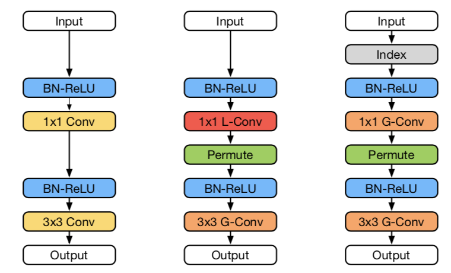
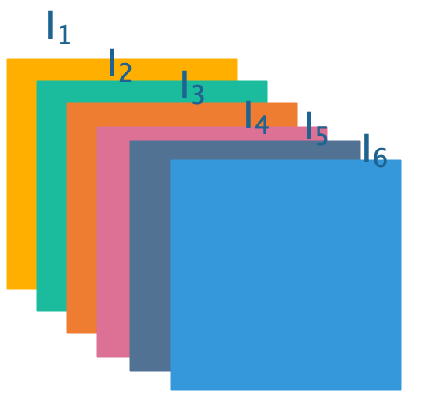
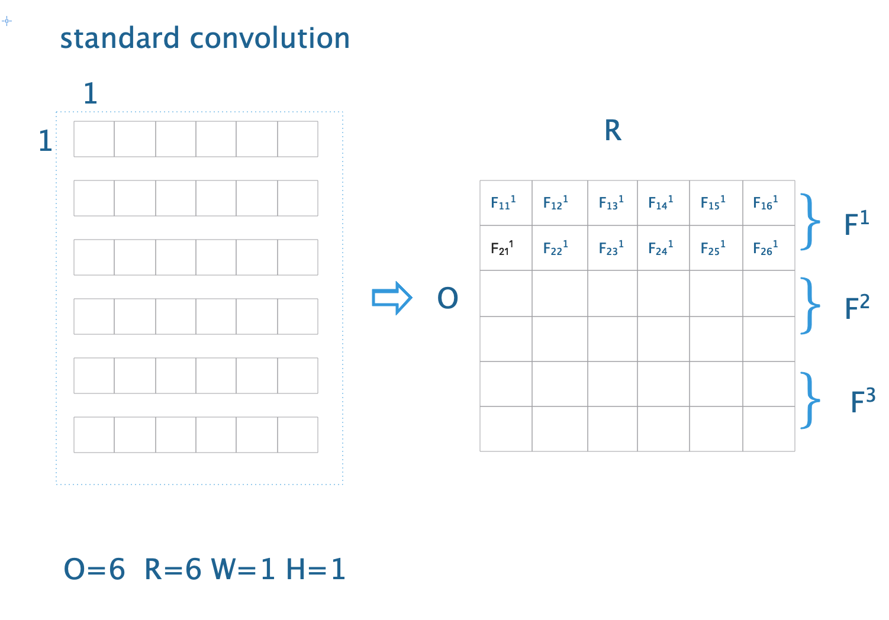
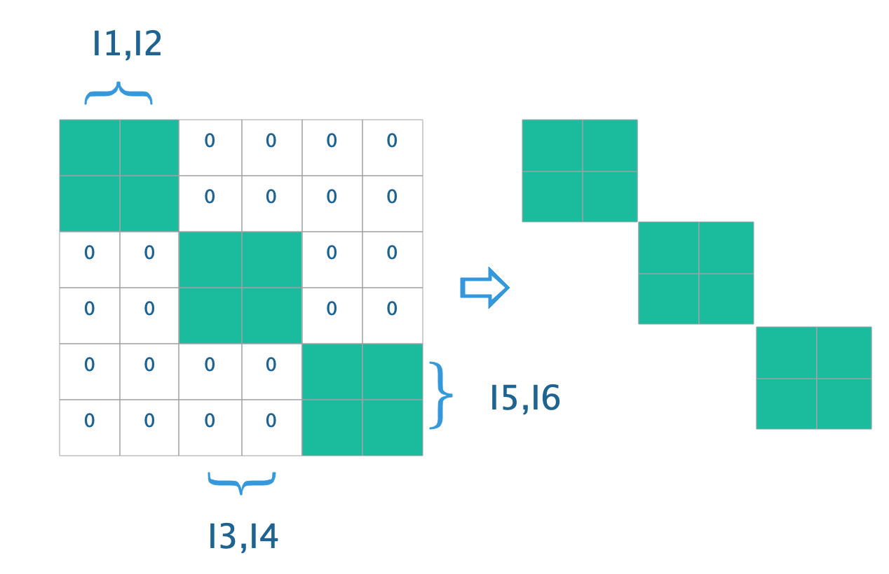
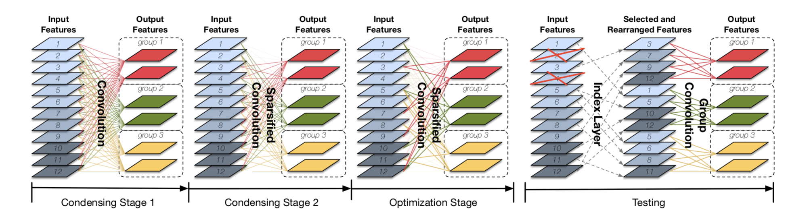
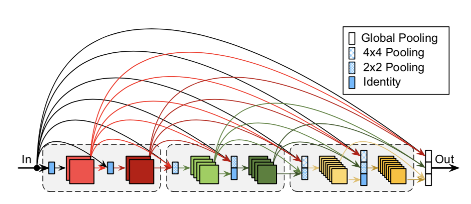

&ensp;&ensp;&ensp;&ensp; **condensenet**类似于模型压缩里的**pruning**剪枝类型，但是其不同之处在于，一般的剪枝是对已经训练好的模型进行处理，而**condensenet**是在训练过程中进行剪枝。它将Densenet的稠密连接和新提出的**learned group convolution**模块相结合提出了一个轻量级网络结构。
<!--more-->
&ensp;&ensp;&ensp;&ensp;这个网络结构主要是针对在**Densenet**的稠密连接中存在这许多冗余信息，并非每个后续层都需要所有先前的特征。所以作者提出了一种在训练过程中自主学习输入分组的方法，将**Densenet**中的1x1卷积进行分组，并且进行重新排列来进行训练。

其学习分组的过程如下：

&ensp;&ensp;&ensp;&ensp;首先建设输入的特征图为I，共有6个channel，使用1x1的标准卷积核大小进行卷积输出也为6个channel，则其1x1的卷积核的张量大小为6x6x1x1,并将该卷积核分为3组。

&ensp;&ensp;&ensp;&ensp;其中，O代表输出channel，R代表输入channel，W代表width，H代表height。在卷积过程中，Fi1g只会作用于I1,所以在F1中当abs（F111）+ abs（F211）的均值小于其它列的均值时说明I1的贡献程度较低，可以取消其连接，可以通过将F111和F211置为0来实现。
&ensp;&ensp;&ensp;&ensp;但是现在依然是标准卷积，还不是分组卷积，分组卷积意味着每个Fg中只能有R/g个列不为0。

&ensp;&ensp;&ensp;&ensp;但论文中指出，每个组使用的特征映射比例不一定需要是1/g，其指定了一个常数C，即每个组可以选择R/C个列不为0，将训练的过程分为**Condensing**（冷凝）和**Optimization**（优化）两个阶段，第一个阶段来学习group分组，第二个阶段优化权重参数。同时将第一个阶段分为C-1个stage，每个stage使得R/C个列为0，则在C-1个stage之后只剩R-R/C&times;(C-1)个列并且将训练的stage共分为M/2(C-1)个部分，M代表总共的训练epoch数，所以每个stage需要经过M/2(C-1)个epoch,剩余一半的epoch用于优化训练。

并且论文中定义了一种正则化**Group Lasso**：
$$ \sum_{g=1}^{G}\sum_{j=1}^{R}\sqrt{\sum_{i=1}^{O/G}{F_{i,j}^{g}}^2} $$
&ensp;&ensp;&ensp;&ensp;来减少由重量修剪引起的对准确性的负面影响，L1正则化通常用于诱导稀疏性。 在**CondenseNets**中，鼓励来自同一组的卷积滤波器使用相同的传入特征子集，即引入group级稀疏性。 为此，在训练期间使用了Group Lasso正则化，该正规则同时推动所有Fg列的元素为零。
最后提出的网络结构图如下：

&ensp;&ensp;&ensp;&ensp;其增长率随着深度的增长逐渐增加，这增加了来自后期层的特征相对于来自早期层的特征的比例。 其增长率设置为k = 2m-1k0，其中m是**dense block**的索引，k0是常量, 这种设定增长率的方式不会引入任何额外的超参数。并且为了鼓励更多的**feature reuse**，将输入层连接到网络中的所有后续层，即使这些层位于不同的**dense block**中。 由于密集块具有不同的特征分辨率，因此当使用它们作为使用平均池的较低分辨率层的输入时对具有较高分辨率的特征映射进行下采样。
参考：
  &ensp;https://arxiv.org/abs/1711.09224
 **注**：此博客内容为原创，转载请说明出处