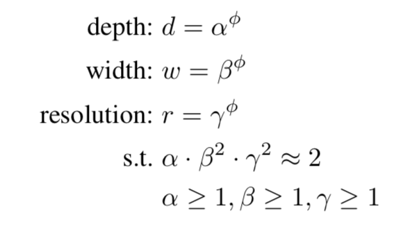

&ensp;&ensp;&ensp;&ensp;efficientnet和ghostnet都是最近出现的轻量级的分类网络，它们有一个共同的特点就是对现有的网络的一些固有属性和特点进行了分析，并且总结出了这些现有网络中模型性能与模型复杂度之间的一些内在规律。
<!--more-->
###### efficientnet
efficientnet发现在一定的计算量限制条件下，同时对网络的深度（depth）、宽度（width）和输入分辨率（resolution）进行放缩可以获得在该条件下最优的模型性能，据此论文提出了一种复合放缩（Compound Scaling）的方法。使用系数$\phi$来统一对网络进行放缩，即：

其中，$\alpha$、$\beta$、$\gamma$都是常数，放缩一个convnet大概会增加$(\alpha·{\beta}^2,·{\gamma}^2)$的FLOPS，在文中设置$(\alpha·{\beta}^2,·{\gamma}^2)\approx2$，这样当设置$\phi$时，就会大概增加$2^{\phi}$倍的FLOPS，这种方法不仅可以适用于现有的网络，作者还通过NAS搜索出了一种网络结构，并将其定义为EfficientNet-B0，其网络结构如下所示：

并且作者通过网格搜索法得到其对应最好的$\alpha=1.2, \beta=1.1, \gamma=1.5$,并且通过设置$\phi=1~7$得到了Efficientnet-B0~Efficientnet-B7。
###### ghostnet
efficientnet总结了网络放缩因子对于网络性能的影响，ghostnet则通过对网络内部生成特征图的冗余性的研究提出了一种通过线性方法来更加高效生成ghost特征图的方法。
在这篇文章中，作者发现在卷积网络中其生成的特征图有很大的冗余性，但是生成这些冗余特征图也需要同样要耗费大量的计算资源。

因此，作者通过将生成的特征划分为内在特征（intrinsic feature）和ghost特征两部分来解决这个问题，并且通过线性变换来得到ghost特征以此来减少计算量和参数量，具体方法如下图所示：

假设原始的网络输出特征图channel维度为n，则现在内在特征的channel维度则为m，并且$n=ms$，其中s代表其每个内在特征都要生成s个其线性对应的ghost特征（当然最后一个为恒等映射），这里的线性变换使用的是$3\times3$深度可分离卷积，接下来进行压缩率分析，

由上述公式可知其可以将传统卷积的计算量和参数量都压缩至原来的$1/s$。同时作者还提出了两个ghost bottleneck结构，如下所示：

并且以此构建了一个轻量级网络ghostnet，其网络结构如下所示：

参考：
   &ensp;https://arxiv.org/abs/1905.11946
  &ensp; https://arxiv.org/abs/1911.11907
 **注**：此博客内容为原创，转载请说明出处
