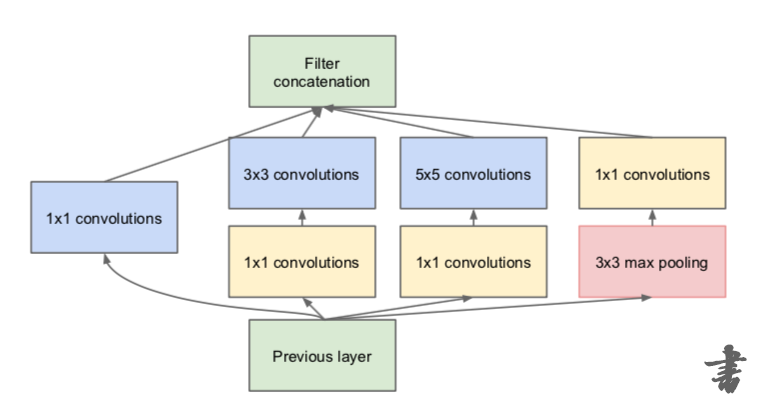
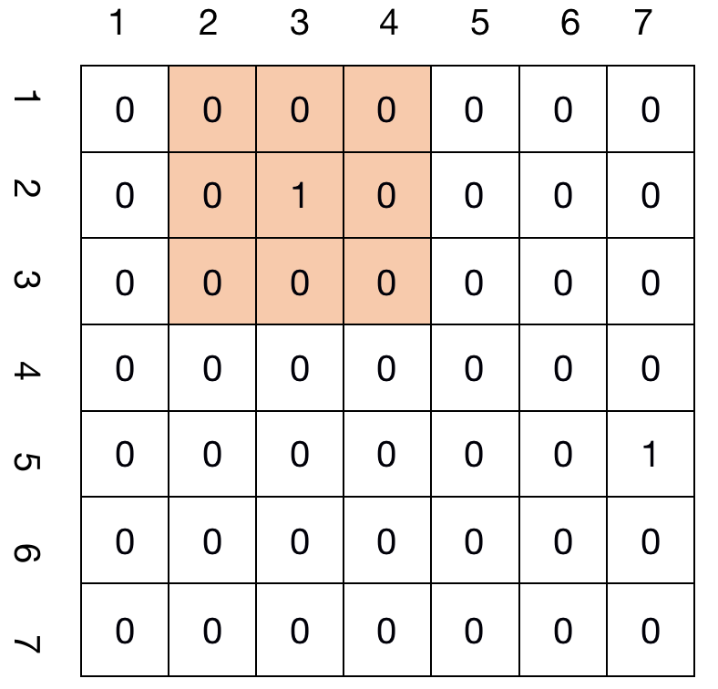
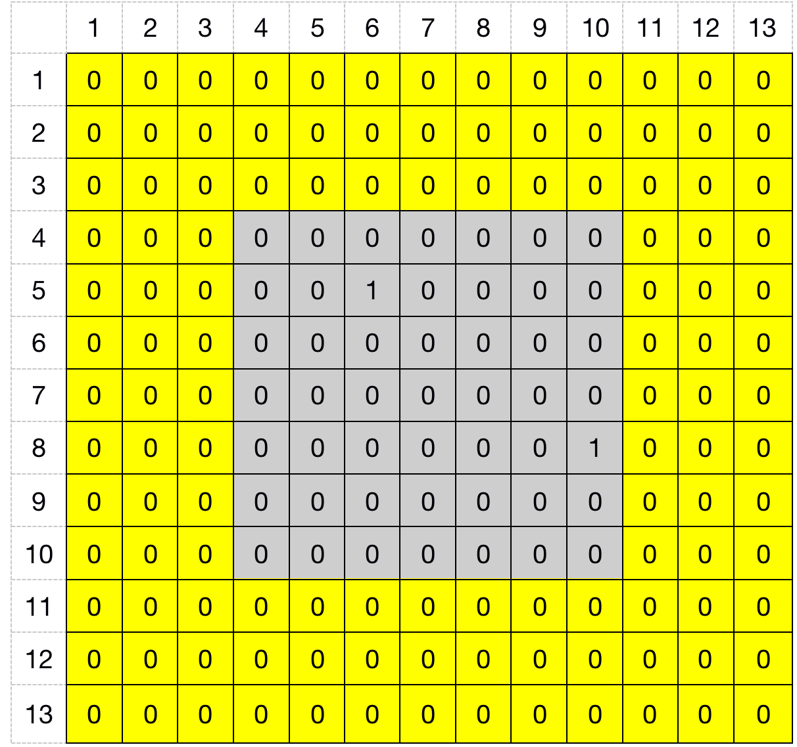
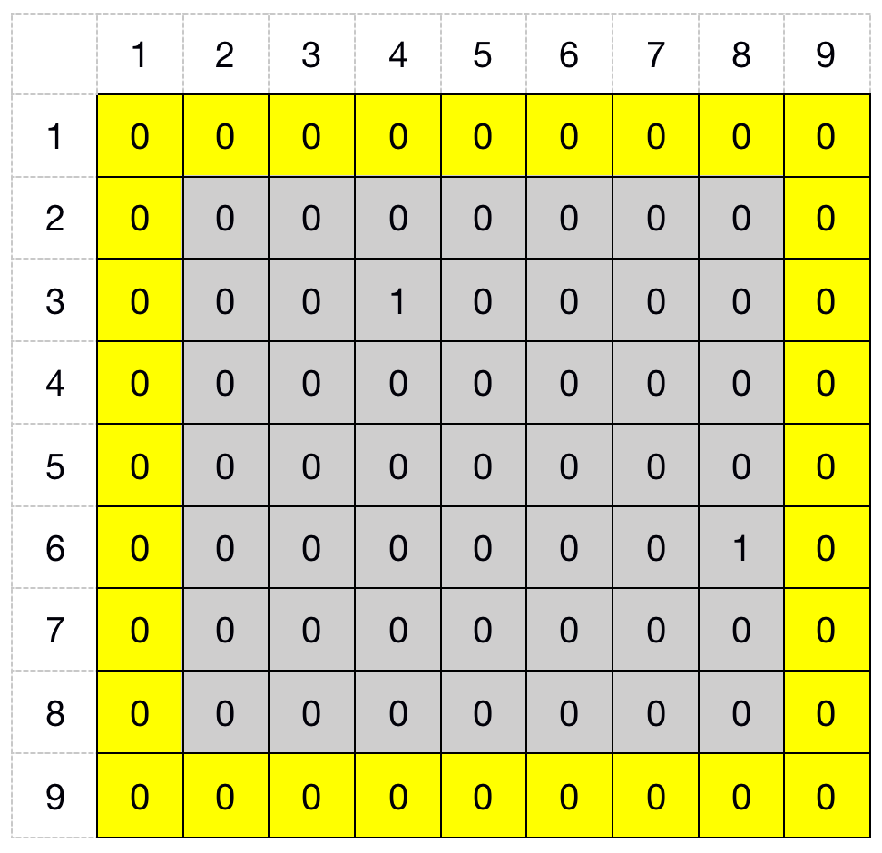

&ensp;&ensp;&ensp;&ensp;**Inception**的中文翻译为"盗梦空间"，取其“**we need go deeper**"的意思，要了解这篇论文，首先我们需要搞清楚其动机，也就是论文的切入点，这样也会让我们产生一些思考，寻求一些不同的解决方法，毕竟解决问题的前提是先要学会发现问题。
&ensp;&ensp;&ensp;&ensp;这篇论文的动机文章中写的很明白，但理解起来还是有一定的困难。在文章第三节的动机和更深层次的思考中，作者写到最直接改善深度神经网络的方法是在宽度和深度两方面对网络进行扩展，但是这有两个缺点，一方面是因为数据集的限制网络很容易过拟合，另一方面是网络的加深对计算资源的要求会更高。对这两点其实不难理解，我想其实还有一点，那就是梯度爆炸和梯度消失，毕竟**inceptionv2**的**Batch Normalization**出现之后才很大程度上改善了这个问题。作者认为解决这两个问题的办法就是使用稀疏连接结构来代替全连接，前人研究结果表明如果数据集的概率分布可以用一个大的、非常稀疏的深度神经网络来表示，那么可以通过分析最后一层激活的相关统计数据和具有高度相关输出的聚类神经元来逐层构造最优网络拓扑。但是目前的**计算机计算非均匀稀疏数据结构的效率很低**，而且大量的在稀疏矩阵方面的文献研究显示将稀疏矩阵聚类为相关的密集型子矩阵可以在稀疏矩阵乘法上实现最先进的实际表现。
&ensp;&ensp;&ensp;&ensp;**inception**的体系结构始于第一作者的一个案例研究，该案例研究评估了复杂网络拓扑结构构建算法的假设输出，该算法试图近似对视觉网络所暗示的稀疏结构，并通过密集的、可读的组件覆盖假设结果。在第四节的技术细节中作者写到**inception**的思想主要是找出卷积视觉网络中的**最优局部稀疏结构是如何被现成的密集组件所近似和覆盖的**。作者假设来自早期层的每个单元对应于输入图像的某个区域，并且这些单元被分组到滤波器组中。在较低层（靠近输入层）中，相关单元将集中在局部区域。这意味着，最终会在一个区域中聚集许多簇，它们可以被下一层1×1卷积层覆盖。然而，在更大的补丁上，可以被卷积覆盖的空间分布更广的集群数量会减少，在更大的区域，补丁数量也会减少。为了避免补丁对齐问题，初始体系结构的当前体现被限制为过滤器尺寸1×1、3×3和5×5，但是这个决定更多的是基于便利性而不是必要性。这也意味着，建议的架构是所有这些层及其输出滤波器组的组合，这些滤波器组连接成单个输出向量，形成下一阶段的输入。此外，由于池操作对于当前最先进的卷积网络的成功至关重要，因此建议在每个这样的阶段添加一个可选的并行池路径也应具有额外的有益效果。添加1x1的网络结构主要是为了维度减少和投影来节省计算资源。这种体系结构的一个主要好处是，它允许在每个阶段显著增加单元的数量，而不会在计算复杂性上出现不受控制的爆炸。
&ensp;&ensp;&ensp;&ensp;图1是作者根据这一思想提出来的**inception**模块，并且最后采用**VGG**堆叠的思想提出了22层的**GoogleNet**分类网络。上面说了一大堆，其实作者的主要目的就是希望通过密集子矩阵来覆盖一个大的稀疏结构，那首先应该先搞清楚什么是稀疏结构，什么又是密集子矩阵，最后来看看用密集子矩阵来代替大的稀疏结构究竟有哪些好处。
<div align=center></div>
&ensp;&ensp;&ensp;&ensp;当矩阵中非零元素的个数远远小于矩阵元素的总数，并且非零元素的分布没有规律，通常认为矩阵中非零元素的总数比上矩阵所有元素总数的值小于等于0.05时，则称该矩阵为稀疏矩阵。在卷积神经网络中，这种稀疏性应该来自于非线性激活函数relu=max(0,x),因为relu可以讲特征图上的负值全部映射为0。以**Googlenet**的inception5a阶段举例说明，在inception5a阶段中输入与输出的特征图大小都为7x7，假设进过前面层的作用在5a阶段的输入为一个稀疏度很高的特征图，为方便起见此处假设channel为1。
<div align=center></div>
&ensp;&ensp;&ensp;&ensp;在这个7x7的特征图中只有两个1，其余的值全部为零，其稀疏度为2/49小于0.05，可以将其称之为稀疏矩阵，再来看看其密集子矩阵，这图中的3x3的子矩阵中，其稀疏度为1/9大于0.05，所以其是一个相对更加稠密的矩阵。稀疏矩阵由于其不均匀性，所以计算效率较低，现在的对稀疏矩阵的计算为了减少对零元素的访问，所以将其压缩存储，其常见的压缩方式有COO(Coordinate Format)和CSR(Compressed Sparse Row)，COO很简单，就是使用3个数组，分别存储全部非零元的行下标（row index）、列下标（column index）和值（value）；CSR稍复杂，对行下标进行了压缩，假设矩阵行数是m，则压缩后的数组长度为m+1，记作（row ptr），其中第i个元素（0-base）表示矩阵前i行的非零元个数。在此以COO方式为例说明，下表为上述特征图对应的COO存储三元组。

| row_idex   | 2   | 5   |
| --------- | --- | --- |
| col_index | 3   | 7   |
| value     | 1   | 1   |
&ensp;&ensp;&ensp;&ensp;假设不用1x1,3x3,5x5这样的小的密集子矩阵去覆盖稀疏特征图，而是用一个传统方式的大的7x7卷积核来对稀疏特征图来进行处理。首先从参数量进行对比，假设输入为上述7x7x832的稀疏特征图，输出也为7x7x832，则其共需7x7x832x832=33918976个参数(不考虑bias)，而采用多分支结构其共需1x1x832x256+1x1x832x160+3x3x160x320+1x1x832x32+5x5x32x128+1x1x832x128=833536个参数，参数量远远小于传统方式，这种参数量的减少来自于两个方面：1.采用多分支的结构再进行concat的方式可以使每个分支的channel数减少；2.使用1x1的bottleneck结构可以减少参数量。
&ensp;&ensp;&ensp;&ensp;接着从计算量来进行对比，以7x7的卷积核来卷积一个7x7的特征图，stride=1，则需要的padding=3，padding后的特征图如下所示：
<div align=center></div>
&ensp;&ensp;&ensp;&ensp;此时的COO存储变为下表:

| row_idex | 5   | 8   |    
| ------- | --- | --- | 
| col_idex | 6   | 10  |    
| value   | 1   |  1   |     
将特征图矩阵记为A，将7x7的卷积核记为B，则计算的卷积过程为一个7x7的卷积核在13x13的特征图上以步长为1从左至右，从上至下进行卷积，但以COO的存储方式可以避免对零元素的计算，以第一个非零值A[5][6]来说，其计算过程共被访问了36次。其所经历的计算如下：

| A[5][6] | B[5][6] | 从左至右第0次滑动    |
| ------- | ------- | -------------------- |
| A[5][6] | B[5][5] | 从左至右第1次滑动    |
| A[5][6] | B[5][4] | 从左至右第2次滑动    |
| A[5][6] | B[5][3] | 从左至右第3次滑动    |
| A[5][6] | B[5][2] | 从左至右第4次滑动    |
| A[5][6] | B[5][1] | 从左至右第5次滑动    |
| A[5][6] | B[4][6] | 下移1位之后第0次滑动 |
| A[5][6] | B[4][5] | 下移1位之后第1次滑动 |
| A[5][6] | B[4][4] | 下移1位之后第2次滑动 |
| A[5][6] | B[4][3] | 下移1位之后第3次滑动 |
| A[5][6] | B[4][2] | 下移1位之后第4次滑动 |
| A[5][6] | B[4][1] | 下移1位之后第5次滑动 |
| .......... | .......... | ....................................  |
| A[5][6] | B[1][6] | 下移5位之后第0次滑动 |
| A[5][6] | B[1][5] | 下移5位之后第1次滑动 |
| A[5][6] | B[1][4] | 下移5位之后第2次滑动 |
| A[5][6] | B[1][3] | 下移5位之后第3次滑动 |
| A[5][6] | B[1][2] | 下移5位之后第4次滑动 |
| A[5][6] | B[1][1] | 下移5位之后第5次滑动 |
以3x3的卷积核来卷积一个7x7的特征图，stride=1，则需要的padding=1，padding后的特征图如下所示：
<div align=center></div>
此时的COO存储变为下表:

| row_idx | 3   | 6   |    
| ------- | --- | --- | 
| col_idx |  4  | 8  |    
| value   | 1   |  1   |     
将特征图矩阵记为A'，将3x3的卷积核记为B'，则计算的卷积过程为一个3x3的卷积核在9x9的特征图上以步长为1从左至右，从上至下进行卷积，以第一个非零值A'[3][4]来说，其计算过程共被访问了9次。其所经历的计算如下：

| A'[3][4] | B'[3][3] | 从左至右第2次滑动        |
| -------- | -------- | ------------------------ |
| A'[3][4] | B'[3][2] | 从左至右第3次滑动        |
| A'[3][4] | B'[3][1] | 从左至右第4次滑动        |
| A'[3][4] | B'[2][3] | 下移1位从左至右第2次滑动 |
| A'[3][4] | B'[2][2] | 下移1位从左至右第3次滑动 |
| A'[3][4] | B'[2][1] | 下移1位从左至右第4次滑动 |
| A'[3][4] | B'[1][3] | 下移2位从左至右第2次滑动 |
| A'[3][4] | B'[1][2] | 下移2位从左至右第3次滑动 |
| A'[3][4] | B'[1][1] | 下移2位从左至右第2次滑动 |
其计算代码如下：
```javascript
for l in range(out_h):
    for j in range(out_w):
	    for i in range(len(value)):
		    if j <= row_index[i] <= k+j  and l <= col_index[i] <= k+l:
			    out[l][j] = value[i] * B[raw_index[i]-j][col_index[i]-l]
```

&ensp;&ensp;&ensp;&ensp;从上述分析可以看出，这些小的卷积核每次覆盖的都是大的稀疏特征图的一个密集子矩阵，使用较小的卷积核可以减少对非零值的访问次数，在并行计算的过程中有更快的速度。并且使用多个分支最后聚合还能达到提取多尺度特征的效果，能进一步提高网络的适应性，在每个分支上的bottleneck结构因为增加了一个非线性激活层，也可以更好的提升稀疏特性。
参考：
  &ensp;https://arxiv.org/pdf/1409.4842v1.pdf
  &ensp;http://book.51cto.com/art/201506/480986.htm
  &ensp;https://baike.baidu.com/item/%E7%A8%80%E7%96%8F%E7%9F%A9%E9%98%B5/3249303?fr=aladdin
**注**：此博客内容为原创，转载请说明出处


       

