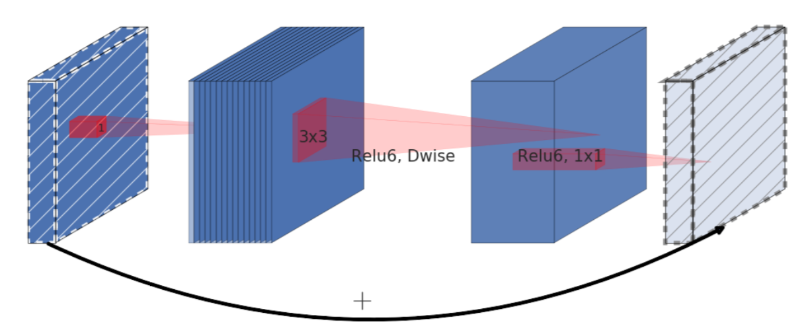
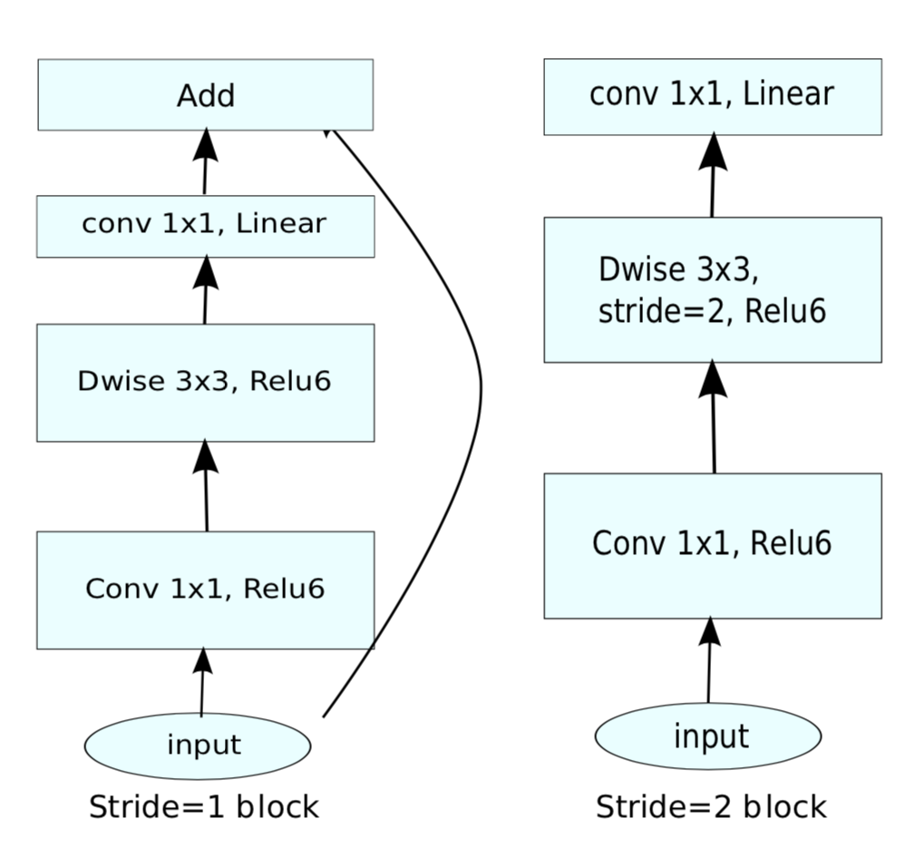
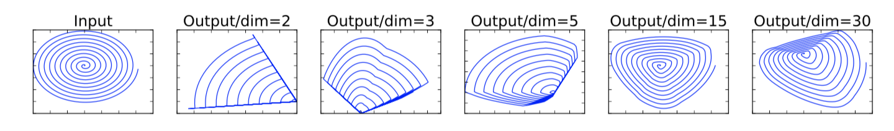
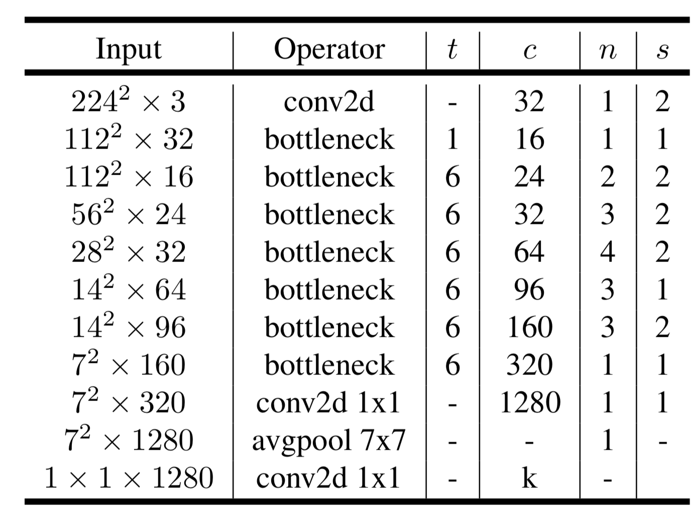

&ensp;&ensp;&ensp;&ensp; **Mobilenetv2**是谷歌继**Mobilenetv1**提出的一种新型轻量级网络，该论文提出了一种新型的网络结构模块：具有线性瓶颈的倒置残差(**Inverted Residuals**)模块。其首先将一个低维压缩表示的张量首先扩张其通道，然后使用深度可分离卷积方式将其映射回低维，并通过短路连接将两个瓶颈部分进行相加。值得注意的是其采用线性瓶颈，即在第一部分对低维扩张时不使用relu非线性单元，而是在对扩张之后的高维张量首先使用relu再通过深度卷积，而一般残差结构是对输入进行relu之后再进行深度卷积。

&ensp;&ensp;&ensp;&ensp;对于倒置残差模型作者认为它在构建块（瓶颈层）的输入/输出域与层转换之间提供了自然分离——这是一种将输入转换为输出的非线性函数。前者可以看作是网络在每一层的容量，而后者则是表现力，允许将网络表现力（由扩展层编码）与其容量（由瓶颈输入编码）分开。并且在计算中能够减少内存的利用率。

对于线性映射，作者认为感兴趣流型(**manifold of interest**)存在与高维空间的低维子空间中，并且通过relu能够保持的非零体积是线性变化（说明在进行高维到低维的感兴趣流形之前需要通过线性变换，降低信息的损失，并且作者做了对比实验使用随机矩阵T跟随ReLU将初始螺旋嵌入到n维空间中，然后使用T -1将其投影回2D空间。在上面的例子中，n = 2,3导致信息丢失，其中流形的某些点彼此塌陷，而对于n = 15到30，变换是高度非凸的。说明当原始输入维度数增加到15以后再加ReLU，基本不会丢失太多的信息；但如果只把原始输入维度增加至2~5后再加ReLU，则会出现较为严重的信息丢失，进一步说明channel数较少的层之后应该不使用relu）。
其网络结构如下图：

其中t代表扩张的倍数，c代表输出的通道数，n代表每个结构的循环次数，s代表步长。
参考：
  &ensp;https://arxiv.org/abs/1801.04381
 **注**：此博客内容为原创，转载请说明出处
 