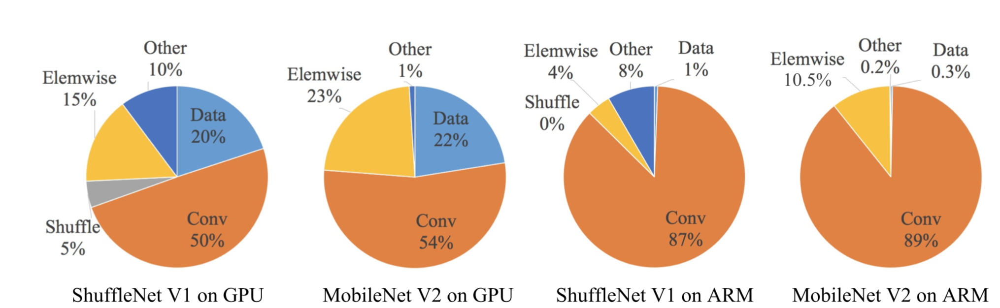
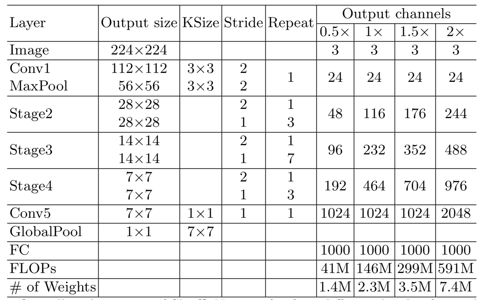

&ensp;&ensp;&ensp;&ensp;   **shufflenetv2**首先认为现在网络的轻量级评价标准是基于一些非直接的参数，比如**FLOPs**,没有从直接从网络的直接标准（运行速度或延时）来进行衡量，而拥有相同**FLOPs**的网络其运行速度可能大不相同，所以使用仅**FLOPs**来作为衡量标准是不充分的。
**FLOPS**：注意全大写，是**floating point operations per second**的缩写，意指每秒浮点运算次数，理解为计算速度。是一个衡量硬件性能的指标。
**FLOPs**：注意s小写，是**floating point operations**的缩写（s表复数），意指浮点运算数，理解为计算量。可以用来衡量算法/模型的复杂度。
卷积层：（2&times;ci&times;k^2-1)&times;H&times;W&times;co
Ci=input channel, k=kernel size, HW=output feature map size, Co=output channel。2是因为一个MAC算2个operations。
不考虑bias时有-1，有bias时没有-1。
全联接层： (2&times;I-1)&times;O
I=input neuron numbers, O=output neuron numbers。2是因为一个MAC算2个operations。
不考虑bias时有-1，有bias时没有-1。
&ensp;&ensp;&ensp;&ensp; 间接和直接指标之间的差异可归因于两个主要原因。 首先，FLOP没有考虑几个对速度有相当影响的重要因素。 1，存储器访问成本（MAC），在诸如组卷积的某些操作中，这种成本占运行时的很大一部分。 它可能是具有强大计算能力的设备（例如GPU）的瓶颈。因此在网络架构设计期间，不应忽略此成本。 还有并行度因素，在相同的FLOP下，具有高并行度的模型可能比具有低并行度的另一个模型快得多。2，平台原因，因为矩阵分解被广泛应用，但研究发现在CUDNN的库里对3x3的卷积进行了优化，虽然矩阵分解能够降低大约75%的浮点远算量，但是运行速度更慢。通过这些观察，作者建议应该考虑两个原则来进行有效的网络架构设计。 首先，应该使用直接度量（例如，速度）而不是间接度量（例如，FLOP）。 其次，应在目标平台上评估此类指标。
提出了四个设计网络的一般性原则：
1，输入通道数与输出通道数相等能减少MAC。
现代网络实际上采用了可分离的卷积，其中逐点卷积（即1×1卷积）占复杂性的大部分。1×1卷积的形状由两个参数指定：输入通道数c1和输出通道c2。 设h和w为特征映射的空间大小，1×1卷积的FLOPs为B = h&times;w&times;c1&times;c2。
为简单起见，假设计算设备中的高速缓存足够大以存储整个特征映射和参数。 因此，存储器访问成本（MAC）或存储器访问操作的数量是MAC = hw（c1 + c2）+ c1c2。 注意，这两个术语分别对应于输入/输出特征映射和内核权重的存储器访问。
从均值不等式来看，有：
`!$$ c1+c2\geq2\sqrt{c1c2} $$`
`!$$ hw(c1+c2)\geq 2\sqrt{hwB} $$`
`!$$ MAC \geq 2\sqrt{hwB} + \frac{B}{hw} $$`
因此当输入c1与输出c2通道数相等是上式取得最小值。

2，过多的组卷积会增加MAC。
组卷积是现代网络架构的核心。 它通过将所有信道之间的密集卷积改变为稀疏（仅在信道组内）来降低计算复杂度（FLOP）。 一方面，它允许在给定固定FLOP的情况下使用更多信道，并增加网络容量（从而提高精度）。然而，另一方面，增加的信道数导致更多的MAC。与上一规则的假设一致，其MAC为：
`!$$ MAC = hw(c_1+c_2)+\frac{c_1 c_2}{g} = hwc_1 + \frac{Bg}{c_1}+\frac{B}{w}$$`
其中g是分组数，**B** = hwc1c2/g是其对应的FLOPs，由上式可以看出MAC随着g的增加而增加。因此，作者建议应根据目标平台和任务仔细选择分组数。 使用大的组数是不明智的，因为这可以使用更多的通道，因为快速增加的计算成本可以轻易地超过准确度增加的好处。

3.网络分支过多会降低并行性能。
在GoogLeNet系列和自动生成的体系结构中，在每个网络块中广泛采用“多路径”结构。使用了许多小型运算符（这里称为“碎片运算符”）而不是几个大运算符。例如，在NASNET-A 中，碎片运算符的数量（即一个构建块中的单个卷积或池化操作的数量）为13.相比之下，在ResNet 等常规结构中，此数字为2或3。
虽然这种碎片结构已被证明有利于准确性，但它可能会降低效率，因为它对具有强大并行计算能力的设备（如GPU）不友好。它还引入了额外的开销，例如内核启动和同步。为了量化网络碎片如何影响效率，作者评估了一系列具有不同碎片程度的网络块。具体地，每个构建块由1至4个1×1个卷积组成，它们按顺序或并行排列。每个块重复堆叠10次。碎片在GPU上显着降低了速度，例如： 4片段结构比1片段慢3倍。在ARM上，速度降低相对较小。

4.元素级别的操作比如relu，batch normalization，是不可忽略的。
因为虽然这种操作的FLOPs很少但是MAC有很大的占比。元素操作占用了相当多的时间，尤其是在GPU上。 这里，元素操作符包括ReLU，AddTensor，AddBias等。它们具有小的FLOP但是相对较重的MAC。为了验证，作者在ResNet 中试验了“瓶颈”单元（1×1转换后跟3×3转换，然后是1×1转换，具有ReLU和短路连接）。 ReLU和短路操作将分别删除。在删除ReLU和快捷方式后，观察到在GPU和ARM上都获得了大约20％的加速。

基于以上四点原则，作者对shufflenetv1做出了改进，通过去掉组卷积和加入通道切片提出了新的shufflenetv2结构。在每个单元的开头，c个特征通道的输入被分成两个分支，分别具有c-c'和c'通道。 在规则3之后，一个分支仍然是恒等映射。 另一个分支由三个卷积组成，具有相同的输入和输出通道以满足规则1。与v1不同，这两个1×1卷不再是分组。 这部分是为了遵循规则2，部分原因是拆分操作已经产生了两个组。卷积后，两个分支连接在一起。 因此，通道数保持不变（规则1）。 然后使用与v1中相同的**channel shuffle**操作来实现两个分支之间的信息交流。shuffle后，下一个单元开始。 请注意，v1中的“add”操作不再存在。 ReLU和深度卷积这些元素级操作仅存在于一个分支中。 此外，三个连续的逐元素操作“Concat”，“Channel Shuffle”和“Channel Split”被合并为单个元素操作。 根据规则4，这些变化是有益的。
最后的网络结构如下：

并且最后通过在每个块中的第一个点卷积之前再加入一个3x3深度分离卷积提出了性能最优的shufflenetv2。得出了许多比较结果，Mobilenetv1的运行速度最快，分类准确率ShuffleNet v2 ≥ MobileNet v2 > ShuffeNet v1 > Xception, 检测准确率ShuffleNet v2 > Xception ≥ ShuffleNet v1 ≥ MobileNet v2. 这表明Xception在检测任务方面很有用。 这可能是由于Xception构建块的感受域比其他对应物（7对3）更大。 受此启发，我们还通过在每个构建块中的第一个逐点卷积之前引入额外的3×3深度卷积来扩大ShuffleNet v2的感知领域。 该变体表示为ShuffleNet v2 *。 只需几个额外的FLOP，它进一步提高了准确性。
参考：
  &ensp;https://arxiv.org/pdf/1807.11164.pdf
 **注**：此博客内容为原创，转载请说明出处
