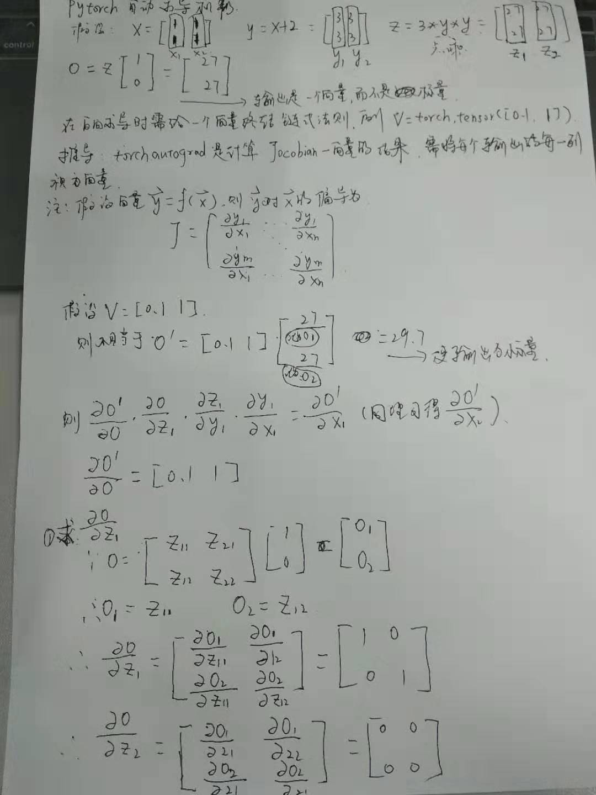

&ensp;&ensp;&ensp;&ensp;不论对于任何深度学习框架其自动求导机制一定是其核心模块，**pytorch**也不例外，**pytorch**的自动求导主要依赖于**autograd**这个包，**pytorch**与**tensorflow**有所不同，其主要是构建动态图，这也意味着每一次迭代的反向传播都有可能不同，关于自动求导的例子**pytorch**的官方手册的例子非常好，可以在这里查看[Autograd: Automatic Differentiation](https://pytorch.org/tutorials/beginner/blitz/autograd_tutorial.html#sphx-glr-beginner-blitz-autograd-tutorial-py),其实反向传播也主要是根据链式求导法则，但是还有一点我们在官方手册中会看到就是必须要求最后的输出为标量才可以终结链式求导法则，**pytorch**的**autograd**包也才可以计算出完整的**Jacobian**，否则当我们调用y.backward()方法时会提示错误，或者当我们在调用y.backward()时额外输入一个向量来终结链式法则，便可得到一个 **vector-Jacobian product**，这时可能有人比较疑惑，或者不知道输出的是什么东西，下面通过一个例子大家就可以清楚的搞明白这个过程。
&ensp;&ensp;&ensp;&ensp;这里由于输入公式比较麻烦，就直接上图了，推导过程见下（请忽略丑字）：
<div align=center></div>
接下页如下：
<div align=center></div>
所以在运行如下代码时会得到tensor([[ 1.8000,  0.0000], [18.0000,  0.0000]])的输出。
```javascript
    import torch
    x = torch.ones(2, 2, requires_grad=True)
    print(x)
    y = x + 2
    print(y)
    print(y.grad_fn)
    z = y * y * 3
    z_1 = torch.tensor([1, 0], dtype=torch.float32).view(2, 1)
    out = torch.mm(z, z_1)
    print(z, out)
    gradients = torch.tensor([0.1, 1.0], dtype=torch.float).view(2, 1)
    out.backward(gradients)
    print(x.grad)
```
而如果不传入gradients这个向量来终结链式求导法则时，会报如下错误：
```javascript
    raise RuntimeError("grad can be implicitly created only for scalar outputs") RuntimeError: grad can be implicitly created only for scalar outputs
```
参考：
  &ensp;https://pytorch.org/tutorials/
 **注**：此博客内容为原创，转载请说明出处
