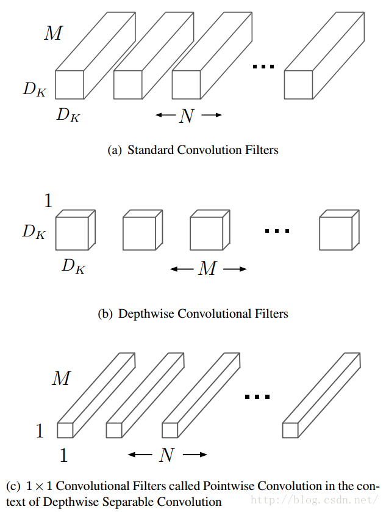
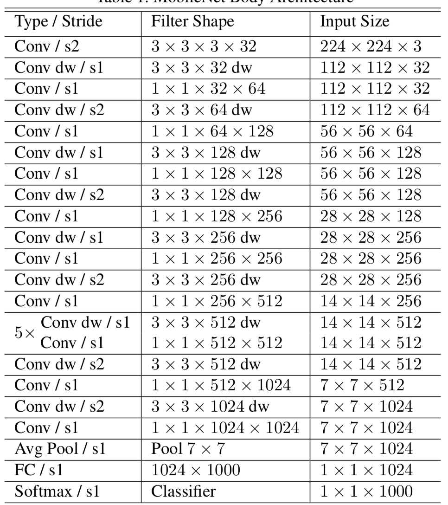

&ensp;&ensp;&ensp;&ensp;    **MobileNet** 是谷歌在2017年提出的手机端的网络架构，其目的是从结构上减少网络参数，加速网络运行。**MobileNets**模型基于深度可分解的卷积，它可以将标准卷积分解成一个深度卷积和一个点卷积（1 × 1卷积核）。深度卷积将每个卷积核应用到每一个通道，而1 × 1卷积用来组合通道卷积的输出。
<!--more-->

&ensp;&ensp;&ensp;&ensp;假设输入为DF x DF x M,输出为DF x DF x N,卷积核的大小为DK x DK,则深度可分离卷积能够减少:

$$ \frac{D_k&times;D_k&times;M&times;N+M&times;N&times;D_F&times;D_F}{D_k&times;D_k&times;M&times;N&times;D_F&times;D_F}=\frac{1}{N}+\frac{1}{D_k^2} $$
的计算量。
以上说的**MobileNet**的基准模型，但是有时候需要更小的模型，引入了两个超参数：**width multiplier**（宽度乘数）和**resolution multiplier**（分辨率乘数）。**width multiplier**主要是按比例减少通道数，该参数记为α，其取值范围为(0,1]，那么输入与输出通道数将变成αM和αN。第二个超参数是分辨率乘数 ρ ，比如原来输入特征图是224x224，可以减少为192x192。分辨率乘数用来改变输入数据层的分辨率，同样也能减少参数。在 α 和 ρ 共同作用下，**MobileNets**某一层的计算量为：
$$ D_k&times;D_k&times;&alpha;M&times;&alpha;N+&alpha;M&times;&alpha;N&times;&rho;D_F&times;&rho;D_F $$
**Mobilenet**在所有的卷积层之后都接了**BN**层和**relu**，其降采样在深度卷积阶段执行，其网络结构为：

参考：
  &ensp;https://arxiv.org/abs/1704.04861
 **注**：此博客内容为原创，转载请说明出处