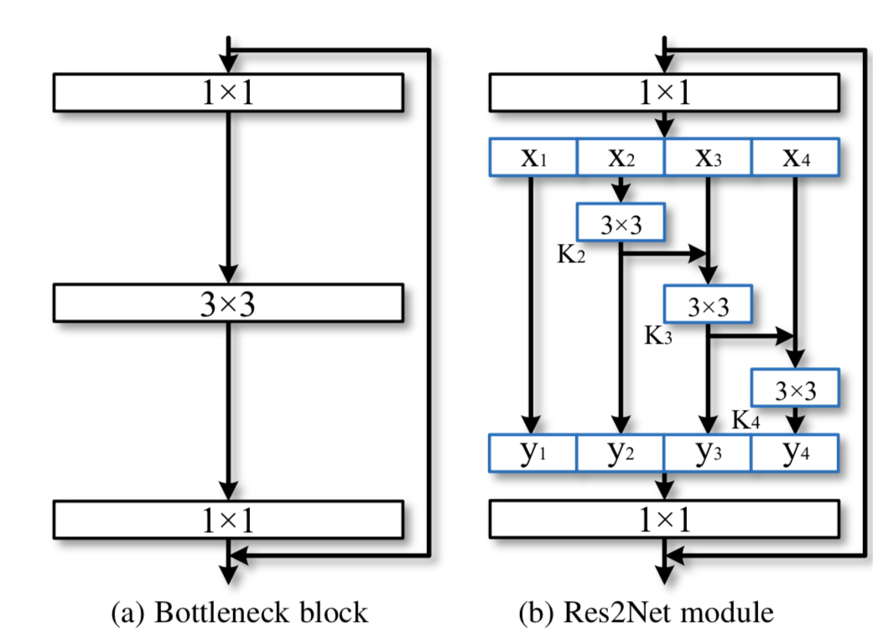
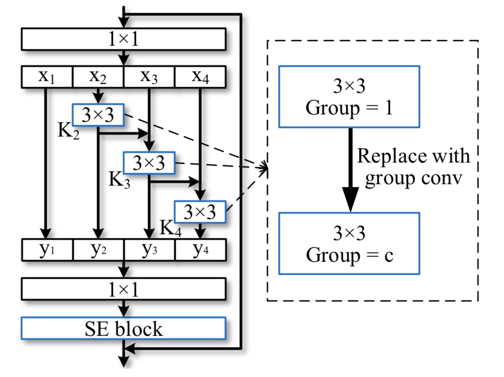
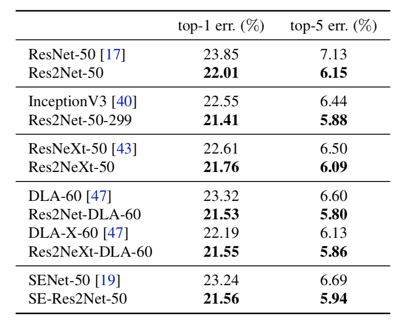
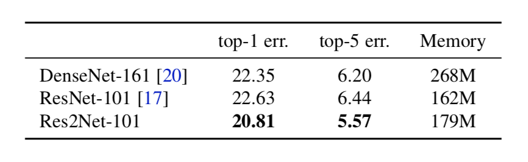
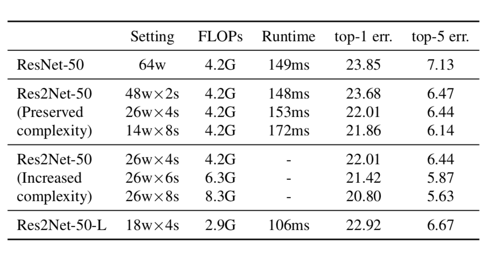

&ensp;&ensp;&ensp;&ensp; **res2net**提出了一种类残差的级联结构(**hierarchical residual-like style**)模块，并且规定了一种类似**resnext**中**基维度**新的维度**scale**维度（Res2Net块中的特征组数量）。
<!--more-->

这种结构通过将残差模块里的1x1之后的通道进行分组，然后除第一个分组外，其它分组通过一个3x3的卷积并且以**add**方式连接到下一个分组。最后将分组输出concat在一起，再通过一个1x1的卷积来整合组间信息。每次特征分割xj通过3×3卷积运算符时，输出结果可以具有比xj更大的接收场。 由于组合效应，**Res2Net**模块的输出包含不同数量和不同的感受野大小/比例组合。可以轻松地将建议的**Res2Net**模块集成到最先进的模型中，例如**ResNet** ，**ResNeXt**和**DLA** 。 相应的模型分别称为**Res2Net**，**Res2NeXt**和**Res2Net-DLA**。比如将**res2net**与**SE-Block**及**resnext**整合在一起的结构如下：

在**imagenet**数据集上的分类test error如下：

其中每个网络的**scale**=4，并且作者通过实验得知这种网络的效果可以随着网络的深度加深而进一步提升。

类似于resnext的**基维度**通过增加**scale**维度，分类的准确率也会进一步提升：

参考：
  &ensp;https://arxiv.org/abs/1904.01169
 **注**：此博客内容为原创，转载请说明出处
