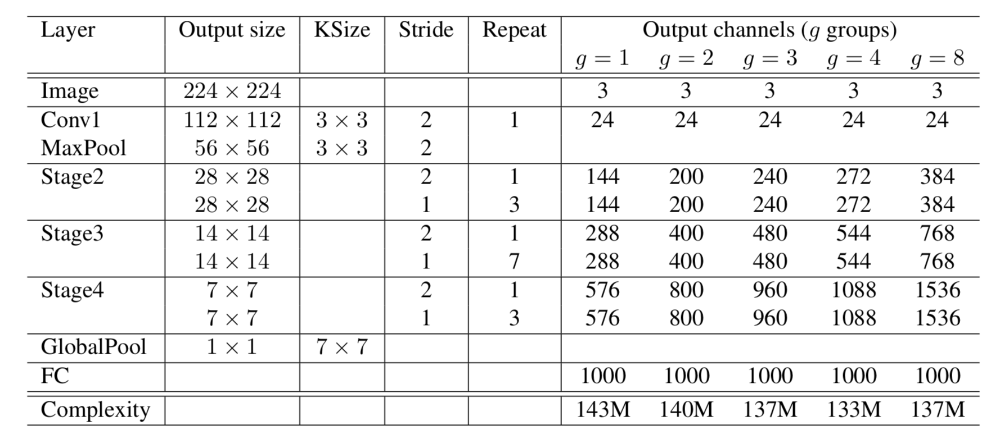

&ensp;&ensp;&ensp;&ensp; **shufflenetv1**是旷视提出了一种新型网络结构，结合**xception**使用深度可分离卷积和**resnext**使用组卷积的特点设计了在残差结构中对1x1卷积使用组卷积来进一步来减少参数量，这样使得在相同的复杂性条件下可以使用更多的特征图通道，从而增强网络对信息的捕获能力。接着对其各个组卷积通道进行**shuffle**来进行组间信息交换，并且使用了深度可分离卷积(受**xception**启发，其后不接relu，这其实和mobilenetv2的结论一样，channel数较少的通道之后不接relu可以减少信息损失)，在深度可分离卷积后的点卷积不使用shuffle操作。
<!--more-->

其shuffle示意图如下：

最后其网络结构为：

**注意对于stage2，在第一个点卷积上没有应用组卷积，因为输入通道的数量相对较小。**
参考：
  &ensp;https://arxiv.org/abs/1707.01083
 **注**：此博客内容为原创，转载请说明出处

