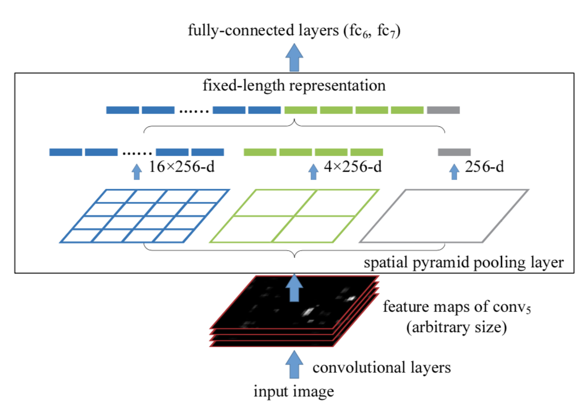
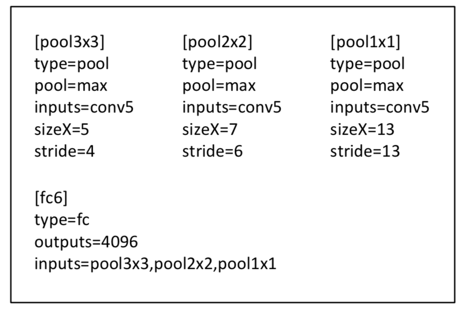

&ensp;&ensp;&ensp;&ensp;深度卷积神经网络（CNNs）都需要输入的图像尺寸固定（比如224×224）。这种人为的需要导致面对任意尺寸和比例的图像或子图像时会降低识别的精度(因为要经过**crop/warp**)。**sppnet**提出了一种“空间金字塔池化”(**spatial pyramid pooling**)的池化策略以消除上述限制。这种方式可以普遍帮助改进各类基于CNN的图像分类方法并且可以提升**RCNN**的检测速度。
<!--more-->
&ensp;&ensp;&ensp;&ensp;CNN主要由两部分组成，卷积部分和其后的全连接部分。卷积部分通过滑窗进行计算，并输出代表激活的空间排列的特征图（feature map）。事实上，卷积并不需要固定的图像尺寸，他可以产生任意尺寸的特征图。而另一方面，根据定义，全连接层则需要固定的尺寸输入。因此固定尺寸的问题来源于全连接层，也是网络的最后阶段。引入一种空间金字塔池化( spatial pyramid pooling，SPP)层以移除对网络固定尺寸的限制。特别地，**将SPP层放在最后一个卷积层之后**。SPP层对特征图进行池化，并产生固定长度的输出，这个输出再喂给全连接层（或其他分类器）。换句话说，在网络层次的较后阶段（也就是卷积层和全连接层之间）进行某种信息“汇总”，可以避免在最开始的时候就进行裁剪crop或变形warp。对深度CNNs而言，SPP有几个突出的优点：1）SPP能在输入尺寸任意的情况下产生固定大小的输出，而以前的深度网络中的滑窗池化(sliding window pooling)则不能；2）SPP使用了多层空间箱(**bin**)，而滑窗池化则只用了一个窗口尺寸。多级池化对于物体的变形有十分强的鲁棒性；3）由于其对输入的灵活性，SPP可以池化从各种尺度抽取出来的特征。
&ensp;&ensp;&ensp;&ensp;SPP-net不仅仅让测试阶段允许任意尺寸的输入能够产生表示(representations)，也允许训练阶段的图像可以有各种尺寸和缩放尺度。使用各种尺寸的图像进行训练可以提高尺度不变性，以及减少过拟合。作者开发了一个简单的多尺度训练方法。为了实现一个单一网络能够接受各种输入尺寸，使用多个共享所有权重（Parameters）的网络来近似得到这种效果，不过，这里的每个网络分别使用固定输入尺寸进行训练。每个epoch 使用固定的尺寸训练这个网络，下一轮使用另一个尺寸来训练。实验表明，这种多尺度的训练与传统的单体型训练是的收敛速度是一样的，但是带来更好的测试精度。

&ensp;&ensp;&ensp;&ensp;上图显示了一个3级金字塔池化（4x4、2x2、1x1）的示例配置，其共有16+4+1=21个bin，其通过金字塔池化的输出张量为21x256。
&ensp;&ensp;&ensp;&ensp;理论上将，上述网络结构可以用标准的反向传播进行训练[1]，与图像的大小无关。**但实践中，GPU的实现（如cuda-convnet和Caffe）更适合运行在固定输入图像上**（所以作者在多尺度训练时选用的180x180,224x224的固定尺寸）。作者共设计了两种训练模式单尺度训练和多尺度训练。
1.单尺度训练
&ensp;&ensp;&ensp;&ensp;首先考虑接收裁剪成224×224图像的网络。裁剪的目的是数据增强。对于一个给定尺寸的图像，先计算空间金字塔池化所需要的块（bins）的大小。考虑一个尺寸是axa（也就是13×13）的conv5之后特征图。对于nxn块的金字塔层的块bins，将这个池level作为一个滑动窗口池来实现，窗口的大小的win=[a/n]和步长s=[a/n]。用l级的金字塔，实现l这样的层（With an l-level pyramid,we implement l such layers. ）。下一个完全连接的层（fc6）将连接则这l个输出。如下图显示了一个3级金字塔池（3x3、2x2、1x1）的示例配置。

如果网络为Alexnet，原来最后一个池化层输出的大小为6x6x256,通过上述的spp结构其共有9+4+1=14个bin，其输出的大小为14x256。
2.多尺度训练
&ensp;&ensp;&ensp;&ensp;带有SPP的网络可以应用于任意尺寸，为了解决不同图像尺寸的训练问题，考虑一些预设好的尺寸。现在考虑这两个尺寸：180×180,224×224。使用缩放而不是裁剪，将前述的224的区域图像变成180大小。这样，不同尺度的区域仅仅是分辨率上的不同，而不是内容和布局上的不同。对于接受180输入的网络，实现另一个固定尺寸的网络。本例中，conv5输出的特征图尺寸是axa=10×10。仍然使用$win = \lceil[a/n]$，$str = \lfloor[a/n]$，实现每个金字塔池化层。这个180网络的空间金字塔层的输出的大小就和224网络的一样了。这样，这个180网络就和224网络拥有一样的参数了。换句话说，训练过程中，通过使用共享参数的两个固定尺寸的网络实现了不同输入尺寸的SPP-net。为了降低从一个网络（比如224）向另一个网络（比如180）切换的开销，在每个网络上训练一个完整的epoch，然后在下一个完成的epoch再切换到另一个网络（权重保留）。依此往复。实验中发现多尺寸训练的收敛速度和单尺寸差不多。多尺寸训练的主要目的是在保证已经充分利用现在被较好优化的固定尺寸网络实现的同时，模拟不同的输入尺寸。除了上述两个尺度的实现，也在每个epoch中测试了不同的sxs输入，s是从180到224之间均匀选取的。后面将在实验部分报告这些测试的结果。注意，上面的单尺寸或多尺寸解析度只用于训练。在测试阶段，是直接对各种尺寸的图像应用SPP-net的。
3.**sppnet用于目标检测**
&ensp;&ensp;&ensp;&ensp;除了用于分类之外，其另外一个主要的用途是目标检测。使用选择性搜索的“fast”模式对每张图片产生2000个候选窗口。然后缩放图像以满足min(w;h) = s，并且从整张图像中抽取特征图。我们暂时使用ZF-5的SPP-net模型（单一尺寸训练）。在每个候选窗口，使用一个4级空间金字塔（1×1, 2×2, 3×3, 6×6, 总共50块）。每个窗口将产生一个12800（256×50）维的表示。这些表示传递给网络的全连接层。然后针对每个分类训练一个二分线性SVM分类器。在训练SVM时使用真实标注的窗口去生成正例。负例是那些与正例窗口重叠不超过30%的窗口（使用IoU比例）。如果一个负例与另一个负例重叠超过70%就会被移除。并且和**RCNN**一样使用标准的难负例挖掘算法（standard hard negative mining ）训练SVM。这个步骤只迭代一次。对于全部20个分类训练SVM小于1小时。测试阶段，分类器用来对候选窗口打分。然后在打分窗口上使用非极大值抑制算法（30%的阈值）。
        通过多尺度特征提取，方法的检测结果可以得到改善。将图像缩放成min(w;h) = s \belongs S = {480; 576; 688; 864; 1200 }，然后针对每个尺度计算conv5的特征图。一个结合这些这些不同尺度特征的策略是逐个channel的池化。但作者从经验上发现另一个策略有更好的效果。对于每个候选窗口，选择一个单一尺度s \belongs S，令缩放后的候选窗口的像素数量接近与224×224。然后从这个尺度抽取的特征图去计算窗口的特征。如果这个预定义的尺度足够密集，窗口近似于正方形。这个方法粗略地等效于将窗口缩放到224×224，然后再从中抽取特征。但此方法在每个尺度只计算一次特征图，不管有多少个候选窗口。
&ensp;&ensp;&ensp;&ensp;作者参照**RCNN**对预训练的网络进行了调优。由于对于任意尺寸的窗口，都是从conv5的特征图中池化来得到特征的，为了简单起见，只调优全连接层。本例中，数据层接受conv5之后的固定长度的池化后的特征，后面跟着fc_{6,7}和一个新的21路（有一个负例类别）fc8层。fc8的权重使用高斯分布进行初始化σ=0.01。修正所有的learning rate为1e-4，再将全部三层调整为1e-5。调优过程中正例是与标注窗口重叠度达到[0.5, 1]的窗口，负例是重叠度为[0.1, 0.5]的。每个mini-batch，25%是正例。使用学习率1e-4训练了250k个minibatch，然后使用1e-5训练50k个minibatch。因为我们只调优fc层，所以训练非常的快，在GPU上只需要2个小时，不包括预缓存特征图所需要的1小时。另外，使用了约束框回归来后处理预测窗口。用于回归的特征也是conv5之后的池化后的特征。用于回归训练的是那些与标注窗口至少重叠50%的窗口。

参考：
  &ensp;https://arxiv.org/abs/1406.4729
  &ensp;https://blog.csdn.net/alibabazhouyu/article/details/80058009
  
 **注**：此博客内容为原创，转载请说明出处

