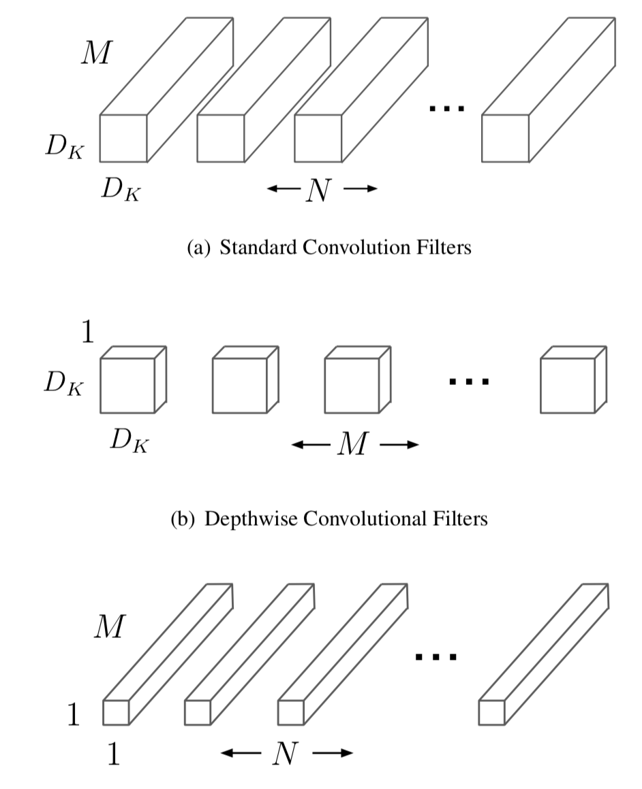
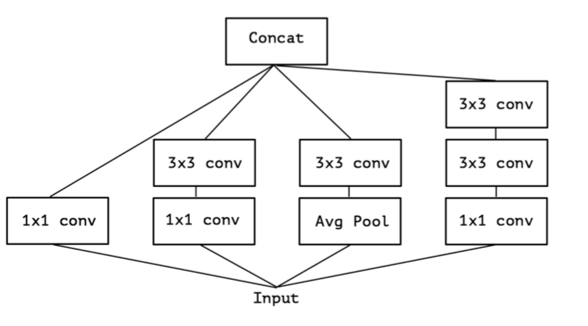
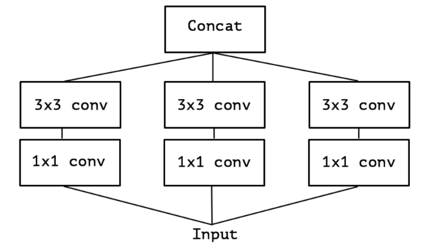
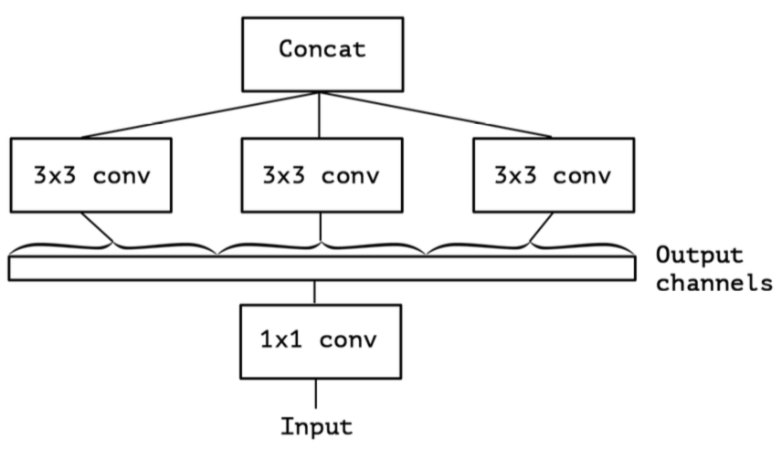
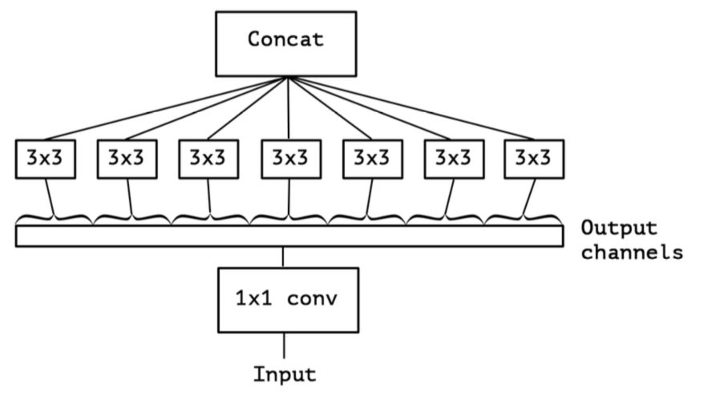

&ensp;&ensp;&ensp;&ensp;**Xception**是**Inception**系列的最后一篇，其主要思想是建立在卷积的空间相关性和通道相关性是可以解耦的，论文对之前**Inception**系列的工作做出了分析，通过类比分析说明了**Inception**的结构其实始终是建立在这种假设之上的，最后采用了轻量级神经网络常采用的深度可分离卷积搭配残差结构，但是有意思的是**Inception**系列中只要用了残差结构的，在其论文中都会不同程度的diss残差结构，看来还是老郭说的对，只有同行之间才是赤裸裸的仇恨啊。
<!--more-->
&ensp;&ensp;&ensp;&ensp;那首先看看深度可分离卷积是什么样的结构：

&ensp;&ensp;&ensp;&ensp;假设输入为DF x DF x M,输出为DF x DF x N,卷积核的大小为DK x DK,则深度可分离卷积能够减少:

$$ \frac{D_k&times;D_k&times;M&times;N+M&times;N&times;D_F&times;D_F}{D_k&times;D_k&times;M&times;N&times;D_F&times;D_F}=\frac{1}{N}+\frac{1}{D_k^2} $$
的计算量。
&ensp;&ensp;&ensp;&ensp;论文分析了**inception**结构是通过有效的卷积分解来分别看待通道信息相关性和空间信息相关性，**inception**结构首先通过1x1的卷积来获取通道信息的相关性将输入映射为3个或4个比原输入空间更小的分离的空间，然后使用3x3或者5x5的常规卷积来进行所有的相关性映射。其实质是假设通道的相关性和空间的相关性是可分离的。

&ensp;&ensp;&ensp;&ensp;其简化版本为：

&ensp;&ensp;&ensp;&ensp;随后论文更进一步探索inception的卷积结构，可以将其视为将输入通过1x1的卷积之后对其输出的通道将其分为若干份然后对其分别进行3x3的卷积来获取这一份的空间相关性。

&ensp;&ensp;&ensp;&ensp;一个极端的情况是将1x1的输出每一个通道分为一份，然后使用3x3的卷积来获取其空间相关性，这种情况下其结构就和深度可分离卷积类型十分相似。

&ensp;&ensp;&ensp;&ensp;但是这种结构与深度可分离有两点不同1.这种结构是先通过点卷积再通过深度卷积，而深度可分离卷积是先通过深度卷积再通过点卷积；2.在原来的**inception**结构中近似的点卷积和深度卷积之后都有relu函数，但是这里的深度可分离卷积中深度卷积即3x3的卷积之后没有relu。我原以为作者分析了这么多会使用自己提出的近似结构，但是论文中最后采用的还是深度可分离结构"In short, the Xception architecture is a linear stack of depthwise separable convolution layers with residual connections"所以论文利用深度可分离卷积来构建**xception**结构网络，并且使用了残差结构。

&ensp;&ensp;&ensp;&ensp;文中针对深度可分离结构中没有relu的非线性激活层做了对比实验，发现没有relu的网络结构收敛更快并且能够取得更好的结果，文中认为可能是中间空间特征的深度决定了非线性的有用性，比如在**inception**中的3x3是对整个输入通道的卷积，这样非线性就会有帮助，而在深度可分离结构中的3x3是对输入的一个通道进行卷积，这可能会损失掉很多信息。文章还对有无残差结构做了对比，结过显示有残差结构的网络性能远远优于不加残差结构的网络，但是作者认为这个结果只显示了这种特定结构的残余连接的重要性，并且为了构建深度可分离卷积堆栈的模型，绝不需要残余连接。 作者还获得了非残留VGG样式模型的优异结果，其中所有卷积层都被深度可分离卷积（深度乘数为1）替换，在JFT上等于参数计数时优于初始V3。
参考：
  &ensp;https://arxiv.org/abs/1610.02357
  &ensp;https://arxiv.org/abs/1704.04861
 **注**：此博客内容为原创，转载请说明出处
